# 学习手册：从零读懂 TensorFlow 2

> 适用项目：`F:\Tensorflow` (`tf2-tutorial`)
> 读者：刚装好 Python、想了解深度学习基本概念并跑通第一个模型的工程师 / 学生。

---

## 写给读者

### 这本书是给谁的？

如果你是**计算机专业的学生**，会写 Python、懂数组和循环、学过线性代数和微积分基础，但还没接触过深度学习——这本书就是为你写的。

我们不会一上来就甩公式。每个新概念都会先给一个生活化的类比，让你"感觉"到它在干什么，然后再给出正式定义。你不需要记住所有术语的英文拼写，但需要理解每个概念在整个拼图里的位置。

### 怎么读这本书？

这本书和代码仓库是配套的。**最佳读法是"读一段，跑一段，改一改"**：

1. **先读章节讲解**：理解这一章要解决什么问题、核心思路是什么。
2. **再跑对应代码**：确认你的环境没问题，看看输出长什么样。
3. **动手改一改**：按照"动手试一试"板块的建议改参数，观察变化。
4. **踩坑不可怕**：遇到报错先看"常见坑"板块，大概率能找到答案。

> **一句话原则**：深度学习不是看会的，是调会的。你改的参数越多，理解就越深。

### 需要什么基础？

| 技能 | 需要到什么程度 | 自查问题 |
| --- | --- | --- |
| Python | 能写函数、循环、列表推导式 | 你能用 Python 写一个冒泡排序吗？ |
| NumPy 数组 | 知道 shape、reshape、广播的概念 | `(3, 1) + (1, 4)` 的结果 shape 是什么？ |
| 线性代数 | 知道矩阵乘法、向量点积 | `A @ B` 的结果形状和 A、B 有什么关系？ |
| 微积分 | 知道导数是什么、链式法则 | `f(g(x))` 对 x 求导等于什么？ |

如果以上有不会的，没关系——我们会在遇到时用类比讲清楚。但如果你连 Python 基础都还不熟练，建议先花一周时间补一补。

### 预计学习时间

| 章节 | 内容 | 建议时间 |
| --- | --- | --- |
| 第 0 章 | 路线图 + 环境搭建 | 30 分钟 |
| 第 1 章 | 张量与自动求导 | 2 小时 |
| 第 2 章 | Keras 第一个模型 | 1.5 小时 |
| 第 3 章 | MLP 分类 MNIST | 2 小时 |
| 第 4 章 | CNN 入门 | 2.5 小时 |
| 第 5 章 | 文本分类 | 2 小时 |
| 第 6 章 | 迁移学习 | 2 小时 |
| 第 7 章 | 回调与 TensorBoard | 1.5 小时 |
| 第 8 章 | 保存与导出 | 1 小时 |
| 实战 09 | 综合项目（`chapters/09`） | 3-5 小时 |
| 实战 10 | 边缘部署（`chapters/10`） | 2-3 小时 |
| 进阶篇 11-15 | 数据管道/序列/注意力/生成/自定义 | 每章 2-4 小时 |
| 第 9-11 章 | 进阶阅读（读论文/调参/调试） | 按需，可无限拉长 |
| 16 周学期制 | [study_plan_semester.md](study_plan_semester.md) | 一个学期 |

**总计**：完整学完前 8 章大约需要 **15-20 小时**（含动手实践）。如果每天投入 2 小时，大约一周到十天可以走完一遍；再加上实战 09/10（约一周），就是完整的主线毕业。节奏安排见 [14 天学习计划](study_plan.md) 与 [知识地图](knowledge_map.md)。

### 这本书的"广、全、实"

- **广**：从最基础的张量到迁移学习、从图像到文本、从训练到部署，你会对深度学习的完整流程有一个全景认知。
- **全**：不仅讲"怎么做"，更讲"为什么这么做"。每个概念都有直觉类比、正式定义、代码示例和动手练习。
- **实**：所有代码都能直接跑，所有建议都来自实际踩坑经验。读完你不仅"知道"，还"做过"。

---

## 0. 路线图

> 📍 **先打开 [知识地图](knowledge_map.md)**：那里有主线故事、章节依赖图、三条学习路径
> 和每章的过关标准。本节是缩略版；任何时候迷路，都回去找"你现在在哪"。

```
 阶段一·直觉        阶段二·核心机制          阶段三·视觉与文本
┌─────────────┐   ┌────────────────────┐   ┌─────────────────────┐
│ chapters/00 │   │ chapters/01 ──► 02  │   │ 03 MLP ──► 04 CNN   │
│ 是什么/为什么 │   │  NumPy      Keras   │   │    │                 │
└─────────────┘   └────────────────────┘   │    ▼                 │
                                            │ 05 文本 ──► 06 迁移   │
                                            └──────────┬──────────┘
                                                       ▼
        阶段五·实战与前沿                  阶段四·工程化
┌────────────────────────────┐   ┌────────────────────────────┐
│ 09 综合项目 ──► 10 边缘部署  │   │ 07 回调/监控 ──► 08 保存/导出 │
│       │                    │   └────────────────────────────┘
│       ▼                    │
│ 进阶篇 11-15：数据管道 / 序列 / 注意力 / 生成 / 自定义 │
│ 手册进阶章：读论文·调参·调试（穿插阅读）│
└────────────────────────────┘
```

### 手册章节 vs 代码章节对照

手册进阶部分沿用了独立编号，**与 `chapters/` 脚本编号不是一回事**，对照如下：

| 代码脚本 (`chapters/`) | 手册对应位置 |
| --- | --- |
| `00_ml_basics.py` | 第 0 章路线图 + [知识地图](knowledge_map.md) |
| `01` ~ `08_*.py` | 手册第 1~8 章（一一对应，每章标了代码入口） |
| `09_capstone_image_classifier.py` | 「实战 09 · 综合项目」（第 8 章之后） |
| `10_edge_raspberry_pi.py` | 「实战 10 · 边缘部署」（紧随实战 09） |
| `11_tfdata_pipeline.py` | 「进阶篇 11 · tf.data 数据管道」 |
| `12_rnn_timeseries.py` | 「进阶篇 12 · 序列建模」 |
| `13_attention_transformer.py` | 「进阶篇 13 · 手写注意力」 |
| `14_autoencoder_gan.py` | 「进阶篇 14 · 生成模型」 |
| `15_custom_training.py` | 「进阶篇 15 · 自定义训练与性能」 |
| ——（无脚本） | 第 9 章 读论文 / 第 10 章 调参 / 第 11 章 调试（进阶阅读） |

- 第 1 章刻意只用 NumPy：不依赖 TensorFlow，确保所有机器都能先看到概念。
- 第 2~8 章逐层加难度，每章都给出"完整可运行 + 训练曲线图"的最小示例。
- 实战 09/10 是把前 8 章串成完整系统的综合验收，讲解重心在"决策与取舍"。
- `src/tf2tutorial/` 是可复用的代码模块；章节脚本只调用，不重复实现。

### 0.1 本机环境

本机 TensorFlow 2.21 装在 `F:\tf2-env`（Python 3.12，仅 CPU）。
建议这样启动：

```powershell
python scripts\use_tf2_env.py chapters\01_tensors_autograd.py
python scripts\use_tf2_env.py chapters\03_mlp_mnist.py
```

`scripts\use_tf2_env.py` 会调用 `F:\tf2-env\Scripts\python.exe`，无需手动激活 venv。

### 0.2 版本说明（本项目对"会变的东西"的处理）

- **依赖锁定**：`requirements.txt` 固定 `tensorflow>=2.16,<3.0`，避免 API 漂移；
- **兼容分支写进代码**：脚本对 Keras 3 与旧版 TF 的差异做了自动分支
  （如导出 SavedModel 时 `model.export` 不可用会回退到 `tf.saved_model.save`），
  不需要你手工改代码（详见 FAQ 报错速查）；
- **原理与工具分离**：本手册讲原理的部分（张量、梯度、卷积、迁移学习、量化）
  不绑定具体版本；会随版本变化的具体调用都集中标注在对应章节的代码块里，
  换版本时只需对照官方迁移指南更新这些点。

---

### 🧠 直觉理解

整个学习路径就像**学开车**：

- **第 1 章（张量 + 自动求导）** = 学发动机原理。你得先知道车是怎么动起来的，虽然平时开车不用拆发动机。
- **第 2 章（Keras Sequential）** = 学挂挡踩油门。知道基本操作就能把车开起来了。
- **第 3 章（MLP on MNIST）** = 在驾校场地里练习。任务简单，反馈及时，用来建立信心。
- **第 4 章（CNN on CIFAR-10）** = 上路开。任务变复杂了，需要更高级的技巧（卷积、池化、Dropout）。
- **第 5 章（文本分类）** = 换一种车型（从图像到文本）。你会发现底层原理是通的。
- **第 6 章（迁移学习）** = 买一辆已经调校好的车，稍微改一改就能跑自己的赛道。
- **第 7 章（回调 + TensorBoard）** = 装仪表盘和行车记录仪。随时看车况，出问题有据可查。
- **第 8 章（保存与导出）** = 把车打包发货。训练好的模型要能在别的地方跑起来。
- **实战 09（综合项目）** = 自己开车跑一趟长途，独立面对路上的一切状况。
- **实战 10（边缘部署）** = 把车开上乡间小路——真实世界不是高速公路，路面条件越苛刻，越见真功夫。
- **进阶篇 11-15** = 改装车库。学会自己造零件（自定义层）、调油路（数据管道）、认识新车型（序列/生成模型），最后把发动机原理（第 1 章）和驾驶技术（第 2 章）正式合体。

### 📌 核心概念

本章是总览，不引入新概念。后续每章的核心概念都会链接到 [术语表](glossary_zh.md)。

### ✋ 动手试一试

1. 打开命令行，跑一下第 1 章的脚本，确认环境没问题：
   ```powershell
   python scripts\use_tf2_env.py chapters\01_tensors_autograd.py
   ```
   如果报错，先看最后的"调试速查"部分。

2. 浏览一下 `chapters/` 目录，数数有几个 `.py` 文件，对应几章内容。

3. 看看 `figures/` 目录里已有的图片，大概了解每章会产出什么。

### ⚠️ 常见坑

1. **路径问题**：一定要从项目根目录（`F:\Tensorflow`）运行脚本，否则相对路径会出错。
2. **Python 版本不对**：如果你直接用 `python` 而不是 `scripts\use_tf2_env.py`，可能调用的是系统 Python 而不是 tf2-env 里的。
3. **首次运行下载数据慢**：第 4、5、6 章首次运行会下载数据集，耐心等待，或者提前运行 `python scripts\download_data.py`。

---

## 1. 第 01 章 —— 张量与"自动求导"是什么

**目标：** 理解 ① 什么是张量，② 什么是"前向 / 损失 / 反向 / 更新"循环。

代码入口：`chapters/01_tensors_autograd.py`

> ✅ **版本**：本章代码在 TF 2.21 + Keras 3 实测通过；其他版本的差异见附录 D。

关键概念：

1. **张量**就是多维数组。`np.array` 与 `tf.constant` 的语义几乎一致。
2. **广播**：`(2,3) + (1,3)` 自动把第二项扩展为 `(2,3)`，避免显式循环。
3. **矩阵乘**：`a @ a.T` 才是"全连接层"的核心运算。
4. **手写梯度**：用链式法则对 `(sigmoid(w*x + b) - y)^2` 求导。
   > 在 TF 中，这段手工梯度会被 `tf.GradientTape` 自动完成。

练习：

```powershell
python chapters/01_tensors_autograd.py
```

读 `figures/chapter01_loss_surface.png`：等高线最深处就是 loss 的最小值点。

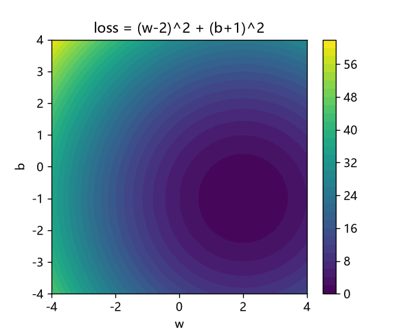

---

### 🧠 直觉理解

#### 张量：多维数组的"洋气名字"

想象你在整理考试成绩：

- 一个学生的一门课分数 `85` → **标量**（0 维张量）
- 一个学生的五门课分数 `[85, 90, 78, 92, 88]` → **向量**（1 维张量）
- 全班 30 个学生的五门课成绩 → **矩阵**（2 维张量，shape = `(30, 5)`）
- 全年级 10 个班的成绩 → **3 维张量**，shape = `(10, 30, 5)`

张量就是这么简单——**有几个维度就是几阶张量**。`shape` 告诉你每个维度有多长。

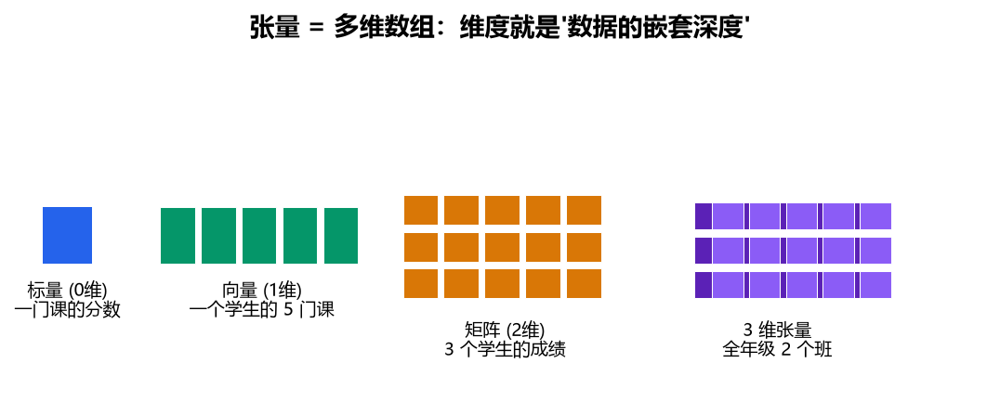

#### 自动求导："你写前向，我算梯度"

假设你在玩一个游戏：你的位置是 `(x, y)`，分数是 `z = x² + y²`（越低越好）。你想知道"往哪个方向走一步分数会降得最快"。

你可以自己推导公式算出梯度是 `(2x, 2y)`。但如果函数很复杂呢？比如有 100 层嵌套呢？手动求导会疯掉。

**自动求导**就是你告诉电脑"我是这么算分数的"（前向传播），电脑自动帮你算出"每个参数该往哪调"（梯度）。在 TensorFlow 里，`tf.GradientTape()` 就是干这个的——它像一个录音机，把你所有的计算步骤都录下来，最后一倒带就算出了梯度。

#### 训练循环：四步走

想象你在射箭，想射中靶心：

1. **前向**：射一箭，看看落在哪（模型给出预测）
2. **算损失**：量一下离靶心有多远（计算预测和真实值的差距）
3. **反向**：分析"瞄准偏左了还是偏右了、力度大了还是小了"（算梯度）
4. **更新**：调整瞄准和力度，再射一箭（按梯度更新参数）

然后重复这四步，直到射中靶心。这就是神经网络训练的全部秘密。

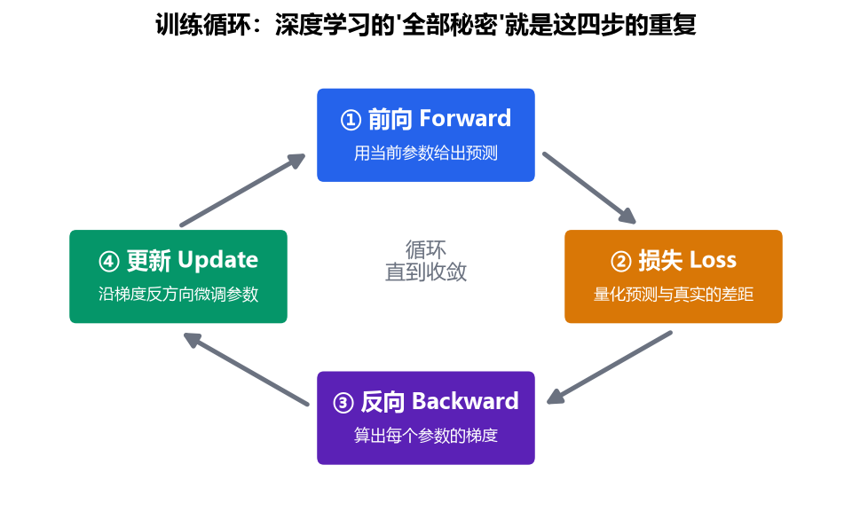

### 📌 核心概念

- [**张量 (Tensor)**](glossary_zh.md#张量-tensor)：多维数组，深度学习的基本数据单位
- [**广播 (Broadcasting)**](glossary_zh.md#广播-broadcasting)：形状不同的张量做运算时自动扩展
- [**梯度 (Gradient)**](glossary_zh.md#梯度-gradient)：损失函数对参数的导数，指示更新方向
- [**前向传播 (Forward Propagation)**](glossary_zh.md#前向传播-forward-propagation)：从输入算出输出的过程
- [**反向传播 (Backpropagation)**](glossary_zh.md#反向传播-backpropagation)：从损失算出梯度的过程

### ✋ 动手试一试

1. **改学习率**：找到代码里的 `learning_rate`，把它从 0.1 改成 1.0，再改成 0.001，观察 loss 曲线的变化。
   - 学习率太大会怎样？（提示：可能来回震荡甚至发散）
   - 学习率太小会怎样？（提示：下降非常慢）

2. **改初始权重**：把 `w` 和 `b` 的初始值改一改（比如都改成 0，或者都改成很大的数），看看收敛速度有什么不同。
   - 初始值全为 0 行不行？为什么？

3. **换一个损失函数**：现在用的是 MSE（均方误差），试试换成 MAE（平均绝对误差，即 `abs(y_pred - y)` 的平均），看看 loss 曲面的形状变了没有。

### ⚠️ 常见坑

1. **shape 不匹配报错**：做矩阵乘法时，`(2,3) @ (2,3)` 会报错，因为第二个矩阵的行数要等于第一个的列数。正确的应该是 `(2,3) @ (3,4)` 得到 `(2,4)`。
2. **忘记 GradientTape 上下文**：`tf.GradientTape()` 必须用 `with` 语句包裹前向计算的代码，否则 tape 没录上，算不出梯度。
3. **除以零 / log(0)**：计算损失时如果出现 `log(0)` 或者除以零，会得到 `nan`（不是数）。遇到 loss 突然变成 nan，先检查有没有这类运算。


> 🚨 **第一次遇到报错怎么办（三步读法）**：① 先读报错**最后一行**（那是结论）；
> ② 从下往上找到第一个"你自己的文件名"（那是你要改的行，中间的框架文件跳过）；
> ③ 把异常类型翻译成人话（ValueError 多半是 shape 不匹配）。
> 完整方法论与"报错翻译表"见第 12 章——本章反例教室里的报错，都可以现场练手。


### 📍 你在哪里

```
 [第0章] 建立直觉 ──► [第1章] 拆开黑盒 ──► [第2章] 装回工具
   你在这里 ─────────────┘
```

- **从已知出发**：第 0 章说"机器学习 = 从数据学规则"。但"学"这个动作在数学上**到底是什么**？
  本章把它拆到不能再拆：一个数组（张量）、一条求导链（梯度）、一个循环（四步训练）。
- **为什么这么走**：下一章的 Keras 会把这四步全部自动化。如果你没亲手拆过一次，
  自动化对你来说就只是"魔法咒语"；拆过一次，它才是"省力的工具"。
- **下章预告**：亲手算完梯度的酸痛，会让你格外珍惜 Keras 的三行代码。

### 🔍 为什么这样设计

**为什么第 1 章故意不用 TensorFlow？** 如果开局就用 `tf.GradientTape`，你只会调用 API，
永远不知道它替你省掉了什么。手推一次链式法则（本节只有 3 步，刻意选了最简单的
sigmoid + MSE 组合，现代组合手推会陷入细节），第 2 章再看到 `GradientTape` 时你才会
真正理解它的价值——**工具的好，要用过原始办法才知道**。

**为什么先讲 shape 和广播？** 因为真实工程里八成的报错是 shape 错误（见下面反例教室）。
把 shape 直觉练成"肌肉记忆"，后面所有章节都受益。

### ❌ 反例教室

**反例 1：shape 不匹配——最常见的崩溃**

```python
a = np.ones((2, 3)); b = np.ones((2, 3))
a @ b        # ❌ ValueError: shapes (2,3) and (2,3) not aligned
a @ b.T      # ✔ (2,3) @ (3,2) -> (2,2)
```
> 教训：`@` 要求**第一个矩阵的列数 = 第二个矩阵的行数**。报错信息里的两个数字
> 就是你需要检查的两个维度。

**反例 2：广播的"沉默错误"——不报错，但答案全错**

```python
a = np.ones((3, 1)); v = np.array([1, 2, 3])
a + v                 # 想逐行加？结果是 (3,3)！(3,1) 和 (3,) 广播成了矩阵
a.reshape(1, 3) + v   # (3,) + (3,) -> 这才是逐元素
```
> 教训：**崩溃的错误好排查，沉默的错误才致命**。广播合法不等于广播正确。
> 拿不准时先 `print(arr.shape)`。

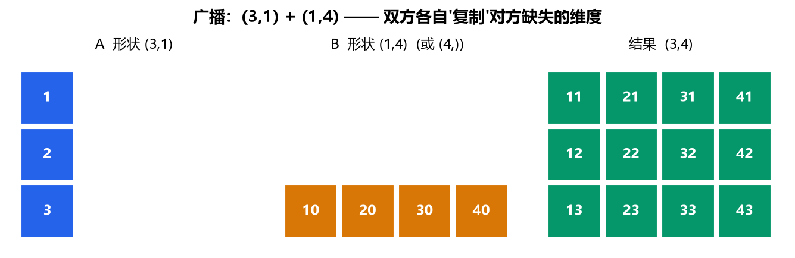

**反例 3：学习率过大——loss 变成 nan**

把 `learning_rate` 改成 `1.0`：loss 先剧烈增大，几步后变成 `nan`。
> 原因：步子太大，每次都跨过谷底到对面更高的山坡，越跳越高直到溢出。
> 修复：除以 10 再试（工程口诀：nan 先怀疑学习率，再怀疑 log(0)/除零）。

### ✅ 过关自测

**基础题**（答不出来就重读对应小节）：

1. `(8,)` 和 `(8, 1)` 是同一个东西吗？【答】不是。前者是一维向量（8 个元素），
   后者是二维矩阵（8 行 1 列），参与运算时广播行为完全不同。
2. `(2,3) + (1,3)` 为什么合法？【答】广播：第二个数组沿第 0 维复制 2 份，变成 `(2,3)`。
3. 训练四步循环是哪四步？【答】前向 → 算损失 → 反向（求梯度）→ 更新参数。

**挑战题**（没有标准答案，做完算进阶）：

1. 用**数值微分**（有限差分 `(f(x+h)-f(x-h)) / 2h`）验证你手推的梯度公式，误差应在 1e-6 量级。
2. 把 sigmoid 换成 tanh，重新手推一遍梯度，体会链式法则怎么处理更深的复合。

**过关标准**：合上手册，能在白纸上独立完成一次"前向 → 损失 → 链式法则求导"的推导，
并跑通脚本看到损失曲面图。

### 📚 延伸阅读

- 3Blue1Brown《神经网络》系列第 1-4 集：梯度的可视化讲解，全网最佳直觉材料
- Chollet《Deep Learning with Python (2nd)》第 2 章：Keras 之父对"张量"的讲法
- NumPy 官方文档 *Broadcasting* 一节：广播规则的完整表格

---

## 2. 第 02 章 —— 用 Keras 写第一个模型

**目标：** 学会 `tf.keras.Sequential` / `Dense` / `compile` / `fit`。

```python
from tensorflow.keras import layers, models
model = models.Sequential([layers.Input(shape=(1,)), layers.Dense(1)])
model.compile(optimizer="sgd", loss="mse")
model.fit(x, y, epochs=30)
```

常见坑：

- `input_shape` 是单个样本的形状，不要写 `(N, 1)`。
- 回归任务的最后一层**不要**加激活函数（让网络学线性映射）。

练习：把 `make_synthetic_regression(noise=...)` 的 noise 调到 0.5，观察 loss 曲线。

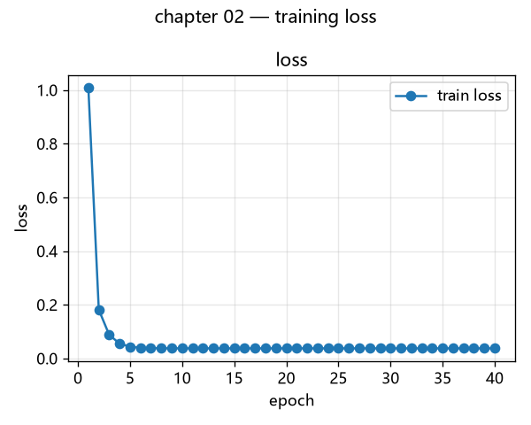

---

### 🧠 直觉理解

#### Keras：深度学习的"乐高套装"

如果你玩过乐高，就知道有两种玩法：

1. **从零搭**：从最小的积木开始，一块一块拼。这就像用纯 NumPy 手写神经网络（第 1 章的做法）。
2. **用预制件**：乐高有很多"预制件"——预制的墙、预制的屋顶，直接拼起来就行。这就是 Keras。

`Dense` 层就是一个"预制的全连接层"，你只要告诉它"输出多少个神经元"，它内部会自动创建权重和偏置，帮你搞定矩阵乘法和加法。`Sequential` 就是把这些层按顺序串起来的"底座"。

#### compile：告诉模型"怎么学"

`compile` 这一步就像在告诉学生：

- 用什么**教材**（优化器 optimizer）——SGD 是笨办法，Adam 是聪明办法
- 用什么**评分标准**（损失函数 loss）——MSE 适合回归，交叉熵适合分类
- 额外关注什么**指标**（metrics）——比如准确率 accuracy

不 compile 就直接 fit？就像老师没说考试范围和评分标准，学生不知道怎么学。

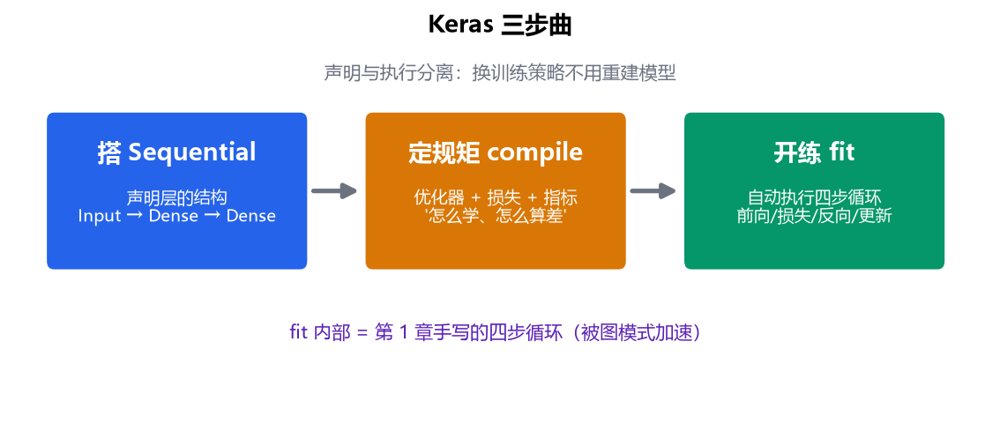

#### fit：开始学习

`fit` 就是"开始训练"的按钮。你把数据（x, y）扔进去，告诉它学几遍（epochs），它就自动帮你完成"前向 → 算损失 → 反向 → 更新"的循环，直到学完所有轮次。

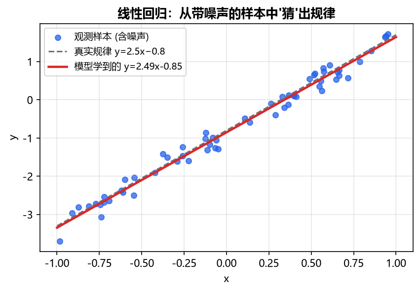

### 📌 核心概念

- [**Keras**](glossary_zh.md#keras)：TensorFlow 的高层 API，让建模更简单
- [**多层感知机 (MLP)**](glossary_zh.md#多层感知机-mlp-multi-layer-perceptron)：全连接层堆叠成的网络
- [**损失函数 (Loss Function)**](glossary_zh.md#损失函数-loss-function)：衡量预测和真实值差距的函数
- [**优化器 (Optimizer)**](glossary_zh.md#优化器-optimizer)：根据梯度更新参数的算法
- [**轮次 (Epoch)**](glossary_zh.md#轮次-epoch)：所有训练数据被完整过一遍的单位

### ✋ 动手试一试

1. **加一层隐藏层**：把模型从单层 `Dense(1)` 改成两层：
   ```python
   model = models.Sequential([
       layers.Input(shape=(1,)),
       layers.Dense(64, activation='relu'),
       layers.Dense(1)
   ])
   ```
   观察 loss 下降得更快还是更慢？模型变"深"了之后，拟合能力变强了吗？

2. **换优化器**：把 `optimizer="sgd"` 换成 `optimizer="adam"`，同样训练 30 个 epoch，比较最终 loss。
   - Adam 通常比 SGD 收敛更快，你观察到了吗？

3. **增加数据噪音**：把 `noise` 从 0.1 调到 0.5，再调到 1.0，看看训练后的模型在测试集上的表现。
   - 噪音越大，模型越难拟合，这正常吗？为什么？

### ⚠️ 常见坑

1. **input_shape 写错了**：`input_shape` 是**单个样本**的形状，不是整个数据集的形状。比如每个样本是 1 个数字，就写 `shape=(1,)`，不要写 `shape=(100, 1)`。
2. **回归任务加了 sigmoid**：sigmoid 会把输出限制在 0 到 1 之间，如果你的目标值范围更大（比如房价预测），最后一层千万不要加激活函数。
3. **忘了归一化输入**：如果输入 x 的数值很大（比如 1000 以上），训练会很不稳定。习惯上要把输入归一化到 0~1 或 -1~1 之间。
4. **epochs 太少就下结论**：有时候模型只是还没收敛，不是模型不行。先把 epochs 调大看看趋势，再判断模型够不够用。


### 📍 你在哪里

```
 [第1章] 拆开黑盒 ──► [第2章] 装回工具 ──► [第3章] 第一次实战
   你在这里 ─────────────┘
```

- **从已知出发**：上一章你亲手完成了"前向→损失→反向→更新"，每一步都要自己写。
  本章把这些机械劳动全部交给 Keras，你只负责三步：**搭（Sequential）→ 定规矩（compile）→ 开练（fit）**。
- **为什么这么走**：工具的意义不是"更高级"，而是把你从重复劳动中解放出来，
  去思考模型结构和数据——这两样才是后面真正难的东西。
- **下章预告**：工具会用了，接下来喂给它第一份真实数据（MNIST）。

### 🔍 为什么这样设计

**为什么 Keras 把训练拆成 compile 和 fit 两步？** `compile` 声明"怎么学"
（优化器、损失函数、指标），`fit` 执行"去学"。声明与执行分离的好处：
同一个模型可以换一套学习策略重新 `fit` 而不重建模型；换模型结构也不用动训练配置。
如果合成一步，每次调学习率都得从头搭模型——你会立刻怀念两步设计。

**为什么回归任务的输出层不加激活函数？** 线性输出才能覆盖任意实数范围。
加了 sigmoid，预测值被硬压进 (0,1)——预测房价 500 万的任务直接报废。
（这正是下面反例 2 的内容：**不报错，但全错**。）

**为什么 `fit` 默认每个 epoch 打乱数据？** 如果同类样本都堆在数据尾部，
最后几个 batch 的梯度会系统性偏向那一类，训练不稳定。打乱让每个 batch
近似独立同分布——这也是为什么 `shuffle=False` 在分类任务里是危险操作。

### ❌ 反例教室

**反例 1：`input_shape` 写成整个数据集的形状**

- **现象**：
  ```python
  layers.Input(shape=(100, 1))   # ❌ 100 是样本数！
  # ValueError: Input 0 of layer "dense" is incompatible with the layer:
  # expected shape=(None, 1), found shape=(None, 100, 1)
  ```
- **原因**：`input_shape` 描述的是**单个样本**的形状，不是数据集的形状。
- **修复**：改为 `shape=(1,)`。
- **一句话教训**：报错信息里给出的两个 shape，就是你要核对的两个维度。

**反例 2：回归任务加了 sigmoid——沉默的全错**

- **现象**：训练正常、loss 下降，但预测值永远挤在 0~1 之间——
  目标是房价（几百万）时，模型"学"到的最好策略就是恒输出 1。
- **原因**：sigmoid 把输出硬压进 (0,1)，回归任务需要的却是任意实数。
- **修复**：输出层不加激活函数。
- **一句话教训**：**不崩但全错的 silent bug 最危险**——回归输出层永远别加激活。

### ✅ 过关自测

**基础题**：

1. `compile` 的三要素是什么？【答】优化器（怎么更新）、损失函数（怎么算差）、
   metrics（额外关注什么）。
2. epoch 和 batch size 什么关系？【答】epoch = 全部数据过一遍；
   batch size = 每次梯度更新用多少样本；一个 epoch 有 `样本数/batch_size` 次更新。
3. 隐藏层加 `relu` 是为了什么？【答】引入非线性——没有它，一百层 Dense 等价于一层线性变换。

**挑战题**：

1. 用 `tf.GradientTape` 手写训练循环，复现本章 `fit` 的结果——这就是把第 1 章和第 2 章接起来的桥。
2. 用 Keras 的函数式 API（`models.Model(inputs, outputs)`）重写本章模型，体会它和 Sequential 的分工
   （Sequential 只能串直线，函数式可以分叉、合并）。

**过关标准**：合上手册，能从空白文件默写出"搭 → compile → fit"三步并跑通；
能说出每一步分别对应第 1 章四步循环中的哪几步。

### 📎 选读：更多反例（初读可跳过）

**反例 3：忘 compile 直接 fit**

- **现象**：
  ```python
  model.fit(x, y)   # ❌ RuntimeError: You must compile your model before ...
  ```
- **原因**：模型还不知道"怎么学"（优化器/损失都没定），无法开始训练。
- **修复**：先 `model.compile(...)` 再 `fit`。
- **一句话教训**：Keras 的报错会直接告诉你缺什么——**学会读报错，比背 API 更重要**。


### 📚 延伸阅读

- Chollet《Deep Learning with Python (2nd)》第 3 章：Keras 作者亲讲 API 设计哲学
- TensorFlow 官方 *Keras quickstart*：十分钟过一遍核心 API
- 手册第 10 章 10.5 节：优化器 SGD/Adam/AdamW 怎么选

---

## 3. 第 03 章 —— MLP 分类 MNIST

**目标：** 把数据 reshape → normalize → 喂入 `Dense`，理解"展平 + 全连接"为何对 28×28 足够。

阅读要点：

- `build_mlp` 是一个可复用函数 (`src/tf2tutorial/models.py`)，其它章节也可以调用。
- `validation_split=0.1` 表示从训练集中切 10% 做验证，**测试集**始终是独立的 `x_test`。
- 训练完会保存 `figures/chapter03_history.png`，可直接放进实验报告。

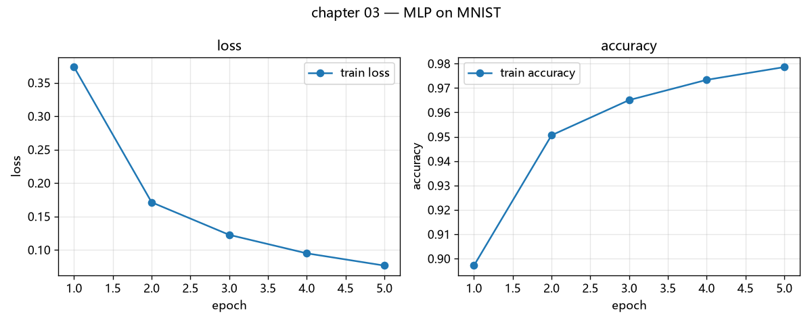

练习：尝试 `hidden=(256, 128)`，观察是否过拟合。

---

### 🧠 直觉理解

#### MNIST：深度学习的"Hello World"

MNIST 是手写数字数据集——6 万张 28×28 的灰度图片，每张写着 0 到 9 中的一个数字。它就像编程界的 "Hello World"，是每个深度学习初学者的必经之路。

为什么用 MNIST？因为它**足够简单又足够有趣**：
- 简单：图片小（28×28）、类别少（10 类）、CPU 就能跑
- 有趣：这是你第一次让电脑"看懂"图片，很有成就感

#### 图片怎么"喂"给全连接层？

全连接层（Dense）吃的是**一维向量**，但图片是二维的（28×28）。怎么办？

很简单——**摊平**。就像把一张二维的地毯卷成一条一维的绳子：

```
28×28 的图片 → 展平 → 784 维的向量 → Dense 层
```

`layers.Flatten()` 就是干这个的。它不改变数据，只是把形状从 `(28, 28)` 变成 `(784,)`。

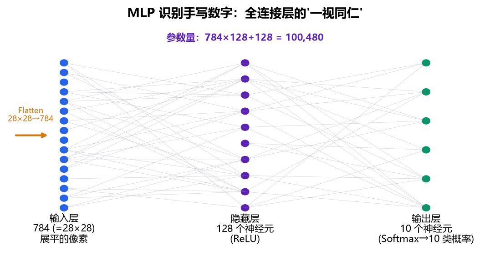

> **思考题**：展平之后，图片的空间信息（比如"这个像素在左上角"）丢失了吗？全连接层知道两个相邻像素是邻居吗？
>
> 答案是：不知道。全连接层把所有像素一视同仁，它不知道谁和谁相邻。这就是为什么处理图片要用 CNN（第 4 章）——CNN 能利用空间结构。

#### 分类 vs 回归：输出层不一样

第 2 章是回归任务（预测一个连续值），输出层就是 `Dense(1)`，不加激活函数。

这一章是分类任务（预测属于 10 个类别中的哪一个），输出层要变：

- 输出 **10 个神经元**（对应 10 个类别）
- 加 **softmax 激活函数**，把输出变成概率分布（10 个数加起来等于 1）

```python
layers.Dense(10, activation='softmax')
```

对应的损失函数也要换：从 MSE 换成**交叉熵**（categorical crossentropy）。你可以把交叉熵理解为"两个概率分布之间的距离"——预测分布越接近真实分布，损失越小。

### 📌 核心概念

- [**Softmax**](glossary_zh.md#softmax)：把输出变成概率分布的激活函数
- [**验证集 (Validation Set)**](glossary_zh.md#验证集-validation-set)：训练时用来调参的独立数据
- [**过拟合 (Overfitting)**](glossary_zh.md#过拟合-overfitting)：训练集表现好但测试集表现差
- [**激活函数 (Activation Function)**](glossary_zh.md#激活函数-activation-function)：给网络引入非线性的函数
- [**权重 (Weight)**](glossary_zh.md#权重-weight)：神经网络的可学习参数

### ✋ 动手试一试

1. **改变隐藏层大小**：试试 `hidden=(32,)` 和 `hidden=(512, 256, 128)`，比较训练准确率、验证准确率、参数数量。
   - 模型越大越容易过拟合，你看到这种趋势了吗？

2. **去掉归一化**：把 `x_train / 255.0` 改成直接用 `x_train`（0~255 的原始像素值），看看训练还能不能收敛。
   - 为什么不归一化就训练不好？（提示：想想梯度的大小和学习率的关系）

3. **换激活函数**：把所有 `relu` 换成 `sigmoid`，观察训练速度和最终准确率。
   - ReLU 为什么比 sigmoid 更常用？（提示：深层网络中 sigmoid 容易导致梯度消失）

### ⚠️ 常见坑

1. **标签格式和损失函数不匹配**：
   - 如果标签是整数（比如 `5`），用 `sparse_categorical_crossentropy`
   - 如果标签是 one-hot（比如 `[0,0,0,0,0,1,0,0,0,0]`），用 `categorical_crossentropy`
   - 搞混了就会报错或者准确率一直很低。

2. **忘记归一化像素值**：图片像素值通常是 0~255，直接喂给网络会导致训练不稳定。一定要除以 255 归一化到 0~1。

3. **把测试集当验证集用**：测试集是"最终考试"，只能用一次。调参的时候只能用验证集，不能偷看测试集，否则就是作弊。

4. **Flatten 的位置不对**：Flatten 应该在第一个 Dense 层之前，把图片展平成向量。如果放在后面就没意义了。


### 📍 你在哪里

```
 [第2章] 装回工具 ──► [第3章] 第一次完整实战 ──► [第4章] 换更强的网络
   你在这里 ─────────────┘
```

- **从已知出发**：第 2 章的三步曲，这次要喂真实数据（6 万张手写数字），
  并第一次正经地把数据分成**训练 / 验证 / 测试**三份。
- **为什么这么走**：MNIST 是"简单到不会失败、完整到没有偷工减料"的任务——
  数据管道、训练、评估、保存曲线，一个不少。以后任何新任务，都按这个模板套。
- **下章预告**：MLP 在 MNIST 上能到 96%+，但换到 CIFAR-10 就露馅了——
  为什么？带着这个问题进第 4 章。

### 🔍 为什么这样设计

**为什么验证集切 10%？** 6 万张的 10% = 6000 张，对 10 个类别平均每类 600 张，
验证指标足够平稳；切太少（比如 1%）验证准确率会剧烈抖动，没法用来判断调参效果。

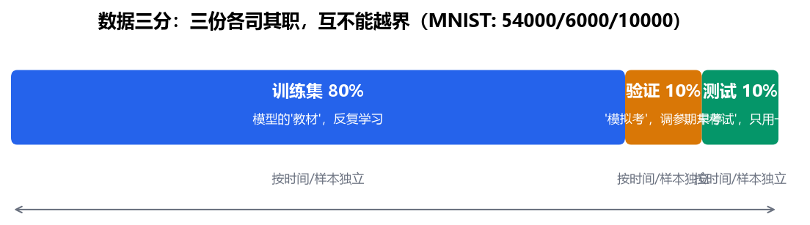

**为什么用 `sparse_categorical_crossentropy`？** 因为标签是 0~9 的整数。
它和 `categorical_crossentropy` 只差在标签格式（整数 vs one-hot 向量），
用前者省掉一步 one-hot 变换，也省 10 倍标签内存。**选哪个只取决于标签长什么样**——
这是初学者最容易搞混的点（见反例 2）。

**为什么 28×28 的手写数字"MLP 足够"？** 数字识别对空间结构的要求不高——
"圈"和"竖线"的位置组合基本决定类别，展平后的 784 维向量保留了足够信息。
但天花板就在 97~98% 附近：MLP 永远学不到"相邻像素"这个概念。
第 4 章的 CNN 专门解决这个。

### ❌ 反例教室

**反例 1：忘记除以 255——沉默的失败**

```python
model.fit(x_train, y_train, ...)   # ❌ x 是 0~255 的原始像素
```
不报错，但 loss 几乎不降：大数值输入让梯度忽大忽小，SGD 步子永远调不准。
**"不报错但不收敛"优先检查归一化。**

**反例 2：标签格式和损失函数不匹配**

```python
model.compile(loss='sparse_categorical_crossentropy')
model.fit(x, y_onehot)   # ❌ one-hot 标签配 sparse 损失
# 报 shape 错误，或准确率卡在 10%（随机水平）——取决于版本
```
> 修复：整数标签 ↔ `sparse_`；one-hot 标签 ↔ 不带 sparse 的。
> 准确率恰好等于"类别数的倒数"时，第一反应就该查这里。

**反例 3：用测试集调参——流程级反例**

"验证集 acc 60%，试一下 learning_rate=0.5，测试集 acc 涨到 70%，再调……"
最后测试集 acc 90% 写进报告——**这个 90% 是假的**：你实际上用测试集训练了你的超参数，
它已经不再是"没见过的数据"。修复：调参只看验证集；测试集只在报告前碰一次。

### ✅ 过关自测

**基础题**：

1. `Dense(128)` 接在 784 维输入后，参数量是多少？【答】784×128 + 128 = 100,480
   （权重矩阵 + 偏置，会算了你就能估算任意网络的规模）。
2. softmax 输出的 10 个数有什么性质？【答】非负、总和为 1——一个合法的概率分布。
3. 验证集和测试集各干什么用？能互换吗？【答】验证集用来调参（可以反复用），
   测试集只做最终评估（只能用一次）；互换会让"期末考试"泄题。

**挑战题**：

1. 把 hidden 层加大到 `(512, 256)`，观察训练 acc 和验证 acc 的差距（gap）——这就是过拟合的直观样子。
2. 计算混淆矩阵（第 4 章脚本里有现成画法），找出最容易被混淆的数字对，想想为什么是它们。

**过关标准**：跑通脚本并保存训练曲线；不看资料说清三份数据的分工；
算对上面参数量那道题。

### 📚 延伸阅读

- 3Blue1Brown《神经网络》第 2 集：梯度下降的动画直觉
- Chollet《Deep Learning with Python (2nd)》第 2 章末：MNIST 完整案例（本书的"原型"）
- `src/tf2tutorial/models.py`：本章用的 `build_mlp` 就来自它——读一遍，体会"章节脚本调库，不重复造轮子"

---

## 4. 第 04 章 —— CNN 入门 (CIFAR-10)

**目标：** 第一次接触 `Conv2D` / `MaxPooling2D` / `Dropout`。

为什么 CNN 比 MLP 强？

- **局部感受野**：3×3 卷积天然适配"邻域像素相关"；
- **权值共享**：一个 3×3 卷积核滑过整张图，参数远少于 `Dense(3072, ...)`；
- **池化降采样**：让模型获得平移不变性。

本节使用 `build_cnn` (`VGG-style` 小网络)。本机 CPU 实测 5 个 epoch 约 93 秒、
测试准确率 72.6%；首次运行还要下载 CIFAR-10（约 170 MB，耗时取决于网络）。
想先看流程可把 `EPOCHS = 1` 跑一遍。

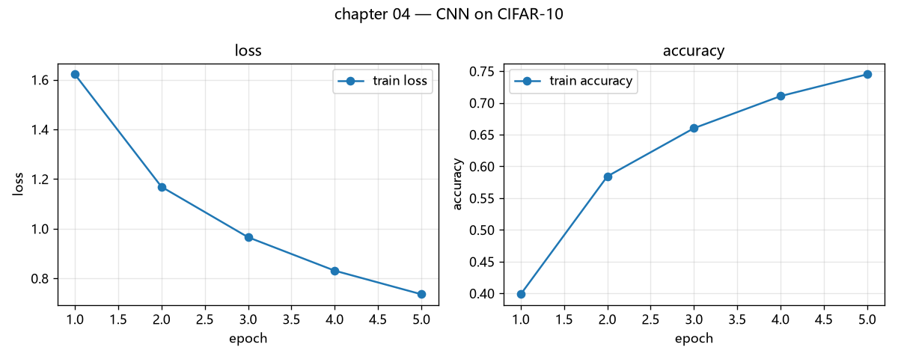
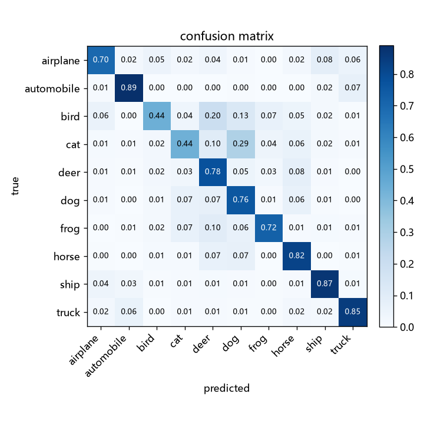

> 📖 **读图指南**：行 = 真实类别，列 = 预测类别；**对角线颜色越深 = 该类分得越准**，
> 非对角线的亮块 = 最容易混淆的类别对。黑白打印时看格中数字（行归一化比例）。

---

### 🧠 直觉理解

#### 为什么 MLP 处理图片不够好？

想象你要认一张人脸照片。如果用 MLP，你把所有像素摊平成一串数字——左眼的像素和右脚的像素在网络看来没什么区别，它不知道"眼睛在脸的上部、对称分布"这种空间规律。

CNN（卷积神经网络）就不一样了。它的设计灵感来自**视觉皮层**——大脑里处理视觉的神经元也是"局部响应"的，每个神经元只看一小片区域。

#### 卷积：用"小放大镜"扫遍整张图

想象你有一个 3×3 的小放大镜（叫**卷积核**或**滤波器**），你把它放在图片的左上角，透过放大镜看到 9 个像素，把它们"揉成一个数字"（加权求和）。然后把放大镜往右挪一格，再揉成一个数字……一直挪到右下角，你就得到了一张新的"图片"——叫**特征图**。

这个放大镜的作用是什么？它是一个**特征探测器**。比如：
- 有的卷积核专门找"竖直边缘"——左边亮右边暗的地方它就响
- 有的专门找"水平边缘"——上边亮下边暗的地方它就响
- 有的专门找"角落"——横竖边缘交汇的地方它就响

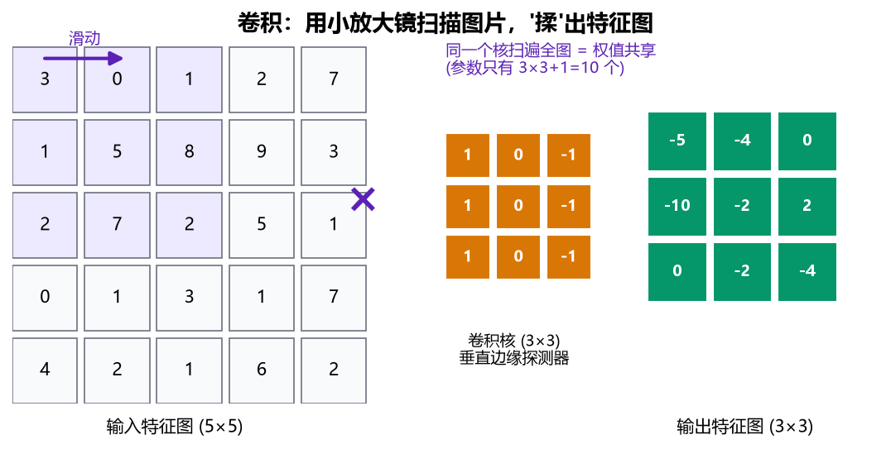

第一层卷积找低级特征（边缘、纹理），第二层卷积在第一层的基础上找中级特征（眼睛、鼻子），再深层找高级特征（整张脸、整只猫）。**层层递进，由简到繁**——这就是深度学习的"深"的意义。

#### 权值共享：参数少了，效果好了

一个卷积核（3×3 = 9 个参数 + 1 个偏置 = 10 个参数）在整张图上滑动，**走到哪儿都用同一套参数**。这叫**权值共享**。

好处是什么？
1. **参数少**：一个卷积核只有 10 个参数，却能处理整张图。对比一下：如果图片是 32×32×3，用 Dense 层输出 32 个通道，需要 32×32×3×32 = 98304 个参数！
2. **泛化好**：因为同一个特征探测器在整张图上都用，所以不管猫在图片左边还是右边，卷积核都能认出来——这叫**平移不变性**。

#### 池化：缩小图片，保留重点

池化就是"缩略图"——把 2×2 的 4 个像素变成 1 个（取最大值叫 MaxPooling，取平均值叫 AveragePooling）。图片尺寸减半，信息密度提高了。

为什么要池化？
1. **降计算量**：图片变小了，后面层的参数和计算量都减少
2. **增感受野**：越往后，每个神经元"看到"的原图范围越大
3. **抗抖动**：稍微平移一点的图片，池化后的结果差不多——增强了鲁棒性

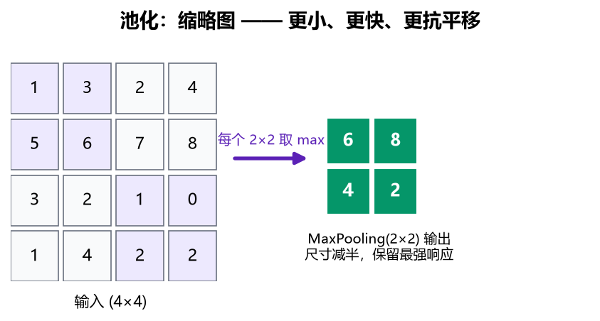

#### Dropout：随机"闭麦"，防止过拟合

训练的时候，每次迭代随机关掉一部分神经元（比如 50%），让它们不参与计算。测试的时候所有神经元都正常工作。

为什么这么做？直觉上，这强迫网络**不要依赖某几个特定的神经元**，而要让每个神经元都学到有用的特征。就像团队合作——如果每个人都能独当一面，团队整体就更稳健。

### 📌 核心概念

- [**卷积 (Convolution)**](glossary_zh.md#卷积-convolution)：用卷积核在输入上滑动提取局部特征
- [**池化 (Pooling)**](glossary_zh.md#池化-pooling)：对特征图降采样，减小尺寸
- [**Dropout**](glossary_zh.md#dropout)：随机失活，防止过拟合的正则化技术
- [**过拟合 (Overfitting)**](glossary_zh.md#过拟合-overfitting)：训练好但测试差的现象
- [**正则化 (Regularization)**](glossary_zh.md#正则化-regularization)：防止过拟合的各种手段

### ✋ 动手试一试

1. **增减卷积层**：试试去掉一个卷积块（Conv+Conv+Pool），或者再加一个卷积块，观察准确率和训练时间的变化。
   - 模型越深越好吗？什么时候开始收益递减？

2. **改卷积核大小**：把 3×3 的卷积核换成 5×5，或者 1×1，比较参数数量和准确率。
   - 1×1 卷积有什么用？（提示：它可以改变通道数，不改变空间尺寸）

3. **调 Dropout 比率**：把 Dropout 从 0.25 调到 0（不用 Dropout），再调到 0.5，观察训练集和验证集准确率的差距。
   - Dropout 越大，正则化效果越强吗？训练会变慢吗？

### ⚠️ 常见坑

1. **输入形状不对**：CNN 的输入是 4 维的 `(batch, height, width, channels)`。如果你忘了通道维度，shape 会不对。灰度图是 1 通道，彩色图是 3 通道。

2. **卷积后尺寸算错**：卷积和池化都会改变特征图的尺寸。如果网络太深、池化太多，特征图可能变成 0×0，直接报错。
   - 公式：输出尺寸 = (输入尺寸 - 核大小 + 2×padding) / stride + 1
   - 简单记法：`padding='same'` 时尺寸不变，MaxPooling(2,2) 尺寸减半。

3. **CPU 上跑 CNN 太慢**：CIFAR-10 + CNN 在 CPU 上训练一个 epoch 可能要 1-2 分钟。先把 epochs 设小一点（比如 1-2）确认能跑通，再增加 epoch 数。

4. **把 Dropout 放在测试模式用**：Keras 的 `model.fit()` 自动处理训练/测试模式的切换，不用担心。但如果你自己写训练循环，别忘了用 `training=True/False` 参数。


### 📍 你在哪里

```
 [第3章] MLP 的天花板 ──► [第4章] 引入空间结构 ──► [第5章] 换一种数据
   你在这里 ─────────────┘
```

- **从已知出发**：第 3 章结尾的问题——全连接层不知道像素相邻——本章用两个新设计回答：
  **局部感受野**（每个神经元只看一小块）+ **权值共享**（同一个探测器扫全图）。
- **为什么这么走**：CNN 不是"更高级的全连接"，而是**针对图片结构的特化**。
  学完本章你会获得一个重要视角：网络结构 = 对数据结构做出的假设，假设越贴合，效率越高。
- **下章预告**：把同样的思想搬到文本上，你会发现"结构假设决定网络形态"再次成立。

### 🔍 为什么这样设计

**为什么用两层 3×3 而不是一层 5×5？** 同样的感受野（5×5），两层 3×3 参数更少
（18 个 vs 25 个），还多了一次非线性激活，表达能力更强。这是 VGG 时代定下的
经典权衡，一直沿用至今。

**为什么池化取 max 而不是 average？** max 回答"这个区域有没有这个特征"（取最强响应），
对"特征稍微移动了一点"天然鲁棒；average 会稀释强响应。特征检测场景 max 更合理。

**为什么 Dropout 只加在分类头、卷积层后面不加？** 卷积层本身参数就因权值共享而很少，
过拟合风险集中在参数最多的全连接头；对卷积层做 Dropout 还会破坏相邻像素的联合特征。
正则化要"打在哪最疼"，不是"到处乱打"。

**为什么 `padding='same'`？** 让"卷积不改变尺寸、池化恰好减半"成为固定规律，
网络设计变成纯机械劳动（见自测题），不用每层都算边界公式。

### ❌ 反例教室

**反例 1：池化次数太多——网络深度被输入尺寸锁死**

- **现象**：
  ```
  32 -> 16 -> 8 -> 4 -> 2 -> 1 -> 再池化?  ❌ ValueError: Negative dimension size
  ```
- **原因**：每池化一次尺寸减半，减到 1 之后没有"半个像素"可池化。
- **修复**：减少池化次数，或提高输入分辨率。
- **一句话教训**：**网络能多深受输入尺寸限制**——CIFAR-10（32×32）最多池化 5 次。

**反例 4：同样的第一层，Conv vs Dense 参数量对比**

- **现象**：
  ```
  Dense(32)，输入 32×32×3=3072：  3072×32+32  ≈  98,336 个参数
  Conv2D(32, 3×3)，输入 32×32×3：  3×3×3×32+32 =     896 个参数
  ```
- **原因**：卷积核在整张图上**权值共享**，参数只跟核大小有关，与图像尺寸无关。
- **启示**：效果相近时，参数少 110 倍的方案训练更快、更不容易过拟合。
- **一句话教训**：**处理网格状数据，先想卷积**——这是 CNN 能做大的根本原因。

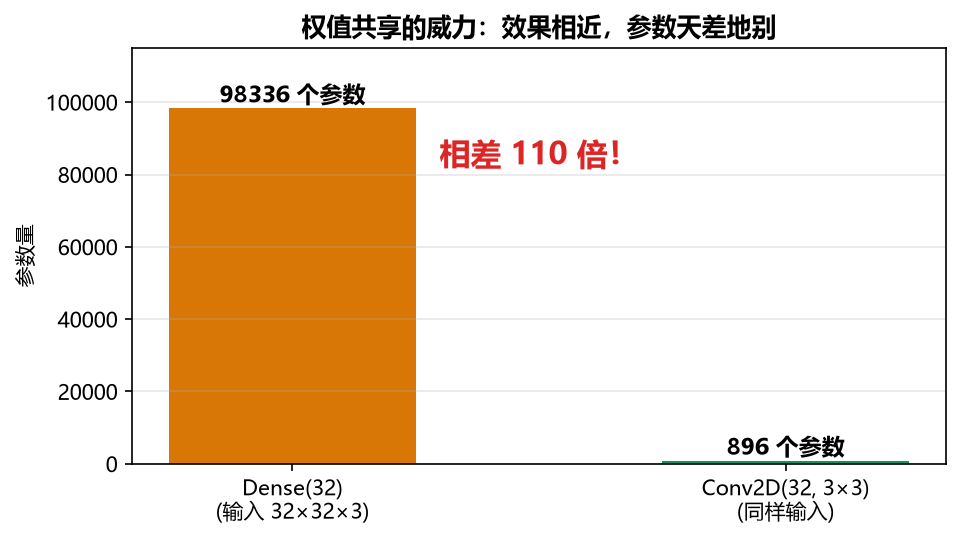

### ✅ 过关自测

**基础题**：

1. `(32,32,3)` 经 `Conv2D(16, 3, padding='same')` 后 shape 是？再经 `MaxPooling2D(2)` 后呢？
   【答】`(32,32,16)` → `(16,16,16)`。same 卷积不变尺寸，池化减半。
2. 卷积核 3×3、输入 3 通道、输出 16 通道，参数量？【答】3×3×3×16 + 16 = 448。
3. Dropout 训练时开、推理时关，Keras 里谁负责切换？【答】`model.fit`/`model(x, training=...)`
   自动处理；自己写训练循环才需要显式传 `training=True/False`。

**挑战题**：

1. 手画本章 `build_cnn` 的完整 shape 流（32→16→8→4→flatten→Dense），标出每层参数量——
   画完这张图，你就"拥有"了这个网络。
2. 把第一个卷积块换成 5×5 核，比较参数量、训练时间、准确率，验证"3×3 堆叠"的权衡。

**过关标准**：不看资料画出本章网络的 shape 流；
能对别人讲清"为什么 CNN 对图片比 MLP 高效"（局部性 + 权值共享 + 池化）。

### 📎 选读：更多反例（初读可跳过）

**反例 2：灰度图忘了加通道维**

- **现象**：
  ```python
  x = x.reshape(-1, 28, 28)        # ❌ 少了通道维
  # ValueError: Input 0 ... expected shape=(None, 28, 28, 1), found (None, 28, 28)
  ```
- **原因**：Conv2D 要求输入是 `(高, 宽, 通道)` 三维，灰度图也要显式补 `1`。
- **修复**：`x.reshape(-1, 28, 28, 1)`。
- **一句话教训**：CNN 的输入永远是 4 维 `(批, 高, 宽, 通道)`——把这句背下来。

**反例 3：Dropout 拉到 0.9——正则化过头的欠拟合**

- **现象**：训练 acc 都上不去，loss 高高悬着。
- **原因**：每次前向关掉九成神经元，网络每步只能学到残缺特征。
- **修复**：从 0.2 起步，出现**过拟合**才逐步加码（口诀见第 10 章 10.6）。
- **一句话教训**：正则化是"药"——剂量对了治病，剂量过了致病。


### 📚 延伸阅读

- Stanford CS231n *Convolutional Networks* 讲义：CNN 最经典的英文教材
- Chollet《Deep Learning with Python (2nd)》第 8 章：从零实现并可视化卷积
- Distill.pub *Feature Visualization*：看看卷积核"眼里"的世界
- 进阶：ResNet 论文（He et al., 2015）——残差连接如何让百层网络成为可能

---

## 5. 第 05 章 —— 文本分类 (IMDB)

**目标：** 用全连接网络对"影评正/负"二分类。

数据流：

```
IMDB 原始数据 -> 整数序列 -> one-hot 向量 (10,000 维) -> Dense -> sigmoid
```

为什么先用 one-hot 而不是 `Embedding`？

- 教学顺序：先用最朴素的方式理解"输入 = 词袋向量"；
- 想对比时，把 `src/tf2tutorial/models.py` 的 `build_text_classifier`
  （Embedding + 全局池化）换成这一层，作为本章练习。

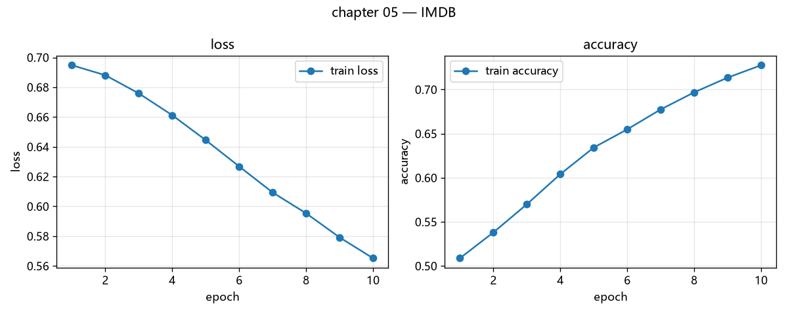

---

### 🧠 直觉理解

#### 文本怎么变成数字？

电脑不认识字，只认识数字。所以处理文本的第一步，就是**把文字翻译成数字**。

最简单的翻译方法叫 **One-Hot 词袋**（Bag of Words）：

1. 先建一个"词典"，收录最常用的 10,000 个词，每个词对应一个编号（0 到 9999）。
2. 对于每一条影评，统计"词典里的每个词出现了没有"（出现了就是 1，没出现就是 0）。
3. 这样，一条影评就变成了一个 10,000 维的 0/1 向量。

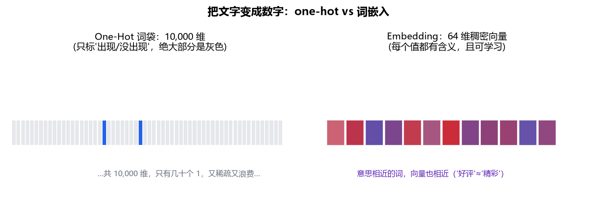

就像你填调查问卷——有 10,000 道"这个词出现了吗？"的判断题，你打勾或打叉，最后得到一张长长的答题纸。这张答题纸就是模型的输入。

> **为什么叫"词袋"？** 因为你只统计了"有哪些词"，但完全不管词的顺序。就像把一句话的所有词装进一个袋子里摇一摇，顺序全乱了，但词还在。
>
> 比如"这部电影好，不无聊"和"这部电影不好，无聊"，在词袋模型看来是完全一样的——因为词都一样，只是顺序不同。但它们的意思正好相反！
>
> 这就是词袋模型的局限性。后面你会学到 Embedding 和 RNN/Transformer，它们能捕捉词序和语义。

#### 二分类：是好评还是差评？

IMDB 任务是**二分类**——判断一条影评是正面的（好评）还是负面的（差评）。所以输出层只有 1 个神经元，用 **sigmoid 激活函数**把输出压缩到 0 到 1 之间，可以理解为"是好评的概率"。

- 输出接近 1 → 模型认为是好评
- 输出接近 0 → 模型认为是差评

对应的损失函数叫 **二元交叉熵**（binary crossentropy），原理和多分类的交叉熵类似，只是只有两个类别。

#### 为什么不用 CNN 处理文本？

其实也可以用！一维卷积（Conv1D）在文本分类上效果也不错。但文本和图片不一样：

- 图片是**二维空间结构**，像素的空间关系很重要
- 文本是**一维序列结构**，词的顺序关系很重要

处理序列数据，除了 CNN，还有更专门的武器：RNN（循环神经网络）和 Transformer。第 9 章会介绍这些方向的入门路径。

### 📌 核心概念

- [**嵌入 (Embedding)**](glossary_zh.md#嵌入-embedding)：把离散的词映射成稠密向量
- [**激活函数 (Activation Function)**](glossary_zh.md#激活函数-activation-function)：sigmoid 用于二分类输出
- [**损失函数 (Loss Function)**](glossary_zh.md#损失函数-loss-function)：二元交叉熵用于二分类
- [**过拟合 (Overfitting)**](glossary_zh.md#过拟合-overfitting)：文本任务中高维输入更容易过拟合
- [**深度学习 (Deep Learning)**](glossary_zh.md#深度学习-deep-learning)：从图像扩展到文本领域

### ✋ 动手试一试

1. **换成 Embedding 层**：把 one-hot + Dense 的结构换成 Embedding + GlobalAveragePooling1D + Dense，比较准确率、参数数量和训练速度。
   - Embedding 的输入是整数序列（每个词的编号），不是 one-hot 向量。
   - 哪种方法效果更好？为什么？

2. **改变词典大小**：把最常用词数量从 10,000 改成 2,000 或 20,000，观察模型表现的变化。
   - 词典太小会怎样？（提示：很多词被忽略，信息丢失）
   - 词典太大会怎样？（提示：输入维度太高，容易过拟合）

3. **观察哪些词最有区分度**：训练完模型后，看看第一层权重的绝对值——权重越大的词，对判断"好评/差评"越重要。
   - 你觉得哪些词会是"好评词"？哪些是"差评词"？和模型学到的一致吗？

### ⚠️ 常见坑

1. **文本预处理不一致**：训练和测试用了不同的词典（比如一个用 10,000 词，一个用 20,000 词），输入维度对不上。确保预处理逻辑一致。

2. **序列长度不一致**：如果用 Embedding 层，每条文本的长度（词数）不一样，需要 padding（补零）到相同长度才能组成 batch。Keras 的 `pad_sequences` 可以搞定。

3. **one-hot 维度爆炸**：词典一大，one-hot 向量的维度就爆炸了（比如 10 万维），又稀疏又浪费。这种情况下 Embedding 是更好的选择。

4. **忘记二分类用 sigmoid + binary_crossentropy**：二分类不是多分类，不要用 softmax + categorical_crossentropy。


### 📍 你在哪里

```
 [第4章] 图片线 ──► [第5章] 文本线 ──► [第6章] 数据不够怎么办
   你在这里 ─────────────┘
```

- **从已知出发**：前四章只处理过"矩阵长得像图片"的数据。本章证明：
  只要能把数据变成张量，**同一套训练循环原封不动**就能处理文本。
  你学到的不是"某个网络"，而是"把任何数据变成张量"的建模思维。
- **为什么这么走**：文本是和图片反差最大的数据形态（一维、离散、有序），
  用它练"举一反三"最有效。
- **下章预告**：图片和文本都会了，下一个现实问题浮出水面——数据太少怎么办？

### 🔍 为什么这样设计

**为什么教学先用 one-hot 词袋而不是 Embedding？** 词袋是"能跑通的最简单基线"：
没有词序、没有可学参数、完全可解释。先跑通基线，再换 Embedding 对比
（见动手试一试），你才能量化地说出 Embedding 到底好在哪——
而不是人云亦云地"听说 Embedding 高级"。

**为什么花大篇幅讲词袋的局限（丢词序）？** "这部电影好，不无聊" vs
"这部电影不好，无聊"——词袋看来完全相同，意思却相反。这不是顺带的吐槽，
而是为 RNN / Transformer **预埋的动机**：等你以后学序列模型时，会想起这个例子。

**为什么词典取 10,000 词？** 覆盖日常文本的绝大部分词 + 控制维度。
低频词（人名、错字）对情感判断贡献极小，全收进来的代价是维度爆炸和过拟合。

### ❌ 反例教室

**反例 1：训练/测试用了不同的词典**

```python
x_train = vectorize(train_seqs, dimension=10000)
x_test  = vectorize(test_seqs,  dimension=20000)   # ❌ 维度对不上
# ValueError: matmul: Input operand dimensions... / incompatible shapes
```
> 教训：预处理逻辑必须**一份代码、两处调用**，而不是各写一遍。

**反例 2：词编号越界喂 Embedding**

```python
Embedding(vocab_size=10000)
model(np.array([[1, 5, 99999]]))   # ❌ InvalidArgumentError: indices out of range
```
> 原因：编号必须 < vocab_size。数据里漏过滤生僻词就会踩雷。

**反例 3：二分类用了 softmax + categorical_crossentropy**

```python
layers.Dense(1, activation='softmax')   # ❌ 1 个神经元做 softmax 毫无意义
```
轻则效果差，重则报形状错误。**分类任务三件套必须配套**：
二分类 = sigmoid + binary_crossentropy + 单神经元；
多分类 = softmax + categorical_crossentropy + 类别数个神经元。

### ✅ 过关自测

**基础题**：

1. 词袋模型丢掉了文本的什么信息？代价是什么？【答】词序。"狗咬人"和"人咬狗"
   变成同一个向量——大多数时候够用，歧义句上会翻车。
2. sigmoid 输出 0.93 代表什么？【答】模型认为这条影评是好评的概率为 93%。
3. 为什么词典越大 one-hot 越不划算？【答】向量维度 = 词典大小，10 万词就是 10 万维，
   又稀疏又费内存，而 Embedding 用 64 维稠密向量就够了。

**挑战题**：

1. 参数量对比：one-hot 方案第一层是 `10000×N`，Embedding 方案是 `10000×64`——
   分别算出 N=16 时的数值，解释为什么 Embedding 又小又强。
2. 训练完找出模型眼中"最强好评词 / 最强差评词"（看第一层权重的绝对值排序），
   检验你的直觉和模型是否一致。

**过关标准**：不看资料说清"文本 → 张量 → 分类"的三步转换；
能向别人解释词袋和 Embedding 的取舍（而不是背结论）。

### 📚 延伸阅读

- Jay Alammar *Visualizing Word Embeddings*：词向量的可视化直觉
- Chollet《Deep Learning with Python (2nd)》文本章节：从词袋到序列模型
- 手册第 9 章 9.2 节"方向二 NLP"：词袋之后的世界（RNN / Transformer 路线图）

---

## 6. 第 06 章 —— 迁移学习 (tf_flowers)

**目标：** 把 MobileNetV2 当作"通用视觉特征提取器"。

```python
base = MobileNetV2(weights="imagenet", include_top=False)
base.trainable = False         # 先冻结
# ... 训练分类头 ...
base.trainable = True           # 再微调最后 20 层
for layer in base.layers[:-20]:
    layer.trainable = False
```

如果机器性能一般，把 `IMAGE_SIZE` 降到 96 或者 `BATCH_SIZE` 降到 16。

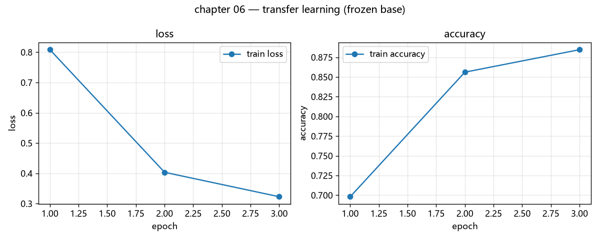
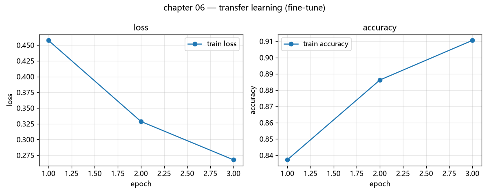

---

### 🧠 直觉理解

#### 为什么要迁移学习？

想象你要学画画：

- **从零开始学**：先学画线条、再学画形状、再学上色、再学构图……可能要学好几年才能画好一幅肖像。
- **迁移学习**：找一位已经画了几十年的大师（预训练模型），他已经掌握了所有基础技法。你只要在他的草稿上，用你自己的风格稍微改一改，很快就能画出不错的作品。

在深度学习里，"大师"就是在**超大数据集**（比如 ImageNet，有 1400 万张图、1000 个类别）上训练好的模型。它的底层已经学会了识别边缘、纹理、形状、甚至眼睛鼻子这些通用视觉特征。

当你要做一个新任务（比如花卉分类），你不需要从零开始教模型"什么是边缘"——直接把大师的底层拿来用，只训练最后几层（分类头）就行了。这就是**迁移学习**。

#### 两阶段训练：先冻住，再微调

迁移学习通常分两步走：

**第一步：冻结特征提取器，只训练分类头**
- `base.trainable = False` —— 把预训练模型的权重冻住，不让它们变
- 只训练你自己加的最后几层（比如 `Dense(128)` + `Dense(5)`）
- 这一步相当于"让分类头学会怎么用大师提取的特征"

**第二步：解冻最后几层，微调**
- 训练几轮后，分类头已经不错了
- 这时可以解冻预训练模型的最后几层（比如最后 20 层）
- 用很小的学习率继续训练，让这些层稍微调整一下，更适应你的任务
- 这一步叫 **Fine-tuning（微调）**

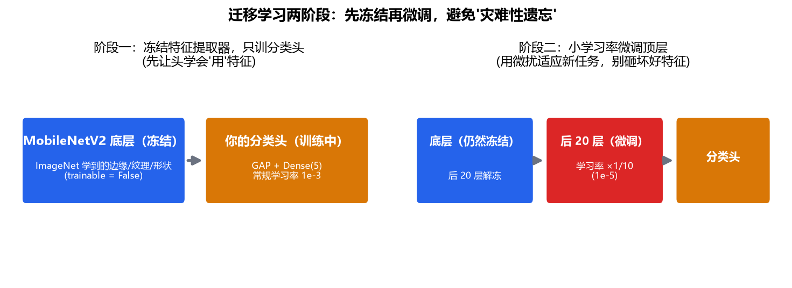

为什么不一开始就把所有层都放开训练？因为：
1. **会破坏预训练的知识**：随机初始化的分类头产生的大梯度会把底层学好的特征搞乱
2. **容易过拟合**：你的数据集可能很小，训练整个大模型容易过拟合
3. **训练慢**：整个大模型的参数太多了，训练起来慢

#### MobileNetV2：轻量级的"大师"

MobileNetV2 是 Google 设计的轻量级 CNN 架构，专门为手机等移动设备设计。它的特点是**小、快、准**：

- 小：参数只有 350 万左右（对比 VGG16 有 1.38 亿）
- 快：计算量小，手机上都能实时跑
- 准：在 ImageNet 上 top-1 准确率能到 72%

对于学习和实验来说，MobileNetV2 是一个非常好的选择——CPU 上也能在合理时间内完成迁移学习的训练。

### 📌 核心概念

- [**迁移学习 (Transfer Learning)**](glossary_zh.md#迁移学习-transfer-learning)：把预训练模型的知识用到新任务上
- [**过拟合 (Overfitting)**](glossary_zh.md#过拟合-overfitting)：小数据集上微调更容易过拟合
- [**深度学习 (Deep Learning)**](glossary_zh.md#深度学习-deep-learning)：层次化特征提取的威力
- [**卷积 (Convolution)**](glossary_zh.md#卷积-convolution)：底层卷积提取通用视觉特征
- [**正则化 (Regularization)**](glossary_zh.md#正则化-regularization)：迁移学习本身就是一种正则化

### ✋ 动手试一试

1. **试试不同的冻结层数**：试试冻结全部、冻结最后 20 层、冻结最后 50 层、完全不冻结，比较最终准确率和训练速度。
   - 冻结得多 → 训练快但可能不够准
   - 冻结得少 → 训练慢但可能更准
   - 你的数据集大小和这个选择有关系吗？

2. **换一个预训练模型**：试试 ResNet50、EfficientNetB0 等其他预训练模型，比较大小、速度和准确率。
   - Keras 内置了很多预训练模型：`tf.keras.applications.*`
   - 哪个模型的"性价比"（准确率/速度）最高？

3. **用更少的数据训练**：从 tf_flowers 里只取 10% 的数据，然后分别用迁移学习和从零训练，比较结果。
   - 数据越少，迁移学习的优势越明显，你观察到了吗？

### ⚠️ 常见坑

1. **忘记预处理方式匹配**：不同的预训练模型有不同的预处理要求。比如有的要归一化到 [-1, 1]，有的要减去 ImageNet 均值。用错了预处理，模型效果会大打折扣。
   - 正确做法：用 `tf.keras.applications.mobilenet_v2.preprocess_input` 这种配套的预处理函数。

2. **微调时学习率太大**：微调的时候学习率要比从头训练小很多（比如小 10 倍），否则会把预训练的权重搞坏。

3. **include_top 参数理解错**：`include_top=True` 表示包含最后的全连接分类层（1000 类），`include_top=False` 表示只要特征提取部分。做迁移学习一般用 `include_top=False`，然后自己加分类头。

4. **BatchNormalization 层的处理**：微调时，BatchNormalization 层要特殊处理——即使解冻了上面的层，BN 层也应该保持冻结状态（用它在 ImageNet 上学到的均值和方差）。Keras 中设置 `trainable=False` 时会自动处理，但解冻后要注意。


### 📍 你在哪里

```
 [第5章] 文本线 ──► [第6章] 数据不够怎么办 ──► [第7章] 让训练可控
   你在这里 ─────────────┘
```

- **从已知出发**：前面所有章都默认"数据管够"。真实世界常常不是——
  你手里的 flowers 数据集只有 3670 张，从零训 CNN 远远不够。
  解法不是"造数据"，而是**把别人在大数据上学到的知识搬过来**。
- **为什么这么走**：迁移学习是现实中小数据任务的**标准答案**，
  也是"预训练 + 微调"这一大模型时代核心范式的雏形。
- **下章预告**：模型越来越复杂，训练过程得装上仪表盘（回调 + TensorBoard）。

### 🔍 为什么这样设计

**为什么两阶段（先冻结后微调）而不是一步到位？** 随机初始化的分类头
最初输出的梯度又大又"瞎"，一步到位会让这些大梯度冲毁底层精心学好的特征
（术语叫**灾难性遗忘**——下面反例 1 让你亲手复现它）。先冻结训练头，
等头"懂事"了再小步放开底层，是保护预训练知识的顺序设计。

**为什么微调的学习率要小 10 倍？** 预训练权重已经在很好的位置上，
只需要**微扰**去适应新任务；大学习率等于把它踹下山重新爬。

**为什么选 MobileNetV2 而不是更大的 ResNet50？** 两条理由都务实：
教学上，CPU 几分钟能跑完，反馈快；工程上，MobileNet 系列就是为移动端设计的，
和实战 10（边缘部署）无缝衔接。**选型要考虑"后面一步"，不只看当前精度**。

**为什么 `include_top=False`？** ImageNet 的 1000 类分类头对 5 类花朵毫无用处，
搬过来还要拆掉。迁移搬的是"特征提取能力"，不是"分类结论"。

### ❌ 反例教室

**反例 1：一上来就全解冻——灾难性遗忘现场**

```python
base.trainable = True          # ❌ 从第一步就放开全部
model.compile(optimizer=Adam(1e-3), ...)
```
训练照常进行，但 val_acc 卡在 40~60%，**比冻结方案还差**。
> 原因：随机头的初始梯度把 ImageNet 学到的底层特征搅乱了。
> 修复：先 `trainable=False` 训练几轮头，再解冻、小学习率微调。

**反例 2：预处理方式和预训练模型不配套——沉默的大折扣**

```python
x = x / 255.0                   # ❌ 归一化到 [0,1]
base = MobileNetV2(...)         # 但 MobileNet 期望 [-1,1]
```
不报错，但 val_acc 可能凭空掉十几个点——每个预训练模型家族都有配套的
`preprocess_input`，**用谁的模型就用谁的预处理**。

**反例 3：微调学习率太大**

解冻后沿用 1e-3：loss 不降反升。微调用 1e-5 量级。
> 记忆口诀：**冻结训练用常规 lr，微调用它的十分之一到百分之一**。

### ✅ 过关自测

**基础题**：

1. 迁移学习"迁移"的到底是什么？【答】底层通用特征（边缘/纹理/形状）的表示能力，
   而不是某个具体任务的分类结果。
2. 为什么分类头要最后才解冻/或者说先训练？【答】让头先学会"用"特征，
   避免随机头的坏梯度污染好特征。
3. `include_top=False` 之后自己的头需要什么？【答】全局池化（把特征图变向量）
   + 按类别数配的 Dense + softmax。

**挑战题**：

1. 对比三条策略的曲线：全冻结 / 解冻最后 20 层 / 全解冻（注意各配什么学习率），
   写一段"什么情况下选哪条"的决策笔记。
2. 换 EfficientNetB0 重跑，比较参数量、时间、精度——体会"选型"这件事。

**过关标准**：不看书写出两阶段训练伪代码并解释每阶段的学习率选择；
能说出"数据量越少，越该冻结得多"的原因。

### 📚 延伸阅读

- MobileNetV2 论文（Sandler et al., 2018）：倒残差结构怎么做到又小又准
- Keras 官方 *Transfer learning & fine-tuning* 教程：本策的工业级完整版
- CS231n *Transfer Learning* 讲义：什么时候迁移有效，什么时候不如从零训

---

## 7. 第 07 章 —— 回调函数与 TensorBoard

**目标：** 让训练"可视化、可中断、可恢复"。

```python
model.fit(
    ..., callbacks=[
        TensorBoard(log_dir=...),   # 浏览器看曲线
        ModelCheckpoint(...),       # 只保留最优权重
        EarlyStopping(patience=2),  # 自动停止
        LambdaCallback(...),        # 自定义钩子
    ],
)
```

启动 TensorBoard：

```powershell
tensorboard --logdir F:\Tensorflow\output\logs
```

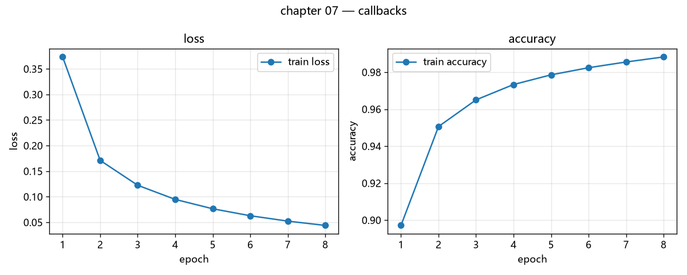

---

### 🧠 直觉理解

#### 回调函数：训练过程中的"外挂"

你在打游戏的时候，可能会开一些"外挂"——有的显示 FPS，有的自动存档，有的帮你捡东西。这些外挂不改变游戏本身，但让你玩得更舒服。

**回调函数（Callback）** 就是训练过程中的"外挂"。它在训练的特定时间点（比如每个 epoch 结束时、每个 batch 开始时）被自动调用，可以做各种有用的事情：

- 记录日志 → TensorBoard
- 保存模型 → ModelCheckpoint
- 提前停止 → EarlyStopping
- 调整学习率 → ReduceLROnPlateau
- 你自己想做的任何事 → LambdaCallback / 自定义 Callback

Keras 内置了很多常用的回调函数，你也可以自己写。

#### TensorBoard：训练的"仪表盘"

训练一个模型可能要跑几小时甚至几天。你不能一直盯着终端看输出吧？你需要一个**仪表盘**，实时显示：

- **loss 曲线**：训练 loss 和验证 loss 下降得怎么样了？
- **准确率曲线**：训练 acc 和验证 acc 上升了吗？
- **参数分布**：权重和梯度的分布正常吗？有没有梯度消失/爆炸？
- **计算图**：模型长什么样？
- **嵌入可视化**：高维向量降维后长什么样？

TensorBoard 就是这个仪表盘。它从日志文件里读取数据，在浏览器里画出漂亮的交互式图表。你可以同时对比多次实验的曲线，一目了然。

#### EarlyStopping + ModelCheckpoint：防呆组合

训练时最尴尬的事情是什么？——跑了一晚上，早上起来发现模型早就过拟合了，最后一轮的权重反而是最差的。

**EarlyStopping** 帮你自动止损：监控验证集 loss，如果连续几轮（`patience` 参数）都没改善，就自动停止训练，省得白跑。

**ModelCheckpoint** 帮你自动存档：每轮都保存一下权重，但只保留验证集 loss 最低的那次（`save_best_only=True`）。这样即使后来过拟合了，你手里还有最好的那轮的权重。

这两个回调搭配使用，就是"无脑训练"的秘诀——开跑之后不用管，回来直接拿最优模型就行。

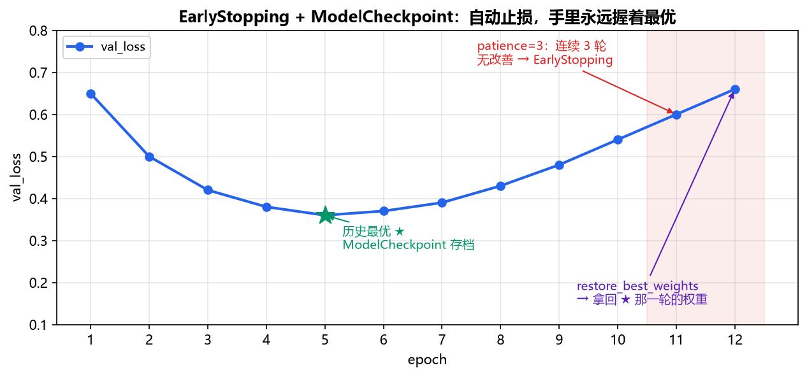

### 📌 核心概念

- 回调函数（Callback）：在训练特定节点执行自定义操作的机制
- TensorBoard：TensorFlow 官方的可视化工具
- EarlyStopping：根据验证集表现自动停止训练
- ModelCheckpoint：训练过程中自动保存最优模型
- 学习率调度（Learning Rate Scheduling）：训练过程中动态调整学习率

> 以上术语详见 [术语表](glossary_zh.md)

### ✋ 动手试一试

1. **试试 EarlyStopping 的 patience 参数**：把 patience 设成 1、3、5，分别训练，看看训练多少轮就停了、最优结果有什么区别。
   - patience 太小 → 可能还没开始学就停了（早停）
   - patience 太大 → 可能过拟合了还在跑（浪费时间）
   - 你觉得设多少比较合适？

2. **用 TensorBoard 对比多次实验**：跑两次实验（比如一次用 Dropout，一次不用），把日志存在不同目录，然后在 TensorBoard 里同时看两条曲线。
   - 怎么区分两条曲线？（提示：log_dir 用不同的子目录）

3. **写一个自定义 Callback**：比如写一个回调，在每个 epoch 结束时打印当前学习率，或者把当前模型在几张测试图上的预测结果存成图片。
   - 提示：继承 `tf.keras.callbacks.Callback`，重写 `on_epoch_end` 方法。

### ⚠️ 常见坑

1. **TensorBoard 看不到数据**：
   - 确认 `log_dir` 路径对不对
   - 确认模型真的在训练（有没有调用 fit）
   - 刷新一下页面，或者重启 TensorBoard
   - 有时候文件缓存会导致显示不更新

2. **EarlyStopping 停得太早**：刚开始训练的前几轮验证 loss 可能波动很大，如果 patience 太小，模型可能还没收敛就停了。可以设 `patience=5` 或更大，或者设 `min_delta` 参数（至少改善多少才算改善）。

3. **ModelCheckpoint 保存了很多文件占空间**：用 `save_best_only=True` 只保留最优的，或者用 `max_to_keep` 限制保存数量。

4. **回调顺序有讲究**：多个回调之间可能有依赖关系。比如 ReduceLROnPlateau 应该在 EarlyStopping 之前触发——先降学习率试试，实在不行再停止。Keras 会自动处理大部分情况，但复杂的自定义回调要注意顺序。


### 📍 你在哪里

```
 [第6章] 模型变复杂 ──► [第7章] 装仪表盘 ──► [第8章] 模型去哪
   你在这里 ─────────────┘
```

- **从已知出发**：前六章回答"怎么把模型训好"；从本章起回答"怎么把训练**管好**"。
  模型越大、实验越多，"盯着终端看输出"就越不可行。
- **为什么这么走**：这是全书"理论 → 工程"的分水岭。工程能力的第一课不是写更多模型，
  而是让每一次训练**可观测（TensorBoard）、可保存（Checkpoint）、可自动止损（EarlyStopping）**。
- **下章预告**：训练管住了，那训练完的模型怎么保存、交给谁、跑在哪？

### 🔍 为什么这样设计

**为什么回调是"钩子"而不是给 `fit` 加一堆开关？** 存档、监控、早停、调学习率——
这些是训练的"周边事务"，和"训练本身"是两件事。钩子机制让它们**自由组合**
而不改 `fit` 一行代码：想要什么就往列表里加什么，不要就删掉。
这是软件工程里"关注点分离"的直接体现。

**为什么 EarlyStopping 监控 val_loss 而不是 val_acc？** acc 是台阶状的
（93% 和 94% 之间没有中间值），loss 连续且更敏感——acc 还没动时，
loss 的停滞往往先出现。监控更平滑的量，早停的触发更稳定。

**为什么 EarlyStopping 和 ModelCheckpoint 必须成对出现？** 早停停下的位置
不一定是历史最优（可能是"又挣扎了两轮才放弃"）。加上
`ModelCheckpoint(save_best_only=True, restore_best_weights=True)`，
停下来的那一刻手里就是最优权重。**单独用早停 = 白跑的风险，
单独用存档 = 不会停的风险**，组合起来才是"无脑训练"。

**为什么 TensorBoard 写文件而不 print？** 文件日志可以断点续看、
多实验叠加对比、训练完回放——print 做不到任何一条。

### ❌ 反例教室

**反例 1：patience=1——把波动当停滞**

验证 loss 本来就有抖动，第 2 轮比第 1 轮高一点点，训练立刻被停。
> 修复：patience ≥ 5，或配 `min_delta`（改善小于多少不算数）。
> **早停的第一原则：给波动留出余地。**

**反例 2：EarlyStopping 没设 restore_best_weights**

训练停在第 8 轮，但最优出现在第 5 轮——你拿到的是第 8 轮（已经开始过拟合）的权重。
> 修复：`EarlyStopping(patience=5, restore_best_weights=True)`。
> 这也是"silent bug"：不报错，但你默默用了更差的模型。

**反例 3：回调写好了，忘了传进 fit**

```python
cbs = [EarlyStopping(...), ModelCheckpoint(...)]
model.fit(x, y, epochs=50)          # ❌ callbacks 参数没传
```
一切都静悄悄：不早停、不存档。**回调只有在传入 `fit` 后才生效**——
本章脚本里 `callbacks=cbs` 这一行，就是全部魔法。

**反例 4：两次实验共用同一个 log_dir**

TensorBoard 里新旧曲线纠缠不清，对比实验无从谈起。
> 修复：每次实验一个子目录（如 `logs/run_lr0.001/`、`logs/run_lr0.01/`），
> TensorBoard 会自动把它们画在一张图里——这才是对比实验的正确姿势。

### ✅ 过关自测

**基础题**：

1. `patience=5` 是什么意思？【答】监控指标连续 5 个 epoch 没有改善才停止。
2. `save_best_only=True` 存的是"最后一轮"还是"历史最优"？【答】历史最优
   （按监控指标判断）。
3. TensorBoard 怎么对比两次实验？【答】两次实验的 log_dir 设为不同子目录，
   启动时指向共同的父目录。

**挑战题**：

1. 写一个自定义 Callback：每个 epoch 结束把当前学习率和 val_acc 追加写入 CSV，
   训练结束后直接用 pandas 画图——亲手体会"钩子"的写法。
2. 组合 ReduceLROnPlateau + EarlyStopping（先降 lr 再停），观察两者触发的先后，
   想想为什么这个顺序是合理的。

**过关标准**：不查文档配出"早停 + 只存最优 + TensorBoard 日志"三件套并解释
每个参数为什么这么设。

### 📚 延伸阅读

- Keras 官方 *Callbacks* API 文档：全部内置回调的参数表
- TensorFlow 官方 *TensorBoard* 教程：从曲线到嵌入投影的完整功能
- 手册第 10 章 10.2 节：学习率调度的深入讨论（ReduceLROnPlateau 的进阶用法）

---

## 8. 第 08 章 —— 保存与导出

三种格式对比：

| 格式 | 优点 | 适用场景 |
| --- | --- | --- |
| `.keras` | Keras 3 原生，保存结构 + 权重 + 优化器 | 单文件分发 |
| `SavedModel` | TF Serving / TF Lite / TFLite 转换的"中转站" | 服务端部署 |
| `.tflite` | 极小、专为移动 / 嵌入式优化 | App / Edge |

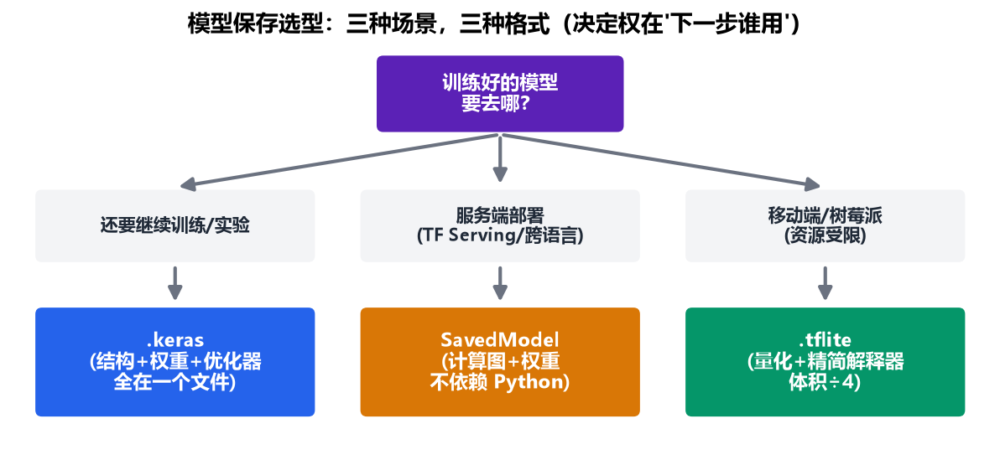

产物位置：`models/chapter08_mnist_mlp.keras`、`models/saved/chapter08_mnist_mlp/`
(SavedModel)、`models/chapter08_mnist_mlp.tflite`。脚本使用 Keras 3 的
`model.export(...)`（TensorFlow ≥ 2.16）导出 SavedModel，旧版本自动回退到
`tf.saved_model.save(...)`。

---

### 🧠 直觉理解

#### 训练完了，然后呢？

训练模型就像**造车**——你在工厂里（训练环境）把车造好了、测试过了，但最终是要开上路的（部署到生产环境）。

不同的"上路"场景，需要不同的"打包方式"：

- **你自己开（继续训练 / 实验）**：直接保存 `.keras` 格式就行，整个模型（结构+权重+优化器状态）都在一个文件里，下次加载接着训。
- **卖给别人开（服务端部署）**：导出成 `SavedModel` 格式，这是 TensorFlow 的标准交换格式，可以在各种 TF 生态的服务端框架里跑。
- **装到手机上开（移动端 / 嵌入式）**：转换成 `.tflite` 格式，体积小、速度快，专门为资源有限的设备优化。

#### .keras 格式：Keras 的"存档文件"

`.keras` 是 Keras 3 的原生格式。你可以把它理解成一个 ZIP 包，里面装了：

- **模型结构**（JSON）：有哪些层、怎么连的
- **模型权重**（.h5 或 NumPy 格式）：训练好的参数值
- **优化器状态**：优化器的内部变量（比如 Adam 的动量）
- **训练配置**：损失函数、metrics 等

用 `.keras` 格式保存和加载都很简单：

```python
model.save('my_model.keras')   # 保存
model = tf.keras.models.load_model('my_model.keras')  # 加载
```

加载之后，模型的状态和保存时完全一样——可以继续训练，也可以直接预测。

#### SavedModel：TensorFlow 的"通用货币"

SavedModel 是 TensorFlow 的序列化格式，它保存的是**计算图**（Graph）和权重，不依赖 Python 代码。这意味着：

- 你可以用 Python 训练，然后用 C++/Java/Go 部署
- 可以直接在 TensorFlow Serving（谷歌的模型服务框架）里跑
- 可以转换成 TFLite 或 TensorFlow.js 格式

SavedModel 是一个目录，里面有：
- `saved_model.pb`：计算图（protobuf 格式）
- `variables/`：权重变量
- `assets/`：额外的资源文件（可选）

#### TFLite：移动端的"精简版"

TFLite 是 TensorFlow Lite 的格式，专门为移动设备和嵌入式设备设计。它做了很多优化：

- **量化（Quantization）**：把 32 位浮点数权重变成 8 位整数，体积缩小 4 倍，速度还更快
- **算子融合**：把多个小算子合并成一个大算子，减少计算开销
- **轻量级解释器**：TFLite Interpreter 只有几百 KB，适合装进 App

转换流程通常是：
```
Keras 模型 → SavedModel → TFLite 模型
```

### 📌 核心概念

- `.keras` 格式：Keras 原生的模型保存格式，单文件包含结构+权重+优化器
- `SavedModel`：TensorFlow 的通用序列化格式，用于部署和格式转换
- `.tflite`：TensorFlow Lite 格式，专为移动端/嵌入式优化
- 量化（Quantization）：降低权重精度以减小模型体积和加速推理
- 推理（Inference）：用训练好的模型做预测的过程

> 以上术语详见 [术语表](glossary_zh.md)

### ✋ 动手试一试

1. **比较三种格式的文件大小**：分别保存 `.keras`、`SavedModel`、`.tflite` 三种格式，看看它们各占多少磁盘空间。
   - TFLite 比 SavedModel 小多少？
   - 如果用了量化（int8），还能再小多少？

2. **加载保存的模型继续训练**：保存一个训练了 5 个 epoch 的模型，然后加载回来再训练 5 个 epoch，看看准确率是不是接着涨。
   - 优化器状态也保存了吗？怎么验证？

3. **用 TFLite 做推理**：写一段代码，用 TFLite Interpreter 加载 `.tflite` 模型，对一张测试图片做预测，和 Keras 模型的预测结果对比。
   - 结果完全一样吗？如果有微小差异，为什么？（提示：量化可能引入精度损失）

### ⚠️ 常见坑

1. **加载模型时缺少自定义层**：如果你的模型里有自定义层（自己继承 Layer 写的），加载 `.keras` 模型时要传 `custom_objects` 参数告诉 Keras 这个层是什么。

2. **SavedModel 和 .keras 搞混**：`.keras` 是 Keras 格式，保存的是 Keras 模型对象；SavedModel 是 TF 格式，保存的是计算图。SavedModel 加载回来后不能直接 `fit()`，因为它不是 Keras Model 对象（不过 TF 2 里可以用 `tf.keras.models.load_model` 加载 SavedModel 并还原成 Keras 模型，但有局限性）。

3. **TFLite 不支持某些算子**：TFLite 只支持常用算子，如果你的模型用了比较冷门的算子，转换可能失败。解决办法：用 TFLite 的 Select TF ops，或者改写模型结构。

4. **量化后精度下降太多**：全整数量化可能导致精度明显下降。可以试试：
   - 用动态范围量化（只有权重量化，激活还是浮点）
   - 用 float16 量化（精度损失更小）
   - 用校准数据集做全整数量化（更准确）

5. **忘记保存预处理逻辑**：模型本身只是计算图，数据预处理（归一化、resize 等）也要保存下来，否则推理时预处理不一致，结果会错得离谱。


### 📍 你在哪里

```
 [第7章] 训练中可管 ──► [第8章] 训练后可交付 ──► [实战09] 完整项目
   你在这里 ─────────────┘
```

- **从已知出发**：第 7 章管住了"训练过程"；本章解决"训练之后"——
  模型锁在你的 Python 进程里，等于没发生。保存、分发、部署，是理论走向产品的最后一公里。
- **为什么这么走**：三种保存格式不是三种"难度"，而是三种**场景**。
  本章教你做格式选型决策，实战 09/10 会直接用到。
- **下站预告**：实战 09 综合项目把全部章节串成一件作品；实战 10 把 .tflite 真正跑上树莓派。

### 🔍 为什么这样设计

**为什么三种格式并存、而不是一种万能格式？** 因为场景诉求互相冲突：
继续训练要"全"（连优化器动量一起存），服务部署要"通用"（跨语言、无 Python 依赖），
移动端要"小"（量化 + 精简解释器）。**一种格式必然冗余，专用格式必然割裂**
——这个冲突不可消除，只能取舍。做工程的人要习惯这种"多格式并存"的现实。

**为什么 SavedModel 故意不依赖 Python 代码？** 保存的是计算图 + 权重，
C++ / Java / Go 的运行时都能加载——这是"Python 训练、任意语言部署"的前提。
代价：自定义逻辑必须写进图里，加载端拿不到你的 Python 源码。

**为什么 TFLite 要量化？** 树莓派和手机没有 GPU，float32 的存储带宽就是瓶颈。
int8 把体积除以 4，CPU 上常见 2~4 倍提速，代价是少量精度损失——
**用精度换速度体积，这笔账怎么算**，实战 10 会带你在树莓派上实测。

**为什么转换链是 Keras → SavedModel → TFLite？** TFLite 转换器吃的是"图"，
不吃 Keras 对象。SavedModel 是图的载体，所以它是必经中转站——
这也解释了为什么第 8 章脚本先 `model.export()` 再转换。


### ✅ 过关自测

**基础题**：

1. 三个场景各选什么格式？继续训练 / 服务端部署 / 树莓派？
   【答】`.keras` / SavedModel / `.tflite`。
2. 量化为什么能让模型变小变快？【答】32 位浮点 → 8 位整数：体积÷4；
   整数运算比浮点快且省内存带宽。
3. SavedModel 里没有你的 Python 源码，自定义逻辑怎么保留？【答】写成 Keras 层/函数，
   让它被追踪进计算图。

**挑战题**：

1. 同一模型分别导出 float32 / float16 / int8 三种 `.tflite`，列表比较体积和精度差
   （实战 10 会给你实测数据，先自己预测再对照）。
2. 用 TFLite Interpreter 对一张 MNIST 图跑推理，和 Keras 模型的输出对比，
   观察量化前后的差异在什么量级。

**过关标准**：能为"继续训练 / 服务端 / 树莓派"三场景各选对格式并说明理由；
能独立跑通"Keras → SavedModel → .tflite"全链路。

### 📎 选读：更多反例（初读可跳过）

**反例 2：自定义层没传 custom_objects**

- **现象**：
  ```python
  model = tf.keras.models.load_model('m.keras')
  # ❌ ValueError: Unknown layer: 'MyLayer'. Please pass custom_objects...
  ```
- **原因**：`.keras` 文件里只存结构，不存你的 Python 类定义，加载端"不认识"自定义层。
- **修复**：`load_model(..., custom_objects={'MyLayer': MyLayer})`。
- **一句话教训**：自定义的东西（层/损失/指标），加载端都要"认识"。

**反例 3：全整数量化没给代表性数据集**

- **现象**：
  ```python
  converter = tf.lite.TFLiteConverter.from_keras_model(model)
  converter.optimizations = [tf.lite.Optimize.DEFAULT]   # ❌ 缺 representative_dataset
  ```
- **原因**：int8 量化要用一批真实样本"校准"激活值的范围，没有校准数据无法定标。
- **修复**：提供 `representative_dataset`（几百条真实样本即可）。
- **一句话教训**：**量化不是免费的，它需要数据**。


### 📚 延伸阅读

- Keras 官方 *Save and serialize models* 指南：三种格式的权威说明
- TensorFlow Lite *Convert* 文档：量化选项的完整矩阵
- 实战 10 + `docs/raspberry_pi_deployment_zh.md`：本策内容的落地实战


## 实战 09 —— 综合项目：把前 8 章串成一件作品

代码入口：`chapters/09_capstone_image_classifier.py`（数据集 tf_flowers，微调后 val_acc ≈ 90%）

> ✅ **版本**：本章代码在 TF 2.21 + Keras 3 实测通过；其他版本的差异见附录 D。
配套模板：`teaching/project_template.md`（7 步从零搭项目 + 报告模板）

### 🎯 本章目标

前面 8 章的知识点都是"零件"；这一章把它们装配成一台整车，并**独立**跑完全流程：

```
 ┌────────┐  ┌────────┐  ┌────────┐  ┌────────┐  ┌────────┐  ┌────────┐
 │ 数据管道 │─►│ 建立基线 │─►│ 迁移训练 │─►│ 深入评估 │─►│ 导出模型 │─►│ 撰写报告 │
 │ 加载/增强│  │ (不调参) │  │ 两阶段   │  │ 混淆矩阵 │  │ .tflite │  │ 复盘得失 │
 └────────┘  └────────┘  └────────┘  └────────┘  └────────┘  └────────┘
      少了任何一步，项目都算"没做完"——尤其最后一步
```

### 📍 你在哪里

```
 [第8章] 格式选型 ──► [实战09] 完整项目 ──► [实战10] 边缘部署
   你在这里 ─────────────┘
```

- **从已知出发**：数据管道（3 章）、迁移学习两阶段（6 章）、监控三件套（7 章）、
  格式选型（8 章）——本章没有任何新知识点，考的是**把它们连起来的能力**。
- **为什么必须有这一站**：孤立的知识点是"清单"，只有穿过完整项目才会变成"能力"。
  这也是为什么面试都问项目、不问名词。

### 🔍 为什么这样设计

**为什么第一步是"先跑基线"而不是先调参？** 基线（最简模型 + 默认超参）给出
一个"及格线"。之后每次改动都能和它对比，才知道改动值不值。
**没有基线的调参，等于没有参照系的赛跑。**

**为什么评估要看混淆矩阵而不只看 acc？** acc=90% 听起来不错，但混淆矩阵可能显示
"郁金香和蒲公英互相认错 30 次"——下一步该加什么数据、增强怎么做，答案都藏在
混淆矩阵里。acc 是总分，混淆矩阵是逐题批改。

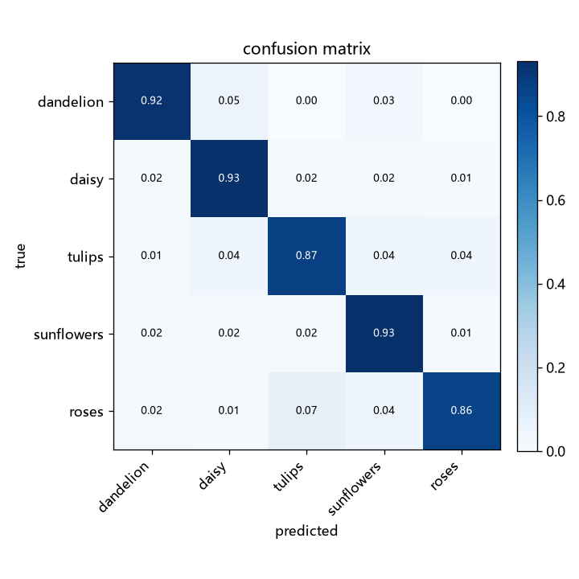

> 📖 **读图指南**：同第 4 章——先看对角线（正确率），再找**最亮的非对角格**：
> 它告诉你"哪两种花最容易被认混"，直接决定你下一步该补拍/增强哪两类数据。

**为什么报告是项目的一部分？** 写报告的过程会逼你回答"为什么这么设计"——
答不上来的地方，就是你其实没懂的地方。（模板见 `teaching/project_template.md`，
里面连"常见陷阱自查表"都替你列好了。）

### ❌ 反例教室

**反例 1：只存权重，加载进不同结构**

- **现象**：
  ```python
  model.save_weights('w.h5')          # 只存了参数
  other_model.load_weights('w.h5')    # ❌ ValueError: 层数/形状对不上
  ```
- **原因**：权重和结构是**一对**，权重文件里没有结构信息，套进不同结构必炸。
- **修复**：要么存整模型（`.keras`），要么保证加载端结构逐层一致。
- **一句话教训**：**权重不离结构**——交付模型时交付它的"身体"。

**反例 4：保存了模型、丢了预处理——最隐蔽的部署事故**

- **现象**：训练时输入是 x/255，部署端直接喂 0~255 原图：不报错，但预测全错。
- **原因**：模型只是计算图；预处理没有跟着模型走，两端输入分布就不同。
- **修复**：把 Rescaling 写进模型结构，或把预处理代码与模型一起交付
  （实战 10 的 deploy 包就是这么做的）。
- **一句话教训**：**预处理是模型的一部分**——这是部署事故排行榜的第一名。

### ✅ 过关自测

**基础题**：

1. 项目六步流水线是哪六步？【答】数据管道 → 基线 → 迁移训练 → 深入评估 →
   导出 → 报告。
2. 基线的作用是什么？【答】给所有后续改动提供参照系。
3. 数据增强应该只作用在哪份数据上？【答】训练集。

**挑战题**（这就是"自己的项目"的起点）：

1. 换一个你自己感兴趣的数据集（自拍照片 / Kaggle 入门赛），用 `project_template.md`
   从零走完全流程，写完报告。
2. 在你的项目里故意制造一个 bug（如忘记归一化），用第 11 章的调试技巧定位它——
   这是把"调试能力"也练起来的办法。

**过关标准**：能独立跑通全流程，且报告能回答"每一步为什么这么设计"。

### 📚 延伸阅读

- `teaching/project_template.md`：7 步建项目 + 报告模板 + 常见陷阱自查表
- Kaggle 入门赛（Titanic / Digit Recognizer）：别人的完整 notebook 是最好的对照
- Chollet《Deep Learning with Python (2nd)》末章：Kaggle 实战的方法论

---

## 实战 10 —— 边缘部署：把模型送进真实世界

代码入口：`chapters/10_edge_raspberry_pi.py`

> ✅ **版本**：本章代码在 TF 2.21 + Keras 3 实测通过；其他版本的差异见附录 D。
完整实战手册：`docs/raspberry_pi_deployment_zh.md`（从刷系统到实时推理，9 章）
开箱即用的部署包：`deploy/`（`pi_classify.py` + 标签文件，拷到树莓派即可运行）

### 🎯 本章目标

把第 9 章项目的模型做**三种量化**、压成 `.tflite`，并在树莓派（或任意无 GPU 设备）
上跑通实时推理，亲手测出"量化换来多少速度和体积"。

```
 Keras 模型 ──► SavedModel ──► ┌ float32 基线（精度参照）┐
                               │ float16  体积÷2        │──► .tflite ──► 树莓派
                               │ int8     体积÷4+提速    │      TFLite Interpreter
                               └ (int8 需校准数据)      ┘            │
                                                              单图 / 基准 / 摄像头
```

### 📍 你在哪里

```
 [实战09] 项目完成 ──► [实战10] 走进真实设备 ──► 手册 9-11 章（进阶自选）
   你在这里 ─────────────┘
```

- **从已知出发**：第 8 章你已经会"转换"；本章回答转换的**后半段**——
  到了没有 GPU 的设备上，模型到底跑多快？精度损失了多少？值不值？
- **为什么这么走**：真实世界绝大多数设备没有 GPU。"在受限设备上做工程权衡"
  是嵌入式 AI 的日常，也是"理论与工程并重"的最后一课。

### 🔍 为什么这样设计

**为什么量化是"用精度换速度体积"，而不是免费的优化？** float32 → int8，
每个权重从 4 字节变 1 字节（体积÷4）；CPU 整数运算远快于浮点（提速 2~4 倍）。
代价是表示精度下降——int8 只有 256 个刻度去表示连续的权重分布。所以量化
**必须重新评估精度**，而不是转完就走（见反例 1）。

**为什么 int8 需要代表性数据集（校准）？** 量化对象不只是权重，还有激活值。
激活范围事先不知道，需要喂几百张真实样本"摸底"，才能把浮点范围映射到 256 个刻度。
这是三种量化里唯一需要数据的一种——float16 直接类型转换即可。

**为什么基准测试要同设备对比？** 树莓派上的相对差异（int8 比 float32 快几倍）
才是部署决策的依据；拿笔记本的速度预测树莓派是没有意义的。

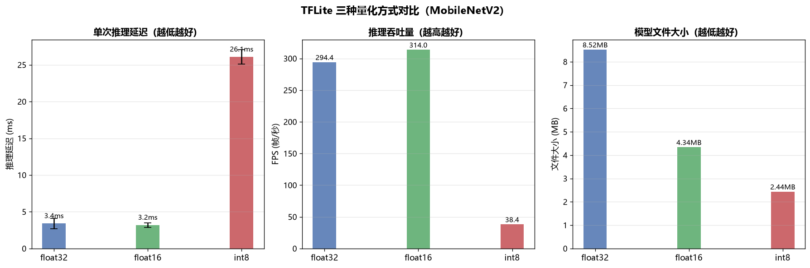

### ❌ 反例教室

**反例 1：量化完直接部署，没重新评估精度**

int8 量化让体积小了 4 倍，团队欢呼上线——没人发现 acc 从 90% 掉到了 71%。
> 规矩：**每次量化后，精度评估和基准测试都要重跑一遍**。脚本里三种量化的
> 评估代码不是装饰，是流程。

**反例 2：树莓派上照搬 PC 的 batch size**

PC 上 batch=64 跑得欢，树莓派上直接内存爆掉（OOM）。
> 教训：边缘设备推理默认 batch=1；"资源受限"要体现在每一个参数上。

**反例 3：预处理不一致（第 8 章反例 4 的边缘版）**

PC 端训练用 [-1,1]，部署包里忘了同款缩放——树莓派上摄像头全开也识别不出花。
> `deploy/pi_classify.py` 把预处理写死在推理脚本里，就是为了让两端永远一致。

### ✅ 过关自测

**基础题**：

1. 三种量化各牺牲什么、换来什么？【答】float16：体积÷2，精度几乎无损，速度提升有限；
   int8：体积÷4 + 提速 2~4 倍，需要校准数据，有精度损失风险。
2. 为什么 int8 量化需要代表性数据集？【答】校准激活值的动态范围。
3. 边缘设备推理的 batch size 应该是多少？【答】1（资源受限 + 实时场景本就逐条处理）。

**挑战题**：

1. 在树莓派上实测三种量化的单帧延迟和精度，画一张"速度-精度-体积"三轴对比表
   （没有树莓派的话，PC 上用 CPU 线程数=1 模拟受限环境）。
2. 把 `deploy/` 包跑起来：换上你自己（实战 09）的模型和标签，端到端识一张照片。

**过关标准**：能向别人讲清"这笔精度换速度的账怎么算"；
亲手在你的目标设备上跑通一次推理。

### 📚 延伸阅读

- `docs/raspberry_pi_deployment_zh.md`：本策的 9 章完整展开（含刷系统、摄像头、实时循环）
- TensorFlow Lite 官方 *Quantization spec*：三种量化的精确语义
- Petumin 等边缘 AI 项目：看看真产品怎么组织部署包


## 进阶篇·开篇路线图（先读我）

主线（第 0-8 章 + 实战 09/10）教的是"一个任务从头做到尾"；进阶篇给你**三样不同的东西**。
先看地图，再上路——学完你会得到下面这张能力拼图：

```
                     ┌───────────────────────────────┐
   工程底座          │ 11 tf.data 数据管道             │ 一切模型的"供血系统"
                     └──────┬────────────────────────┘
                            │
        ┌───────────────────┼───────────────────┐
        ▼                   ▼                   ▼
┌───────────────┐   ┌───────────────┐   ┌───────────────┐
│ 12 序列建模     │──►│ 13 注意力       │   │ 14 生成模型     │
│ RNN/LSTM       │   │ Transformer    │   │ AE / GAN       │
└───────┬───────┘   └───────┬───────┘   └───────┬───────┘
        │     NLP/序列主线    │                   │  生成主线
        └───────────┬───────┘                   │
                    ▼                           │
        ┌───────────────────────┐               │
        │ 16 毕业项目（文本分类）  │◄──────────────┘
        └───────────┬───────────┘
                    ▼
        ┌───────────────────────┐
        │ 15 自定义训练与性能      │  ← 打开引擎盖：前三课的"底层原理"
        └───────────────────────┘
```

**学完进阶篇，你获得了什么能力？**

1. **供血能力**（进阶 11）：能给任何模型搭不挨饿的数据管道，并知道加速从哪里来；
2. **序列能力**（进阶 12-13）：理解"带顺序的数据"怎么建模，并**亲手写过**
   现代 AI 的核心机制——注意力（GPT/BERT 的骨架）；
3. **生成能力**（进阶 14）：知道模型如何"无中生有"，看懂 AE→VAE→GAN→Diffusion 谱系；
4. **底盘能力**（进阶 15）：能写自定义层/损失/训练循环——从"用 Keras"到"写 Keras"；
5. **集成能力**（第 16 章毕业项目）：把以上全部拧成一个完整作品。

**三条阅读路线**：按序通读（推荐）；只走 NLP 主线（11→12→13→16）；
只补工程能力（11→15→16）。每章开头"📍 你在哪里"会不断告诉你当前位置。

## 进阶篇 11 —— tf.data 数据管道：让 GPU 永远不空等

代码入口：`chapters/11_tfdata_pipeline.py`（合成数据，无下载，纯 CPU 十几秒）

> ✅ **版本**：本章代码在 TF 2.21 + Keras 3 实测通过；其他版本的差异见附录 D。

### 🎯 本章目标

主线章节假设"数据是一个能塞进内存的 NumPy 数组"。真实工程里数据在磁盘、
在远端、要实时解码增强。本章把"喂数据"本身变成一门工程：

```
 磁盘/内存 ──► shuffle ──► map(解码/增强) ──► batch ──► cache ──► prefetch ──► 模型
              打乱样本      昂贵预处理          组批     缓存结果   后台预取     (消费者)
 └────────────────── 生产者 ──────────────────────────────────────────────┘
```

### 📍 你在哪里

```
 [实战10] 主线毕业 ──► [进阶11] 数据管道 ──► [进阶12-15] 模型家族与自定义
   你在这里 ─────────────┘
```

- **从已知出发**：第 7 章你已经会"管训练"，本章管"喂数据"。第 9 章（综合项目）
  的数据管道只是一行 `map`，本章解释它背后的一切。
- **为什么这么走**：大规模训练的第一瓶颈几乎从来不是模型，而是数据供给。
- **下章预告**：管道会搭了，接下来认识"序列数据"——与图片完全不同的形态。

### 🔍 为什么这样设计

**为什么 tf.data 要做成惰性求值的"变换图"而不是容器？** 容器只能"先算完再给"，
变换图才能声明"怎么逐批产出"，从而让生产者（预处理）与消费者（训练步）
**重叠执行**——惰性是流水线的前提，这是整章设计的根。

**为什么标准顺序是 shuffle → map → batch → cache → prefetch？**
shuffle 在 map 前：打乱"样本"而非"批"，组内多样性最好；cache 在 batch 后：
缓存批结果最省内存；prefetch 永远最后：它是流水线与消费者之间的缓冲带。

**为什么 cache 是"免费的"而 prefetch 的收益要看资源？** cache 消除的是
**重复计算**（第 2 个 epoch 起直接读结果，本机实测 2.1x），物理上稳赚；
prefetch 赚的是**重叠**——前提是生产者与消费者使用不同资源（如 CPU+GPU）。
纯 CPU 上两者争抢同一批核心，本机实测收益很小。**收益来自资源错开，
先测量瓶颈，再决定优化谁**——这是比"背顺序"重要得多的工程心法。

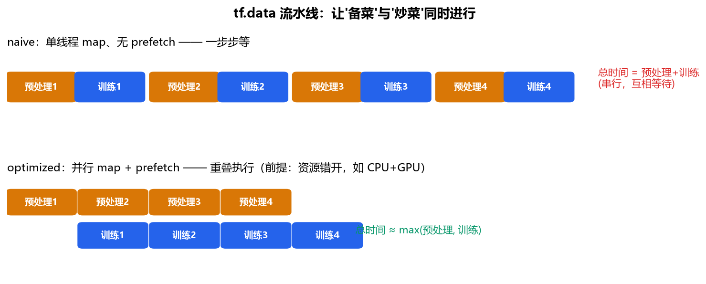

### ❌ 反例教室

**反例 1：map 的计算结果没被使用 → 整段计算被死代码消除（DCE）**

```python
ds = ds_raw.map(lambda x, y: heavy_compute(x), ...)  # ❌ 算完就扔，返回的还是原样
```
本机实测：naive 1.60s vs DCE 版 0.82s——**看起来快了一倍，其实是啥也没算**。
> 排查法：让 map 返回计算结果；基准"快得可疑"时先怀疑这里。

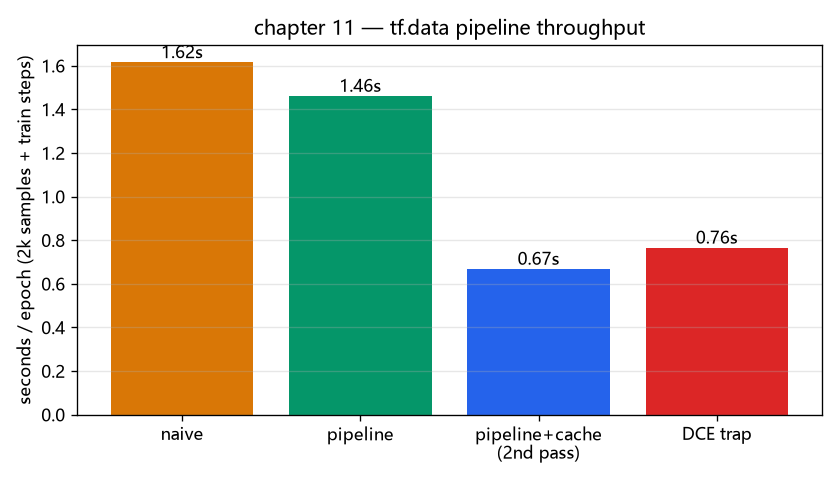

**反例 2：shuffle 放在 batch 之后**

只会打乱"批的顺序"，批内组成完全不变——打了个寂寞。
（脚本 [4] 打印批内前几个元素证明它们仍是原始顺序。）

**反例 3：给数据集计时却没真正消费元素**

惰性求值下，不迭代的"计时"是零秒——**计了个寂寞**。必须真正把元素过一遍。

### ✅ 过关自测

**基础题**：

1. 五个算子的标准顺序？各自的职责？【答】shuffle 打乱 / map 预处理 / batch 组批 /
   cache 缓存 / prefetch 预取。
2. 为什么 cache 是稳赚的？【答】它消除重复计算，不涉及资源竞争。
3. DCE 陷阱是怎么发生的？【答】map 的返回值不依赖计算结果，TF 把计算剪掉。

**挑战题**：

1. 把脚本里的预处理成本参数调大 10 倍，观察 pipeline 相对 naive 的收益变化。
2. （有 GPU）把同一基准搬到 GPU 训练步上重跑——体会资源错开后的真实重叠。

**过关标准**：能向别人解释"这组基准数字每一项为什么是这个值"。

### 📚 延伸阅读

- TensorFlow 官方 *Better performance with the tf.data API*：全部优化项的权威清单

> 🔗 **与下一章的关系**：管道解决了"数据怎么来"。但进阶 12 换一种全新的数据形态——**序列**。你会第一次给网络"喂时间"，而管道里的窗口思维马上就会用上。
- 手册进阶篇 15 章：tf.function 与图执行的深入讨论（与本章互为表里）

---
## 进阶篇 12 —— 序列建模：RNN / LSTM / GRU 与时间序列

代码入口：`chapters/12_rnn_timeseries.py`（合成正弦序列，无下载，CPU 约一分钟）

> ✅ **版本**：本章代码在 TF 2.21 + Keras 3 实测通过；其他版本的差异见附录 D。

### 🎯 本章目标

前 11 章的网络都假设样本是"无序的特征向量"。本章进入**序列数据**的世界：
用过去 32 个时间点预测下一个点，并诚实对比 Dense 基线 / SimpleRNN / LSTM / GRU。

```
 滑动窗口: [s0 s1 ... s31] ──► 预测 s32
                │
   ┌────────────┼────────────┬─────────────┐
   ▼            ▼            ▼             ▼
 Dense 基线   SimpleRNN      LSTM           GRU
 (无记忆)    (有记忆,记不长) (门控记忆)     (门控,更省)
```

### 📍 你在哪里

```
 [进阶11] 数据管道 ──► [进阶12] 序列数据 ──► [进阶13] 注意力机制
   你在这里 ─────────────┘
```

- **从已知出发**：第 5 章你处理过文本（一种序列），当时用的是"词袋"——
  彻底放弃顺序。本章正式回答"怎么建模顺序"。第 2 章的回归流程原样复用。
- **为什么这么走**：序列是图片之外最重要的数据形态；RNN 也是理解 Transformer
  （进阶 13）的历史起点——知道 RNN 痛在哪，才懂注意力妙在哪。
- **下章预告**：RNN 一步步"顺时间读"，能不能一步"同时看全序列"？能，注意力。

### 🔍 为什么这样设计

**为什么循环网络"参数与序列长度无关"？** 每个时间步复用**同一个**循环单元——
这是"权值共享"在时间维度上的翻版（第 4 章的卷积是空间维度）。窗口从 32 加到
128，Dense 基线参数线性膨胀，RNN 一个不多。变长序列上这是决定性优势。

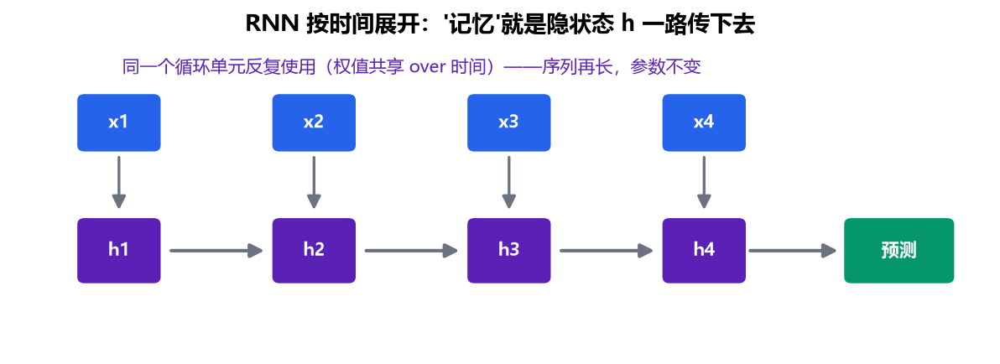

**为什么时序数据必须按时间顺序切分 train/test？** 随机切分会让模型在训练时
"见过未来"——用 t+1 的数据预测 t 是数据泄露的时序版。这是时序工程最高频的
致命错误，本章脚本把切分写成了显式步骤。

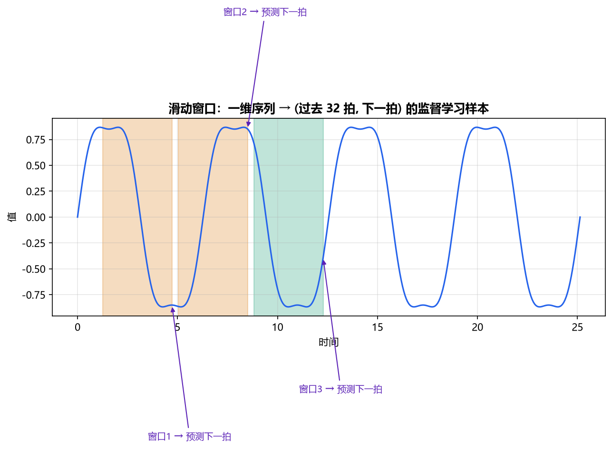

**为什么这章还留一个 Dense 基线？** 在本任务的实测里 Dense 并不输——
因为窗口 32 已含全部所需信息。**诚实建模的第一课：先跑基线，
循环网络的优势要在"长依赖/变长序列"上才显现**（动手题 1 让你亲眼验证）。

### ❌ 反例教室

**反例 1：随机切分时序数据——MSE"好"得离谱**

把 `windowize` 换成随机切分后，测试 MSE 会漂亮得可疑：相邻窗口几乎重复，
测试样本的信息早就在训练集里了。这就是"用未来预测过去"的泄露。

**反例 2：忘了时间维 `(N, window, 1)`，喂成 `(N, window)`**

RNN 层要求显式的时间维：`ValueError: expected ndims=3`。
> 记忆：RNN 的输入永远是 `(批, 时间步, 特征)`，哪怕特征只有 1 个也要补 1。

**反例 3：SimpleRNN 面对长周期序列**

把周期从 50 改成 200（动手题 2），SimpleRNN 的 MSE 会明显劣化——
梯度沿时间连乘导致它"记不长"。这正是 LSTM 门控结构被发明的动机。

### ✅ 过关自测

**基础题**：

1. `windowize` 做了什么？为什么说它比网络选择更重要？【答】把序列切成
   (窗口, 下一拍) 的监督学习问题——窗口设计直接决定任务难度与信息量。
2. SimpleRNN 为什么"记不长"？【答】梯度沿时间步连乘，长序列下消失/爆炸。
3. LSTM 的"门"在干什么？【答】用可学习的开关控制"记什么/忘什么/输出什么"，
   让信息走加法通路绕过连乘。

**挑战题**：

1. 把周期改成 200，四种模型的退化排序——验证"SimpleRNN 掉得最快"。
2. 改成多步预测（一次预测未来 8 拍），对比递归式与直接式的误差积累。

**过关标准**：不看书写出滑动窗口的形状变换；能说清四种模型在同一任务上的
实测排序及其原因。

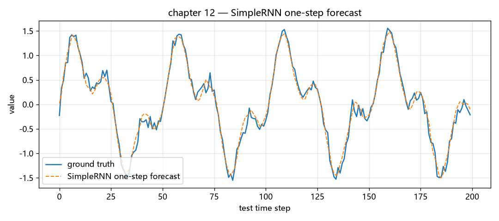

### 📚 延伸阅读

- Chris Olah *Understanding LSTM Networks*：LSTM 门控的最佳图解（必读）
- Stanford CS224n *RNN* 讲义：从语言模型视角再看一遍
- 手册第 9 章 9.2 节：RNN 之后的世界（Seq2Seq → Transformer）

> 🔗 **与下一章的关系**：学完 RNN 你知道了它的死穴——**记不长**（梯度沿时间连乘）。下一章的注意力就是来解决这个问题的：不做"顺时间传话"，让每个位置**一步看全**整个序列。

---
## 进阶篇 13 —— 注意力机制：手写 mini-Transformer

代码入口：`chapters/13_attention_transformer.py`（合成任务，无下载，CPU 数秒）

> ✅ **版本**：本章代码在 TF 2.21 + Keras 3 实测通过；其他版本的差异见附录 D。

### 🎯 本章目标

不调库，手写 scaled dot-product attention（30 行核心代码），
在一个"一眼看懂"的任务上训练它，然后**把注意力画成热力图**：

```
 任务: 8 个 0~9 的数字 ──► 输出最大值
       [3, 7, 2, 9, 4, 1, 8, 5]  ──►  9
                     ▲
   注意力热力图会显示: 所有 token 都把"注意力"投给 9 所在的位置
```

外加一个关键实验：去掉位置编码，验证注意力**天生排列不变**——
这就是 Transformer 必须注入位置信息的数学理由。

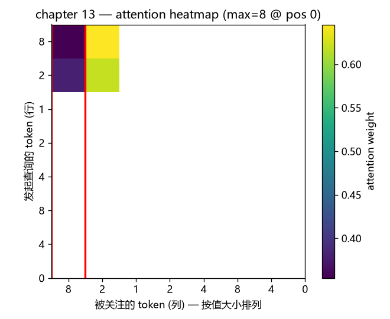

> 📖 **读图指南**：颜色越亮 = 注意力权重越大。重点看**红框那一列**（最大值位置）：
> 如果多数行的亮块都落在这一列，说明模型学会了"抬头看最大值"。黑白打印看亮度深浅。

### 📍 你在哪里

```
 [进阶12] RNN 顺时间读 ──► [进阶13] 一步看全序列 ──► [进阶14] 生成模型
   你在这里 ─────────────┘
```

- **从已知出发**：第 5 章的词向量给了"token → 向量"；第 12 章的 RNN 证明了
  "建模序列需要上下文"，但它只能顺时间读、记不长。注意力一步完成全序列
  两两配对，且路径长度 O(1)——这正是它取代 RNN 的原因。
- **为什么这么走**：Transformer 是现代 AI（GPT/BERT/ViT）的骨架，
  而它的核心就一行公式。手写一遍，以后读任何架构图都不再是黑话。
- **下章预告**：判别式模型到此收尾，下一站——让模型"无中生有"。

### 🔍 为什么这样设计

**Q/K/V 到底是什么？** 图书馆检索的类比：查询 Q 是"我在找什么"，
键 K 是"每本书的标签"，值 V 是"书的内容"。Q 与 K 的点积 = 匹配度，
softmax 后变成"采纳哪本书、采纳多少"，加权求和 V 就是检索结果。

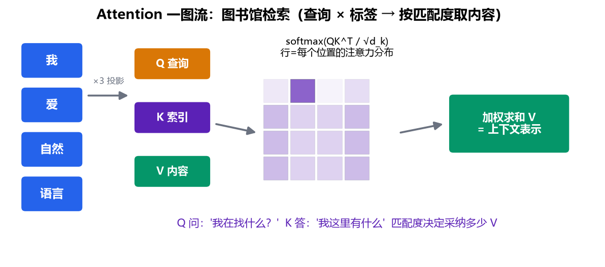

**为什么要除以 sqrt(d_k)？** d_k 维点积的方差随 d_k 增长，值太大会把 softmax
推进饱和区（几乎 one-hot，梯度消失）。除以 sqrt(d_k) 把方差拉回 1——
"缩放点积"的"缩放"二字由此而来（动手题 1 删掉它重训可验证）。

**为什么必须位置编码？** 注意力的打分只依赖内容配对，对输入排列**数学上不变**。
本章实测：无 PE 模型在序列打乱前后预测一致率 = **1.0000**（必然），
有 PE 模型 = 0.9910。任务需要顺序时，顺序必须显式注入——正弦位置编码就是
给每个位置一个独一无二的"指纹"再加到词向量上。

**为什么块里还要残差 + LayerNorm + FFN？** 残差让深层网络的梯度有"高速公路"
（第 11 章手册提过 ResNet 的思想），LayerNorm 稳定各层分布，FFN 提供逐位置的
非线性变换。**注意力 + 这三件套 = Transformer 块**，GPT 就是它的堆叠。

### ❌ 反例教室

**反例 1：删掉 sqrt(d_k) 缩放**

softmax 提前饱和：训练变慢变不稳。这是论文里那一行 `sqrt(d_k)` 的全部存在理由。

**反例 2：`reshape` 把 `-1` 放在最后一维**

```python
out = tf.reshape(out, (batch, seq, -1))   # ❌ Keras 3 构建自定义层时报错:
# "Shapes used to initialize variables must be fully-defined"
```
> 教训：Keras 3 要求权重形状完全确定。最后一维必须写 `heads * d_k` 静态值。
> 这是本章脚本里真实踩过并修掉的坑（build() 显式构建权重）。

**反例 3：多头注意力漏了"拼接"步骤**

各头的输出是 (batch, heads, seq, d_k)，不拼回 (batch, seq, d_model) 就喂给
Dense——形状看似自动对齐了（运气好），语义却错了：各头信息没有混合。

**反例 4：变长序列不做 padding mask**

padding 位置也参与 softmax，注意力被"垫子"分走——真实 Transformer 必须加 mask。
（本章定长序列故未用；知道这一步存在即可。）

### ✅ 过关自测

**基础题**：

1. 写出 attention 公式，并解释 Q/K/V 各自的角色。【答】softmax(QK^T/√d_k)V。
2. 本章排列不变性实验的指标是什么？两个数字分别说明什么？
   【答】打乱前后预测一致率：无 PE = 1.0000（排列不变），有 PE < 1（位置参与）。
3. 一个 Transformer 块有哪几个零件？【答】注意力、残差、LayerNorm、FFN。

**挑战题**：

1. 把任务换成"求和 mod 10"或"找最小值"，热力图形态会怎么变？
2. heads 取 1 / 2 / 8（d_model 不变）对比精度，体会"多头 = 多种关系模式"。
3. 读 *The Illustrated Transformer*，把本文的手写实现与原论文公式逐一对应。

**过关标准**：不看资料手写 `SelfAttention` 的 call()；
能向别人讲清"为什么除以 sqrt(d_k)"和"为什么必须位置编码"。

### 📚 延伸阅读

- Jay Alammar *The Illustrated Transformer*：最好的图解（先读这个再读原文）
- Vaswani et al., *Attention Is All You Need* (2017)：原文，三遍阅读法实战
- Karpathy *nanoGPT*：几百行代码的完整 GPT，本章的"下集"

> 🔗 **与下一章的关系**：注意力让模型"看懂"序列。下一章换一个更狂野的问题——不看任何标签，让模型学会**无中生有**（生成模型）。

---
## 进阶篇 14 —— 生成模型入门：自编码器与 GAN

代码入口：`chapters/14_autoencoder_gan.py`（MNIST 已缓存，CPU 约 2-4 分钟）

> ✅ **版本**：本章代码在 TF 2.21 + Keras 3 实测通过；其他版本的差异见附录 D。

### 🎯 本章目标

前 14 章全是**判别式**任务：给 x 预测 y。本章换视角——学习数据本身的分布，
让模型**无中生有**。两个模型，两种"生成"的思路：

```
 自编码器:   输入 x ──► 压缩到 32 维瓶颈 ──► 重建 x'
             (学会"什么是本质信息" —— 无监督表征学习)

 生成对抗:   噪声 z ──► 生成器 G ──► 假图 ──┐
                                          ├─► 判别器 D: 真?假?
             真实图片 ────────────────────┘
             (G 和 D 博弈, 共同进化)
```

### 📍 你在哪里

```
 [进阶13] 判别式收尾 ──► [进阶14] 生成式起步 ──► [进阶15] 打开 Keras 引擎盖
   你在这里 ─────────────┘
```

- **从已知出发**：AE 的结构你已全部见过（第 3 章的 Dense 堆叠）；
  GAN 的判别器就是第 5 章的二分类器；训练循环用的是进阶 15 将详讲的
  GradientTape——本章先见到它"在野外"的样子。
- **为什么这么走**：生成模型是"学习分布"的起点，也是当前 Diffusion 大爆发
  的历史脉络（AE → VAE → GAN → Diffusion）。
- **诚实预期**：CPU 几分钟训练的密集 GAN 只能产出"雏形数字"——
  卷积 + 数小时训练才能以假乱真。知道预期，才不会被结果吓到。

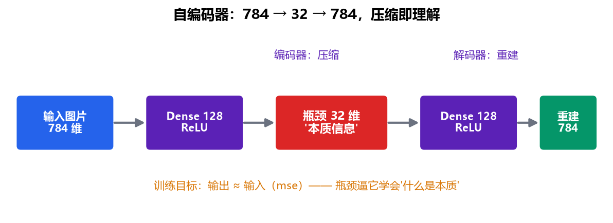
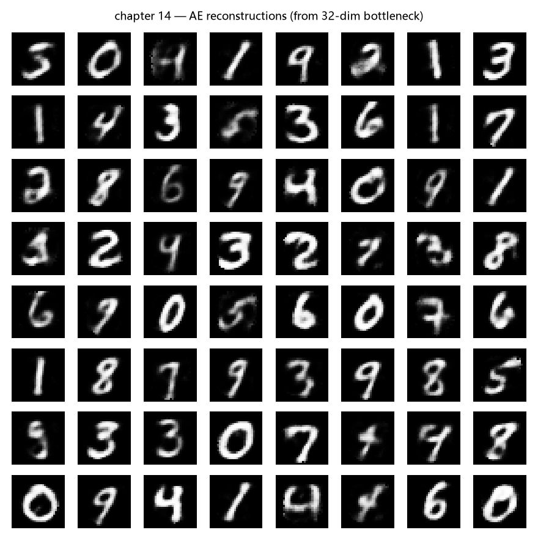
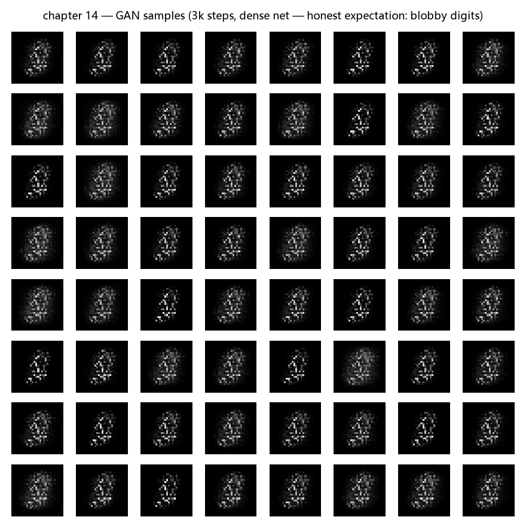

### 🔍 为什么这样设计

**AE 的瓶颈为什么是灵魂？** 784 维压到 32 维再重建，网络被迫丢掉细节、
保留"这是哪个数字"的本质——**压缩即理解**。这也是无监督预训练思想的雏形。

**为什么 AE 输出层用 sigmoid？** 输入归一化到 [0,1]，sigmoid 的值域恰好匹配，
MSE 损失才能逐像素比较。域的一致性（[0,1] vs [-1,1]）是生成模型最常见的
silent bug 来源（见反例 2）。

**为什么 GAN 的 loss 曲线必然震荡？** 监督学习在"下降"找谷底；
GAN 在解**极小极大博弈**：G 变强 → D 掉点 → D 反扑 → G 掉点。
没有共同的谷底，"loss 收敛"这个概念在这里根本不适用——
看样本质量，别盯着 loss 数字。

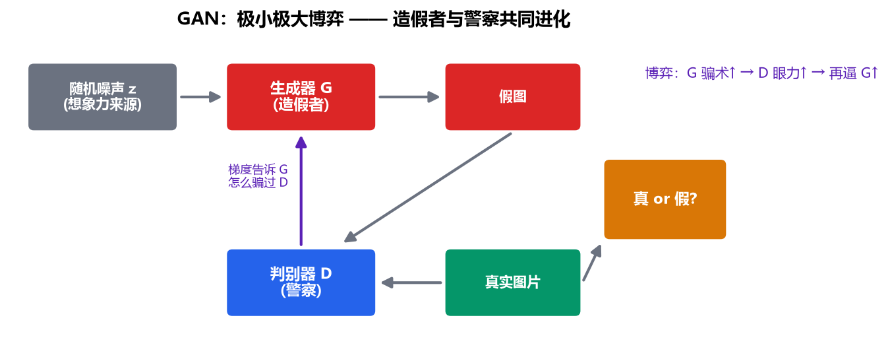

**为什么用 label smoothing（真图标 0.9）？** 判别器太自信会让生成器梯度
消失。把真标签压到 0.9 是给博弈留缓冲——训练失衡（一方碾压另一方）
是 GAN 翻车的头号原因。

### ❌ 反例教室

**反例 1：把 GAN 的 loss 当收敛指标**

loss_g 降了不代表图变好了（可能只是 D 变弱了）。**评估 GAN 靠眼睛和
FID 等分布距离指标，不靠 loss。**

**反例 2：预处理域不一致**

生成器输出 tanh（[-1,1] 域）而真图归一化到 [0,1]：判别器轻松赢，
生成器学不到东西——不报错，就是不出活。**全流程域必须一致。**

**反例 3：AE 的潜在空间没有结构（插值不平滑）**

普通 AE 只保证"编码-解码"往返，不保证空间连续：两个数字的 latent 之间
可能是一串乱码。VAE 用 KL 正则强制空间连续——这就是 VAE 存在的理由。

**反例 4：mode collapse（模式坍塌）**

生成器发现某一种输出"最安全"（总能骗过 D），于是所有噪声都生成同一个数字。
这是 GAN 的经典病症；观察大批量样本的多样性是基本检查项。

### ✅ 过关自测

**基础题**：

1. AE 的瓶颈起了什么作用？【答】逼网络压缩，学出本质表征（信息 784→32，仅 4%）。
2. GAN 的 G 和 D 各自在优化什么？【答】D 最大化区分真假；G 最小化 D 的识别能力
   ——极小极大博弈。
3. 为什么 GAN 的 loss 震荡是正常的？【答】博弈无共同谷底，双方在互相追逐。

**挑战题**：

1. `LATENT_DIM` 取 4 / 32 / 128，比较重建质量与插值平滑度——体会表征容量与
   结构性的取舍。
2. 只用数字 "1" 训练 AE，再输入 "7"：重建结果像什么？为什么？（分布外输入）
3. 把密集 GAN 升级成卷积 GAN（DCGAN），对比样本质量。

**过关标准**：能解释 AE 重建图与 GAN 样本图里看到的一切（包括缺陷）；
能画出 GAN 的训练数据流。

### 📚 延伸阅读

- Goodfellow et al., *GAN* (2014)：原文 + 三遍阅读法实战
- Lilian Weng *From Autoencoder to Beta-VAE*：表征学习谱系的最佳综述
- Lilian Weng *What are Diffusion Models?*：当前主流生成范式的入门

> 🔗 **与下一章的关系**：判别与生成你都见过了。最后一课回到引擎盖下面——本章你已经用过 `GradientTape`（GAN 训练循环），下一章把它彻底讲透，并顺手把前面所有"为什么快/为什么慢"的伏笔一次收完。

---
## 进阶篇 15 —— 自定义训练与性能：打开 Keras 的引擎盖

代码入口：`chapters/15_custom_training.py`（合成数据，无下载，CPU 约 1 分钟）

> ✅ **版本**：本章代码在 TF 2.21 + Keras 3 实测通过；其他版本的差异见附录 D。

### 🎯 本章目标

前面所有章都是"用 Keras"；本章教"写 Keras"——当预制件不够用时：

```
 自定义层    build() 建权重(一次)  +  call() 做计算(每次)   ── 新的"预制件"
 自定义损失  (y_true, y_pred) -> 标量                       ── 新的"评分标准"
 自定义循环  GradientTape 四步: 前向/损失/反向/更新           ── 第 1 章的工业版
 tf.function Python 函数 -> 计算图                            ── eager 灵活 graph 快
```

### 📍 你在哪里

```
 [进阶14] 生成模型 ──► [进阶15] 打开引擎盖 ──► 学期制课程表(16 周) / 终身路线
   你在这里 ─────────────┘
```

- **从已知出发**：第 1 章你手写过四步训练循环，第 2 章学会了 `fit`——
  本章的 GradientTape 循环就是两者的正式闭环：**fit 的内部就是一个
  被图模式加速的四步循环**。第 11 章埋的 tf.function 伏笔也在此揭晓。
- **为什么这么走**：科研与工程的分界线就在"能不能改训练本身"。
  学完本章，Keras 对你不再是黑盒，而是你可以扩展的框架。
- **之后去哪**：进阶篇毕业。按 [16 周学期制课程表](study_plan_semester.md)
  进入系统化进阶，或回[知识地图](knowledge_map.md)选一条岔路。

### 🔍 为什么这样设计

**为什么自定义层拆成 build 和 call？** "建什么权重"取决于"输入长什么样"
（第一次调用才知道），而"算什么"每次都一样。拆开让权重只建一次、计算每次执行——
这是 Keras 所有层的底层约定，看懂它，源码就不神秘了。

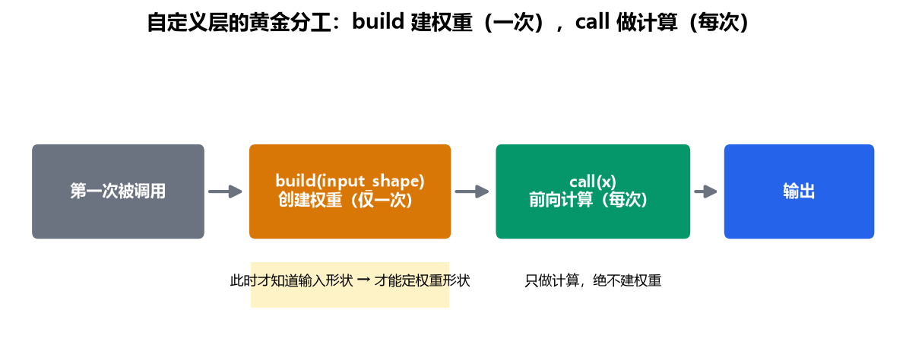

**为什么 Huber 损失"鲁棒"？** MSE 把大误差平方放大，离群点拽着整条拟合线跑；
MAE 在零点不可导。Huber 分段：小误差用 MSE（可导），大误差用 MAE（不放大）。
本章一维实测：2% 离群点让 MSE 的截距偏到 **+0.382**，Huber 只有 **+0.013**
（真值 0）——一张图看懂什么叫鲁棒。

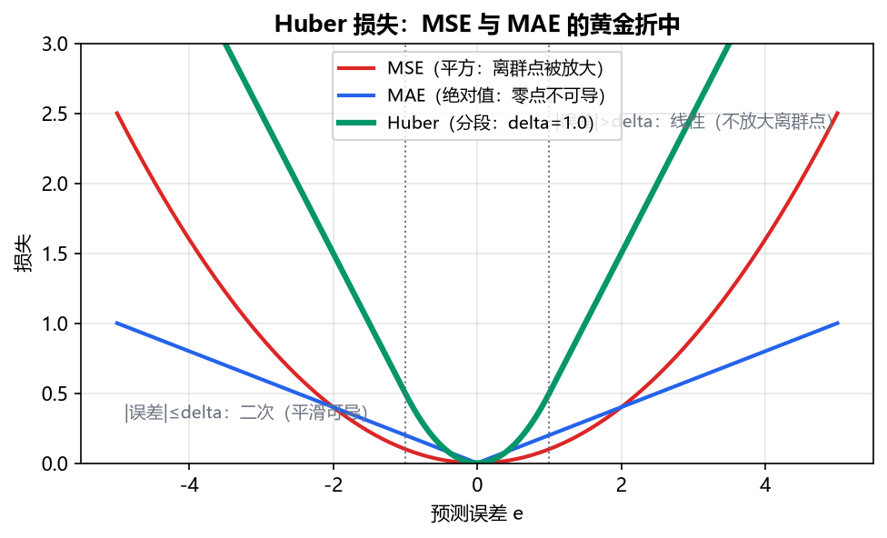

**为什么 GradientTape 是"第 1 章的工业版"？** 第 1 章手推了一个 sigmoid 神经元
的链式法则；tape 把链式法则自动化到**任意**计算图。你写前向，它录带、倒带、
求梯度——四步循环从此可以承载任何自定义结构。

**tf.function 的收益从哪来？** eager 模式每个 op 都走一遍 Python→C++ 调度；
tf.function 只编译一次、之后在 C++ 图执行器里跑。本机实测 50 个小 op 的链条
300 次调用：eager 0.63s vs 图模式 0.13s（约 4.6x）。**op 越小越密集，收益越大**
——大矩阵乘法本身已是 C++，差距自然小（与进阶 11 的观察互相印证）。

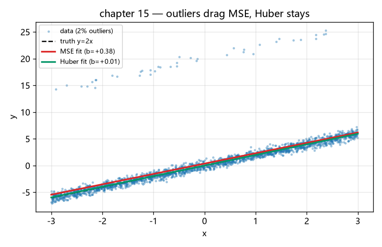

> 📖 **读图指南**：黑虚线 = 真实规律；红/绿实线 = 两种损失的拟合结果。
> 看图技巧：只看**截距**（x=0 处的高度）——MSE 红线被离群点整体抬高，Huber 绿线贴着真值。
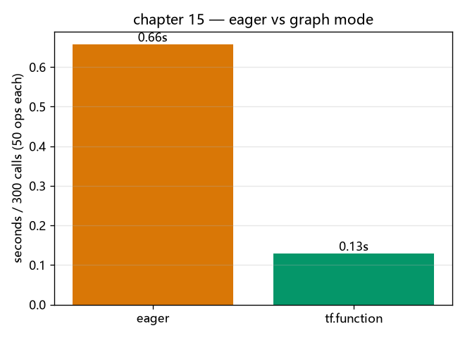

### ❌ 反例教室

**反例 1：在 call() 里创建权重**

```python
def call(self, x):
    self.w = self.add_weight(...)   # ❌ 每次前向都新建 → 参数永远学不到/直接报错
```
> 权重属于 build()。这是自定义层的头号错误，报错信息通常会提示
> "call() may be crashing"——根源是 build 约定没遵守。

**反例 2：tape.gradient 返回 None**

梯度是 None 的两大原因：① 计算发生在 tape 上下文之外（`with` 外的前向）；
② 路径上出现了 numpy 操作或不可导节点，切断了梯度流。
> 排查法：确认所有前向代码都在 `with tape:` 里；检查有没有 `.numpy()` 混入。

**反例 3：首次调用 tf.function 的编译开销污染计时**

第一次调用包含图编译（可能上百毫秒），直接计时会高估图模式成本。
> 规矩：先跑一次 warmup，再开始计时（脚本里就是这么做的）。

**反例 4：该用 fit 的地方手写了循环**

自定义循环要自己管 shuffle、进度条、回调、分布式……**fit + callbacks 覆盖
90% 的需求**。为改而改的自定义是负资产——"什么时候不自定义"也是工程判断。

### ✅ 过关自测

**基础题**：

1. build 和 call 的分工是什么？为什么这样拆？【答】build 一次性建权重（拿到
   输入形状后），call 每次做计算。
2. `tape.gradient` 返回 None 的两个常见原因？【答】前向不在 tape 上下文内 /
   梯度流被不可导操作切断。
3. Huber 什么时候像 MSE、什么时候像 MAE？【答】|误差|≤delta 像 MSE，
   >delta 像 MAE；delta 是两者的分界。

**挑战题**：

1. 给 MyDense 加一个可训练缩放系数（`add_weight`），验证它随训练变化。
2. 把自定义循环的 loss 写进 TensorBoard（`tf.summary.scalar`）——完全掌控训练。
3. 实现一个自定义 metric（如"预测值 >3 的比例"），在 fit 里直接可用。

**过关标准**：能从零写出一个可训练的自定义层 + 自定义损失 +
GradientTape 循环，并解释每一行为什么存在。至此，第 1 章与第 2 章正式闭环。

### 📚 延伸阅读

- Keras 官方 *Making new layers and models via subclassing*：本章的完整版
- Chollet《Deep Learning with Python (2nd)》第 7 章：Keras 高级 API 的权威阐述
- [16 周学期制课程表](study_plan_semester.md)：把进阶篇变成你的一个学期

---

## 进阶篇毕业项目 —— 第 16 章：把五课拧成一股绳

代码入口：`chapters/16_text_capstone.py`（IMDB 已缓存，纯 CPU 约 3-5 分钟）

> ✅ **版本**：本章代码在 TF 2.21 + Keras 3 实测通过；其他版本的差异见附录 D。

### 🎯 本章目标

一个任务，五课集成——**文本情感分类**，但每一环节都必须用进阶篇的方式实现：

```
 IMDB 整数序列 ──► [进阶11] tf.data 管道 ──► [进阶13] 手写注意力(带mask) ──► sigmoid
      │                                        ▲
      └── 定长窗口(进阶12) ──────────────────────┘
                                        [进阶15] GradientTape 自定义训练循环
                                                  │
                              评估(附录H): acc + F1 + 混淆矩阵 ──► [第8章] .keras 导出
```

实测：3 个 epoch 后 val_acc ≈ 88%，测试 acc ≈ 85%（F1 ≈ 0.85）。

### 📍 你在哪里

```
 [进阶15] 引擎盖 ──► [第16章] 进阶毕业 ──► 16 周学期制 / 终身路线
   你在这里 ─────────────┘
```

- **从已知出发**：这一章没有任何新知识点。它存在的意义是**验收**——
  知识点在孤立章节里是清单，穿过完整项目才会变成能力（实战 09 的教训在这里重演一次）。
- **为什么选文本而不是图像**：实战 09 已经是图像综合；文本方向此前只有第 5 章的
  词袋入门。本项补上文本综合，让两条数据主线都有"毕业作品"。

### 🔍 为什么这样设计

**为什么每个环节都要"用进阶篇的方式"？** 用 `fit` 三行也能训出来——但那样
进阶篇就白学了。管道必须带 prefetch（11）、分类头必须手写注意力（13）、
训练必须走 tape（15）——**约束即复习**。

**为什么 mask 反复出现？** 定长窗口里大量位置是 `<PAD>`。注意力打分、
池化求平均——任何一处忘了 mask，模型就会"认真阅读"填充符。
**mask 是序列模型的地基**，这是只有亲手写过才会懂的细节。

**为什么评估要看 F1？** 测试集正负各半，acc≈85% 看着不错；但混淆矩阵会告诉你
两类错误的分布并不对称。F1 把精确率与召回率捆在一起评价——详见附录 H。

### ❌ 反例教室

**反例：Keras 3 函数式布线里直接用 `tf.*`**

- **现象**：
  ```python
  pad_mask = tf.not_equal(inp, 0)   # ❌ inp 是 KerasTensor
  # ValueError: A KerasTensor cannot be used as input to a TensorFlow function...
  ```
- **原因**：Keras 3 的函数式图里，布线代码只能用 `tf.keras.ops`（或 Keras 层）；
  层的 `call()` **内部**才可以用原生 `tf.*`（构建时会以真实张量追踪）。
- **修复**：布线处改 `tf.keras.ops.not_equal / cast / sum`。
- **一句话教训**：**"图里"用 keras.ops，"层里"用 tf.\***——Keras 3 的边界规则。

### ✅ 过关自测

**基础题**：

1. 本项目的五环节分别来自哪一章？【答】管道 11 / 定长窗口 12 / 注意力头 13 /
   tape 训练循环 15 / 导出 08（评估方法见附录 H）。
2. 为什么注意力和池化都要 mask？【答】让模型"看不见" PAD 填充位，否则它会在
   无意义的填充符上花注意力、稀释真实内容的平均。
3. F1 比 acc 多告诉了你什么？【答】精确率与召回率的调和平均——两类错误
   不再被"总量正确"掩盖。

**挑战题**：

1. 把 maxlen 从 200 改成 80，F1 掉多少？——量化"截断信息损失"。
2. 把注意力头换成第 5 章词袋 + Dense，对比 F1——给"注意力带来什么"一个数字答案。

**过关标准**：不看教程独立重跑全流程，并能指着代码说出每一块来自哪一章、
为什么存在。**至此进阶篇毕业**——去 [16 周学期制课程表](study_plan_semester.md)
开始你的学期，或回 [知识地图](knowledge_map.md) 选一条岔路。

### 📚 延伸阅读

- 手册第 9 章 9.2 节：从本项目的注意力头出发，通向完整 Transformer 的路线
- 附录 H（评估指标指南）：把本章的 F1 讲全（PR 曲线 / AUC）
- `teaching/project_template.md`：想把它扩成正式项目报告，用这个模板


---
---

## 9. 第 09 章 —— 怎么读论文、找资源、下一步学什么

**目标：** 学完前 8 章之后，知道自己处于什么位置、下一步该往哪走、怎么自己找学习资源、怎么读论文。

---

### 9.1 你现在在哪里？

恭喜你！学完前 8 章，你已经掌握了深度学习的**入门全套技能**：

- 知道神经网络是怎么训练的（前向 → 损失 → 反向 → 更新）
- 会用 Keras 搭建和训练模型
- 了解 CNN 的核心思想（卷积、池化、权值共享）
- 做过图像分类和文本分类
- 会用迁移学习快速搞定小数据集任务
- 会用 TensorBoard 监控训练、用回调自动保存和早停
- 会保存和导出模型

但这只是开始。深度学习的世界很大，还有很多方向值得探索。接下来的问题是：**下一步学什么？**

### 9.2 主流方向入门路径

#### 方向一：计算机视觉（CV）

你已经学了 CNN 的基础，但 CV 的世界远不止于此：

| 主题 | 是什么 | 经典论文/模型 | 学习建议 |
| --- | --- | --- | --- |
| 目标检测 | 不仅分类，还要用框框出物体位置 | YOLO 系列、Faster R-CNN、SSD | 先看 YOLOv5/v8 的官方教程，跑通一个检测 demo |
| 图像分割 | 像素级分类，标出每个像素属于什么 | U-Net、DeepLab、Mask R-CNN | 医学影像、自动驾驶常用，U-Net 结构简单优雅，适合入门 |
| GAN 生成对抗网络 | 让两个网络对抗，生成逼真图片 | GAN、DCGAN、StyleGAN、Diffusion | 先理解"生成器 vs 判别器"的博弈思想，再看 Diffusion（现在的主流） |
| 自监督学习 | 不用标注数据，自己从数据中学特征 | SimCLR、MoCo、MAE | 大模型时代的预训练范式，了解思想即可 |

**入门路径**：把第 4 章的 CNN 基础打牢 → 学目标检测（YOLO）→ 学图像分割（U-Net）→ 了解 Diffusion 生成模型。

#### 方向二：自然语言处理（NLP）

你已经做了简单的文本分类，但 NLP 的深度和广度远超词袋模型：

| 主题 | 是什么 | 经典论文/模型 | 学习建议 |
| --- | --- | --- | --- |
| Word2Vec / GloVe | 词向量，让意思相近的词在向量空间里靠近 | Word2Vec、GloVe | 理解"分布式表示"的思想，这是 NLP 的基石 |
| RNN / LSTM | 处理序列数据的循环网络 | LSTM、GRU | 理解"记忆"的概念，为什么 LSTM 能解决梯度消失 |
| Seq2Seq + Attention | 序列到序列模型（翻译、摘要）+ 注意力机制 | Seq2Seq、Attention Is All You Need 之前的工作 | 了解注意力机制是怎么来的，为学 Transformer 铺垫 |
| Transformer | 完全基于注意力的序列模型 | "Attention Is All You Need" (2017) | **必学**！现在几乎所有 NLP 模型的基础 |
| BERT / GPT | 预训练语言模型 | BERT、GPT 系列 | 理解"预训练 + 微调"范式在 NLP 中的应用 |

**入门路径**：Word2Vec → RNN/LSTM → Seq2Seq + Attention → **Transformer（重点！）** → BERT/GPT。

> **特别提醒**：Transformer 是现在 AI 的核心基础设施（GPT、BERT、ViT 都是基于它），强烈建议花时间把它彻底搞懂。推荐先看 Jay Alammar 的 *The Illustrated Transformer*（图解 Transformer），再读原文。

#### 方向三：强化学习（RL）

让智能体在环境中通过试错来学习策略，类似于"训练宠物"——做对了给奖励，做错了给惩罚。

| 主题 | 是什么 | 经典内容 | 学习建议 |
| --- | --- | --- | --- |
| Q-Learning / DQN | 值函数方法 | Deep Q-Network (2015) | RL 入门经典，从 Q-Learning 表格法开始 |
| Policy Gradient | 策略梯度方法 | REINFORCE、PPO | 直接优化策略，连续动作空间更适用 |
| Actor-Critic | 演员-评论家方法 | A2C、SAC | 结合值函数和策略梯度的优点 |

**入门路径**：先玩 OpenAI Gym（现在叫 Gymnasium）的 CartPole → 学 Q-Learning → DQN → Policy Gradient → PPO。

#### 方向四：图神经网络（GNN）

处理图结构数据（社交网络、分子结构、知识图谱等）。

| 主题 | 是什么 | 经典论文 | 学习建议 |
| --- | --- | --- | --- |
| GCN | 图卷积网络 | "Semi-Supervised Classification with Graph Convolutional Networks" | GNN 的入门标配 |
| GAT | 图注意力网络 | "Graph Attention Networks" | 引入注意力机制的 GNN |

**入门路径**：先了解图的基本表示（邻接矩阵、节点特征）→ 学 GCN → 用 PyG (PyTorch Geometric) 或 DGL 动手做一个节点分类的例子。

### 9.3 怎么读论文？

读论文是深度学习学习者的必备技能。但初学者读论文很容易陷入"每个单词都认识，但连起来不知道在说什么"的困境。别担心，读论文是有方法的。

#### 三遍阅读法（推荐）

经典的"三遍阅读法"——一篇论文读三遍，每遍有不同的目标：

**第一遍：鸟瞰（5-10 分钟）**
- 读什么：标题、摘要、引言、所有小标题、图表、结论
- 目标：搞清楚这篇论文**解决了什么问题、用了什么方法、效果怎么样**
- 读完问自己：这篇论文和我有关吗？值不值得继续读？

**第二遍：通读（30-60 分钟）**
- 读什么：从头到尾读一遍，但跳过复杂的数学推导和实现细节
- 目标：理解论文的**核心思路**，能在脑子里画出方法的流程图
- 做标记：哪些地方没看懂、哪些地方想深入了解

**第三遍：精读（1-2 小时，可选）**
- 读什么：逐字逐句读，推导公式，复现实验思路
- 目标：彻底理解方法的每一个细节，能给别人讲清楚
- 问自己：如果我是作者，我会怎么做？这篇论文的创新点在哪？有什么不足？

#### 读论文的实用技巧

1. **先读综述/博客，再读原文**：一篇新论文出来，很快会有大佬写解读文章（知乎、Medium、YouTube 上都有）。先看解读，建立大概印象，再读原文会轻松很多。

2. **看代码辅助理解**：很多论文都有官方或第三方的开源实现。对着代码读论文，很多模糊的地方一下就清楚了。Papers With Code 是找代码的好地方。

3. **做笔记**：读完一篇论文，用自己的话写一段总结：解决了什么问题、核心方法是什么、实验结果怎么样、有什么启发。不做笔记的话，过两周就忘了。

4. **从经典论文开始**：不要一开始就读最新的论文。先把领域内的经典论文读了，建立知识体系，再读新论文就容易了。比如学 NLP 先读 Transformer 原文，学 CV 先读 ResNet 原文。

5. **看不懂很正常**：即使是大佬，也不是每篇论文都能一遍读懂。看不懂就先放一放，过几天再看，或者找别人的解读看看。

#### 论文去哪里找？

- **arXiv**：https://arxiv.org/ —— 预印本网站，所有最新论文都先挂在这
- **Google Scholar**：https://scholar.google.com/ —— 搜论文、看引用
- **Papers With Code**：https://paperswithcode.com/ —— 论文 + 代码 + 排行榜
- **Semantic Scholar**：https://www.semanticscholar.org/ —— AI 驱动的学术搜索引擎

### 9.4 优质学习资源推荐

#### 入门课程

| 资源 | 特点 | 适合人群 |
| --- | --- | --- |
| Andrew Ng 机器学习（Coursera） | 经典中的经典，讲得深入浅出 | 零基础入门 |
| Andrew Ng 深度学习专项（Coursera） | 五门课系统讲深度学习 | 学完机器学习之后 |
| fast.ai 课程 | 实战导向，"自上而下"教学，先上手再讲原理 | 喜欢动手的人 |
| 李宏毅机器学习（B站/YouTube） | 中文授课，幽默风趣，每年更新 | 习惯中文教学的人 |
| D2L（动手学深度学习） | 书 + 代码 + 视频，MXNet/PyTorch/TensorFlow 三版 | 喜欢边学边练的人 |

#### 书籍

| 书名 | 特点 |
| --- | --- |
| *Deep Learning with Python* (Chollet) | Keras 之父写的，直觉讲得非常好 |
| *Hands-On Machine Learning with Scikit-Learn, Keras & TensorFlow* (Géron) | 实战导向，内容全面 |
| *深度学习*（花书，Goodfellow 等） | 深度学习"圣经"，理论全面，但偏难 |
| *Pattern Recognition and Machine Learning* (Bishop) | 经典 ML 教材，数学推导详细 |

#### 博客 / 网站

- **Jay Alammar 的博客**（jalammar.github.io）：图解系列（Transformer、BERT、GPT2），强烈推荐
- **Distill**（distill.pub）：交互式可视化讲解，每篇都是精品
- **Towards Data Science**（Medium）：文章质量参差不齐，但好文章很多
- **机器之心 / 量子位**：中文 AI 资讯和技术解读
- **知乎**：关注几个高质量答主，能学到很多

#### 视频 / YouTube

- **3Blue1Brown**：神经网络系列视频，用动画讲清原理，必看
- **Yannic Kilcher**：每周论文解读，讲得很透彻
- **李沐**：动手学深度学习视频版，中文
- **Stanford CS231n**：计算机视觉经典课程
- **Stanford CS224n**：自然语言处理经典课程

### 9.5 学习路线建议

给计算机专业学生的深度学习学习路线（按时间顺序）：

**第 1 阶段：基础入门（1-2 个月）**
- 学完本手册的第 1-8 章
- 补充数学基础：线性代数（矩阵运算、特征值分解）、概率论（贝叶斯、分布）、微积分（偏导、链式法则）
- 看 3Blue1Brown 的神经网络系列视频

**第 2 阶段：系统学习（2-3 个月）**
- 学完 Andrew Ng 的深度学习专项（或李宏毅的课）
- 读 *Deep Learning with Python* 或 *Hands-On ML*
- 选一个方向（CV/NLP）深入，做 2-3 个小项目

**第 3 阶段：读论文 + 复现（3-6 个月）**
- 读领域经典论文（每个方向 10-20 篇）
- 复现 3-5 篇经典论文的实验
- 参加一个 Kaggle 比赛或做一个稍大的项目

**第 4 阶段：确定方向 + 深入（持续）**
- 选定细分方向（比如目标检测、大语言模型、强化学习等）
- 跟进最新论文（每周读 2-3 篇）
- 尝试做自己的研究或项目

> 记住：**深度学习是实践出来的，不是看出来的。** 光看书听课没用，一定要动手写代码、调模型、踩坑、解决问题。

### 9.6 卡住了去哪求助

遇到手册没覆盖的问题，按这个顺序求助——**先搜索，后提问**：

**第一步：搜报错（80% 的问题在这一步解决）**

搜索公式：`框架名 + 异常类型 + 最有辨识度的半句说明`，去掉自己的路径/变量名。
例：`tensorflow ValueError Input 0 of layer is incompatible`。
渠道优先级：官方文档 → GitHub Issues → Stack Overflow。

**第二步：高效提问（附"最小可复现"模板）**

提问的灵魂是**最小可复现示例**（MRE）：10 行以内、别人粘贴就能跑、
能复现同一报错。模板：

```
环境：TF 2.21 / Keras 3 / CPU / Windows 11
目标：想让模型做 XX
最小代码：
    <10 行可运行代码>
完整报错：
    <报错最后 5 行，一字不差>
我已经试过：<列 2-3 件你尝试过的事>
```

**第三步：去哪问**

| 渠道 | 适合 | 备注 |
| --- | --- | --- |
| Stack Overflow（`tensorflow` 标签） | 具体报错 | 先搜后问，命中率极高 |
| TensorFlow GitHub Issues | 疑似框架 bug | 用英文，附 MRE 与版本号 |
| TensorFlow 官方论坛 discuss.tensorflow.org | 设计/用法讨论 | 团队会看 |
| 知乎 / 掘金 / V2EX | 中文经验帖 | 搜"报错信息原文"常有惊喜 |
| 课程/项目自己的 Issues | 本手册相关问题 | 欢迎反馈勘误 |

> 提问的隐藏收益：把问题写成 MRE 的过程，常常自己就把答案写出来了。

---

### 🧠 直觉理解

为什么要读论文？因为深度学习发展太快了——课本上的知识可能已经过时两三年了。论文是这个领域的"第一线情报"，想跟上节奏就必须学会读论文。

但读论文不是为了"读完"——就像看书不是为了"看完"一样。**重要的是理解思想、启发思考**。一篇论文哪怕你只学到一个点子，也是有价值的。

### 📌 核心概念

- Transformer：基于自注意力机制的序列模型，现代 AI 的核心架构
- GAN：生成对抗网络，通过生成器和判别器的博弈生成数据
- RNN / LSTM：循环神经网络，处理序列数据的经典方法
- 自监督学习：利用数据本身构造监督信号，不需要人工标注
- 迁移学习（进阶）：预训练 + 微调是当前大模型时代的主流范式

> 详见 [术语表](glossary_zh.md)

### ✋ 动手试一试

1. **读一篇经典论文**：选一篇你感兴趣方向的经典论文（比如 ResNet 或 Transformer），用"三遍阅读法"读一遍，写一段 300 字的总结。

2. **复现一个小模型**：找一篇简单的论文（比如 LeNet-5 这种经典），自己动手用 Keras 实现一下，在 MNIST 或 CIFAR-10 上跑通。

3. **探索 Kaggle**：注册一个 Kaggle 账号，找一个"入门级"比赛（比如 Titanic、Digit Recognizer），看看别人的解决方案，学习数据科学的完整流程。

### ⚠️ 常见坑

1. **收藏从未停止，学习从未开始**：Mark 了一堆资源、收藏了一堆论文，但从来没真正读过。不如少收藏几篇，每篇都认真读完。

2. **只读不做**：看了很多课程、读了很多论文，但自己动手写代码的时候还是不会。一定要边学边练，每学一个新东西就动手实现一下。

3. **贪多嚼不烂**：同时学好几个方向（CV、NLP、RL 一起来），结果哪个都没学深。建议先把一个方向学扎实，再扩展到其他方向——很多原理是相通的。

4. **死磕数学公式**：初学者没必要把每个公式都推导一遍。先理解直觉和整体思路，公式细节等需要的时候再回来抠。

---

## 10. 第 10 章 —— 调参实用指南

**目标：** 掌握神经网络调参的"经验法则"——遇到问题知道该调什么、怎么调、为什么这么调。

---

### 10.1 调参是什么？为什么重要？

训练神经网络就像**炒菜**：

- 食材（数据）已经有了
- 菜谱（模型结构）也有了
- 但放多少盐（学习率）、炒多久（epoch 数）、火多大（batch size）、加不加料酒（正则化）……这些都得你自己定

这些"需要手动设定、不是训练出来的"参数，叫**超参数**（Hyperparameter）。调参就是调整这些超参数，让模型表现更好。

> **超参数 vs 参数**：
> - **参数**（Parameter）：模型自己学出来的，比如权重和偏置
> - **超参数**（Hyperparameter）：人手动设定的，比如学习率、层数、隐藏单元数

调参很重要——同样的模型和数据，超参数设得好不好，准确率可能差 5-10 个百分点。但调参也很"玄学"——没有固定公式，更多是经验和直觉。

这一章就给你一些**实用的经验法则**，让你调参时不至于"瞎调"。

### 10.2 学习率（Learning Rate）

学习率是**最重要的超参数，没有之一**。它决定了每一步更新的幅度。

#### 学习率太大 vs 太小

| 情况 | 表现 | 后果 |
| --- | --- | --- |
| 太大 | loss 剧烈震荡，甚至越来越大（发散） | 模型永远收敛不了 |
| 略大 | loss 下降很快，但后期在最小值附近震荡，降不到最低 | 最终精度不够 |
| 合适 | loss 平稳下降，越往后越慢，最后趋于平稳 | 收敛到较好的结果 |
| 略小 | loss 下降很慢，需要很多 epoch 才能收敛 | 训练太慢，浪费时间 |
| 太小 | loss 几乎不动，像一条平线 | 可能卡在局部最小值，训练不动 |

#### 怎么选初始学习率？

**经验法则**：
- 先从 **0.01** 开始试（SGD）
- Adam 的话从 **0.001** 开始（Adam 自带自适应学习率，对初始值没那么敏感）
- 跑几个 epoch 看看 loss 曲线：
  - 如果 loss 爆炸（越来越大）→ 学习率太大，除以 10 再试
  - 如果 loss 不动 → 学习率太小，乘以 10 再试
  - 如果 loss 平稳下降 → 这个数量级差不多对了

#### 学习率调度（LR Schedule）

固定学习率通常不是最优的——训练初期可以大步走，训练后期应该小步走。所以有各种**学习率调度策略**：

1. **Step Decay**：每过 N 个 epoch，学习率乘以 0.1（或 0.5）
   ```python
   lr_schedule = tf.keras.optimizers.schedules.ExponentialDecay(
       initial_learning_rate=0.01, decay_steps=10000, decay_rate=0.96)
   ```

2. **ReduceLROnPlateau**：监控验证 loss，连续几轮没改善就降学习率
   ```python
   reduce_lr = tf.keras.callbacks.ReduceLROnPlateau(
       monitor='val_loss', factor=0.1, patience=5, min_lr=1e-7)
   ```
   > 这是最常用的调度方式之一——简单、有效、省心。

3. **Cosine Annealing**：学习率按余弦曲线从大到小衰减
   - 配合 warm-up（先从小学习率慢慢升到最大，再慢慢降下来）效果更好
   - 现在很多 sota 模型都用这个

**建议**：初学者先用 ReduceLROnPlateau，简单好用。等有经验了再尝试其他调度方式。

### 10.3 Batch Size

Batch size 是每次梯度更新用多少样本。

#### Batch Size 大小的影响

| 方面 | 小 batch | 大 batch |
| --- | --- | --- |
| 训练速度 | 慢（迭代次数多） | 快（迭代次数少） |
| 内存占用 | 小 | 大 |
| 梯度噪声 | 大（有正则化效果） | 小（更稳定） |
| 最终精度 | 可能更好（噪声帮助逃离局部最优） | 可能稍差 |

#### 怎么选 batch size？

**经验法则**：
- **先选最大的能塞进显存/内存的 batch size**——训练快、效率高
- 如果效果不好，再调小 batch size
- 常见的 batch size：32、64、128、256（2 的幂次，计算效率更高）
- 实在塞不下的话，用**梯度累积**（Gradient Accumulation）——多个 batch 的梯度累加起来再更新，模拟大 batch 的效果

> **注意**：batch size 和学习率是相关的。batch size 翻倍，学习率通常也应该翻倍（因为梯度更稳定了，可以走更大的步）。

### 10.4 网络结构相关

#### 层数和隐藏单元数

- **模型太小**：欠拟合（训练集准确率就不高）
- **模型太大**：过拟合（训练集很高，验证集很低）

**经验法则**：
- 先从小模型开始，快速迭代，确认能跑通
- 如果训练集准确率就不高 → 加大模型（加层、加隐藏单元）
- 如果训练集很高但验证集低 → 加正则化（Dropout、权重衰减、数据增强）
- 模型大小通常是"能过拟合的最小模型"——刚好能把训练集学好，但又不会大到严重过拟合

#### 激活函数怎么选？

- **隐藏层**：默认用 **ReLU**。简单、快、效果好。
  - 如果 ReLU 效果不好，可以试试 LeakyReLU、ELU、GELU
- **输出层**：
  - 二分类 → sigmoid
  - 多分类 → softmax
  - 回归 → 不用激活函数（线性输出）

### 10.5 优化器怎么选？

| 优化器 | 特点 | 适用场景 |
| --- | --- | --- |
| SGD（带动量） | 经典、稳定、泛化好，但收敛慢 | 追求最终精度、有足够训练时间 |
| Adam | 自适应学习率，收敛快，调参少 | 快速迭代、大多数任务的默认选择 |
| AdamW | Adam + 权重衰减，修正了 Adam 的权重衰减问题 | 现在的主流选择，比 Adam 更稳 |

**建议**：默认用 **AdamW**（或 Adam），学习率设 0.001。如果想追求更好的最终效果，可以换成 SGD + momentum + 学习率衰减，但调参更麻烦。

### 10.6 正则化：什么时候加 Dropout？

Dropout 是最常用的正则化手段之一。

**什么时候加 Dropout？**
- 模型在训练集上表现很好，但验证集差很多 → **过拟合了** → 加 Dropout
- 模型连训练集都没学好 → **欠拟合** → 不要加 Dropout（加了更学不好）

**Dropout 比率设多少？**
- 通常在 **0.2 ~ 0.5** 之间
- 从 0.2 开始试，如果还是过拟合就加到 0.3、0.5
- 不要加太大（比如 0.8），否则模型学不到东西

**Dropout 加在哪？**
- 通常加在全连接层之后、下一层之前
- CNN 中一般加在全连接分类头部分，卷积层后面不常加 Dropout（可以用数据增强、权重衰减替代）

### 10.7 其他重要超参数

#### Epoch 数和 Early Stopping

- epoch 数不用纠结设多少——设大一点，配合 **EarlyStopping** 自动停
- `patience` 设 5-10 比较常用
- 记得用 `ModelCheckpoint(save_best_only=True)` 保存最优模型

#### 权重衰减（Weight Decay）

- 另一种常用的正则化手段，在损失函数里加一项权重的 L2 范数
- 效果上和 Dropout 类似，都是防止过拟合
- AdamW 优化器自带权重衰减，直接设 `weight_decay` 参数就行
- 通常设 `1e-4` 或 `1e-5` 左右

#### 数据增强（Data Augmentation）

- 图像任务中最有效的正则化手段，没有之一
- 常见的增强方式：随机裁剪、随机翻转、颜色抖动、旋转、缩放……
- 原理：通过"人造"更多训练数据，让模型见过更多变化，从而更鲁棒
- 过拟合的时候，先想想能不能用数据增强，比调 Dropout 效果还好

### 10.8 调参的一般流程

给你一个**调参 Checklist**，按顺序来：

1. **先让模型跑起来**：不管效果怎么样，先确保代码能跑、loss 在下降、准确率在上升。
2. **过拟合一个小数据集**：用很少的数据（比如 100 个样本）训练，看看模型能不能把训练 loss 降到接近 0。如果降不到，说明模型有 bug 或者容量不够。
3. **找到合适的学习率**：从 0.01（SGD）或 0.001（Adam）开始，loss 爆炸就减小，不动就增大。
4. **训练完整模型**：用全部数据训练，记录训练集和验证集的曲线。
5. **判断问题**：
   - 训练集准确率低 → 模型太小 / 学习率不对 / 训练不够 → 加大模型 / 调学习率 / 多训几轮
   - 训练集高、验证集低 → 过拟合 → 加正则化（Dropout、权重衰减、数据增强）
   - 都不高但差不多 → 模型不够大 → 加大模型
6. **精调**：在大方向对了之后，再微调学习率、Dropout 比率等超参数，提升 1-2 个百分点。

> **最重要的原则**：一次只改一个参数！同时改好几个，你就不知道是哪个参数起作用了。

### 10.9 自动化超参数搜索：让机器替你调

> 10.1-10.8 教的是"手工调参的直觉"；本节是它的自动化版本。**顺序不变：先粗调再精调**。

**三种搜索策略**：

| 策略 | 做法 | 何时用 |
| --- | --- | --- |
| Grid Search | 把候选值全组合跑一遍（lr∈{0.01,0.1} × bs∈{32,64} → 4 次实验） | 组合少（≤10 次），目标明确 |
| Random Search | 在区间里随机采样 N 组 | **默认首选**——同样的预算，覆盖比网格更均匀 |
| Bayesian Optimization | 根据已有结果建模"哪个区域可能更好"，智能推荐下一组 | 单次实验很贵、参数多时 |

**为什么 Random Search 经常打赢 Grid Search**：多数超参数里只有少数几个真正重要
（通常是学习率）；网格把预算浪费在"不重要参数的全组合"上，随机采样则天然把
预算花在重要参数的更多取值上。（Bergstra & Bengio, 2012 的经典结论。）

**KerasTuner 最小示例**（`pip install keras-tuner` 后可直接跑）：

```python
import keras_tuner as kt
from tensorflow import keras

def build_model(hp):
    model = keras.Sequential([
        keras.layers.Input(shape=(784,)),
        keras.layers.Dense(hp.Int("units", 64, 512, step=64), activation="relu"),
        keras.layers.Dropout(hp.Float("dropout", 0.1, 0.5, step=0.1)),
        keras.layers.Dense(10, activation="softmax"),
    ])
    model.compile(
        optimizer=keras.optimizers.Adam(
            hp.Choice("lr", [1e-2, 1e-3, 1e-4])),
        loss="sparse_categorical_crossentropy", metrics=["accuracy"])
    return model

tuner = kt.RandomSearch(build_model, objective="val_accuracy",
                        max_trials=10, overwrite=True)
tuner.search(x_train, y_train, validation_split=0.1, epochs=5)
tuner.results_summary(3)   # 前三名配方
```

**三条纪律**（和手工调参完全一致）：

1. **先粗后精**：先用 3-5 epoch 的大范围搜索锁定数量级，再用完整训练精调前 2-3 名；
2. **只看验证集**：tuner 的 `objective` 必须是 val_*，测试集留到最终报告；
3. **控制预算**：`max_trials` × 每 trial 的时间 = 总成本，先算账再开跑。

---

### 🧠 直觉理解

调参就像**调音**——吉他弦拧太松，声音发闷；拧太紧，声音尖锐甚至断弦。你得一点点拧，边拧边听，找到那个最合适的松紧度。

但调参也没那么"玄学"。它有规律可循：
- 先大方向对了（模型能收敛、不过拟合也不欠拟合），再抠细节
- 一次只改一个变量，观察变化
- 多调几次，你就有感觉了——大概知道某个参数改了之后会有什么效果

### 📌 核心概念

- [**学习率 (Learning Rate)**](glossary_zh.md#学习率-learning-rate)：梯度下降的步长，最重要的超参数
- [**批量 (Batch)**](glossary_zh.md#批量-批次-batch)：一次更新用的样本数
- [**正则化 (Regularization)**](glossary_zh.md#正则化-regularization)：防止过拟合的各种手段
- [**Dropout**](glossary_zh.md#dropout)：随机失活正则化
- [**优化器 (Optimizer)**](glossary_zh.md#优化器-optimizer)：更新参数的算法（SGD、Adam 等）
- 超参数（Hyperparameter）：手动设定的、不是训练出来的参数
- 学习率调度（LR Schedule）：训练过程中动态调整学习率

> 详见 [术语表](glossary_zh.md)

### ✋ 动手试一试

1. **学习率扫描**：选第 3 章的 MNIST 任务，分别用学习率 1.0、0.1、0.01、0.001、0.0001 训练，画出 5 条 loss 曲线放在一起对比。
   - 哪个学习率收敛最快？
   - 哪个学习率最终效果最好？
   - 哪个学习率导致 loss 爆炸？

2. **Batch Size 对比实验**：分别用 batch size 8、32、128 训练同一个模型，比较：
   - 每个 epoch 的训练时间
   - 收敛速度（多少个 epoch 达到相同精度）
   - 最终精度

3. **正则化效果对比**：在第 4 章 CIFAR-10 任务上，分别训练：
   - 基线模型（无正则化）
   - 加 Dropout(0.5)
   - 加数据增强
   - 加权重衰减(1e-4)
   比较验证集准确率的提升。

### ⚠️ 常见坑

1. **同时改多个参数**：一次改了学习率、batch size、模型结构三个东西，结果变好了/变差了，你完全不知道是哪个因素导致的。**一次只改一个！**

2. **根据测试集调参**：调参的时候只能看验证集，不能看测试集。测试集是"最终考试"，只能用一次。用测试集调参相当于作弊，得到的结果没有意义。

3. **太早下结论**：训练了 2 个 epoch 看 loss 没降多少就说"这个学习率不行"。也许只是还在预热阶段，再等等就降下来了。至少训练 5-10 个 epoch 再下判断。

4. **盲目网格搜索**：把所有超参数排列组合跑一遍，看似科学，实则浪费时间。更好的做法是：先粗调（大跨度找范围），再精调（小范围找最优值）。

5. **忽视数据质量**：模型效果不好，不一定是超参数的问题，也可能是数据有问题（标注错了、类别不平衡、预处理不对）。先检查数据，再调参。

---

## 11. 第 11 章 —— 调试神经网络的 10 个技巧

**目标：** 遇到训练问题时，有一套系统的排查思路，而不是"瞎试一通"。

---

训练神经网络经常遇到各种问题：loss 不下降、准确率上不去、梯度爆炸、过拟合……初学者遇到这些问题很容易慌，到处瞎改参数，结果越调越乱。

这一章给你 **10 个调试技巧**，按顺序用，大部分问题都能找到原因。

### 技巧 1：先过拟合一个小数据集

**这是最最重要的调试技巧，没有之一。**

在怀疑人生之前，先做一个简单的测试：拿**很少的数据**（比如 10-100 个样本），训练你的模型，看看它能不能把这少量数据的 loss 降到接近 0（或者准确率接近 100%）。

- **能过拟合** → 模型结构没问题、代码没问题、梯度流没问题
- **不能过拟合** → 有 bug！模型根本学不到东西，别指望在大数据集上能学好

为什么这个测试这么有用？因为**模型的容量应该足够大到记住少量数据**。如果连几十个样本都记不住，说明要么模型写错了，要么训练流程有 bug。

> **口诀**：先搞定"能学进去"，再谈"学得好不好"、"过不过拟合"。

### 技巧 2：检查数据和标签

很多时候模型训练不好，不是模型的问题，是**数据的问题**。

检查清单：
- 数据归一化了吗？（图片是不是除以 255 了？）
- 标签对吗？有没有标注错误？
- 标签格式和损失函数匹配吗？（整数标签用 sparse，one-hot 用 categorical）
- 类别平衡吗？是不是某一类占了 90%？
- 训练集和测试集的分布一致吗？
- 数据增强有没有搞反标签？（比如翻转图片后，对应的标签有没有同步变化？）

**最简单的检查方法**：把数据和标签画出来/打印出来，**肉眼看几张**。别嫌麻烦——很多低级错误一眼就能看出来。

### 技巧 3：监控训练曲线

不要只看最终的 loss 和准确率——**要看完整的训练曲线**。曲线的形状能告诉你很多信息。

常见的曲线模式：

| 曲线形状 | 可能的原因 | 怎么办 |
| --- | --- | --- |
| loss 一直上升/爆炸 | 学习率太大 | 减小学习率 |
| loss 完全不动 | 学习率太小 / 数据有问题 / 梯度消失 | 增大学习率 / 检查数据 / 换激活函数 |
| loss 下降很慢 | 学习率偏小 / 模型太小 | 增大学习率 / 加大模型 |
| 训练 loss 一直降，验证 loss 先降后升 | 过拟合了 | 加正则化 / 用早停 |
| 训练和验证 loss 都下降但很慢 | 正常情况，继续训 | 多训几个 epoch |
| loss 曲线锯齿状很严重 | batch size 太小 / 学习率太大 | 增大 batch size / 减小学习率 |

**建议**：每次训练都把曲线保存下来（用 TensorBoard 或 history 画图），建立自己的"曲线诊断库"。见得多了，一眼就能看出问题在哪。

### 技巧 4：检查梯度——梯度消失 vs 梯度爆炸

如果模型学不动，可能是**梯度出了问题**。

怎么检查梯度？用 TensorBoard 的直方图功能，看看每一层的梯度分布：

- **梯度消失**：前面几层的梯度几乎是 0，像一条细线 —— 梯度传不到前面，前几层参数不更新
- **梯度爆炸**：梯度的值非常大（几千几万），甚至出现 NaN —— 梯度过大，参数更新失控

#### 梯度消失怎么办？

- 换激活函数：把 sigmoid/tanh 换成 ReLU/LeakyReLU
- 用残差连接（ResNet 的思想）
- 用 Batch Normalization
- 调整初始化方式：He 初始化（配合 ReLU）、Xavier 初始化（配合 tanh）

#### 梯度爆炸怎么办？

- 梯度裁剪（Gradient Clipping）：把梯度限制在某个范围内
- 减小学习率
- 用 Batch Normalization
- RNN 中可以用梯度裁剪 + 门控机制（LSTM/GRU）

### 技巧 5：Loss 不下降的排查清单

loss 不下降是最常见的问题之一。按这个清单排查：

1. **数据层面**
   - [ ] 数据归一化了吗？
   - [ ] 标签对吗？
   - [ ] 训练集和验证集搞混了吗？
   - [ ] 数据 shuffle 了吗？（如果同一类的样本堆在一起，训练会出问题）

2. **模型层面**
   - [ ] 模型结构对吗？（输出层的神经元数 = 类别数？）
   - [ ] 输出层的激活函数对吗？（分类用 softmax/sigmoid，回归不用）
   - [ ] 参数量够吗？（会不会模型太小了？）

3. **训练层面**
   - [ ] 损失函数对吗？（和任务、标签格式匹配吗？）
   - [ ] 学习率合适吗？（太大或太小都不行）
   - [ ] 优化器选对了吗？
   - [ ] 有没有不小心把所有层都冻结了？

4. **数值层面**
   - [ ] 有没有出现 NaN？（loss = nan 肯定有问题）
   - [ ] 有没有除以零？
   - [ ] 有没有 log(0)？
   - [ ] 输入数据有没有极端值？

> **建议**：从上到下一项一项检查，不要跳。大多数时候问题出在很低级的地方。

### 技巧 6：过拟合怎么办？

过拟合（训练好、测试差）是另一个常见问题。按"从易到难"的顺序尝试：

#### 第一梯队：最有效的方法

1. **数据增强**：如果是图像任务，先把数据增强加上。这是成本最低、效果最好的正则化。
2. **更多数据**：如果能拿到更多标注数据，那是最好的。
3. **简化模型**：减小模型大小（减少层数、减少隐藏单元）。模型太大、数据太少，必然过拟合。

#### 第二梯队：常用正则化

4. **Dropout**：加 Dropout 层，比率从 0.2 开始试。
5. **权重衰减**：L2 正则化，用 AdamW 或在优化器里设 weight_decay。
6. **Early Stopping**：至少要用上这个，防止白跑。

#### 第三梯队：进阶手段

7. **数据清洗**：检查训练数据，把标注错误的、重复的、质量差的去掉。
8. **标签平滑（Label Smoothing）**：把硬标签（0/1）换成软标签（0.1/0.9），防止模型过于自信。
9. **更激进的数据增强**：Mixup、CutMix 等高级增强方法。

> **原则**：先试简单有效的，再试复杂的。不要一上来就搞各种花里胡哨的正则化。

### 技巧 7：用简单的 baseline 对比

有时候你觉得模型效果不好，但其实是你**期望太高**了。

在开始复杂模型之前，先建立一个简单的 baseline：
- 分类任务：随机猜测的准确率是多少？（10 分类就是 10%）
- 回归任务：直接预测平均值的 MSE 是多少？
- 图像分类：用最简单的 MLP 能达到多少准确率？

如果你的复杂模型只比 baseline 好一点点，说明模型可能有问题，或者任务本身很难。如果好很多，说明模型在工作，只是还可以更好。

### 技巧 8：随机种子——让结果可复现

调试的时候，你希望"同样的代码跑两次结果一样"，这样才能确定你改的东西有没有效果。

但深度学习里有很多随机因素：
- 权重初始化
- 数据 shuffle
- Dropout
- 数据增强

要让结果可复现，需要**设置随机种子**：

```python
import numpy as np
import tensorflow as tf
import random

seed = 42
random.seed(seed)
np.random.seed(seed)
tf.random.set_seed(seed)
```

> 注意：完全可复现有时候很难（GPU 上的一些操作本身有随机性），但设置种子能大幅减少随机性。调试阶段强烈建议设种子。

### 技巧 9：从简单到复杂，逐步验证

不要一开始就搭一个超级复杂的模型，然后发现效果不好，不知道问题出在哪。

**正确的做法是从简单到复杂，逐步添加**：

1. 先搭一个最简单的模型（比如只有一层 Dense），确认能跑通、能收敛
2. 加一层，看看效果有没有提升
3. 再加一层，再加 dropout……
4. 每加一个东西都确认一下：效果是变好了还是变差了？

这样，如果加了某个东西之后效果突然变差，你就知道问题出在哪了。

### 技巧 10：善用工具，事半功倍

调试神经网络有很多好用的工具，学会用工具能省很多时间：

1. **TensorBoard**：看曲线、看图谱、看梯度分布、看嵌入……调试必备。
2. **`model.summary()`**：打印模型结构和参数量，确认模型是不是你想要的样子。
3. **逐步打印中间结果**：在模型的各个位置打印输出的 shape、均值、方差、有没有 NaN，定位问题出在哪一层。
4. **`tf.debugging.check_numerics`**：检查张量中有没有 NaN 和 Inf，有的话直接报错。
5. **断点调试**：用 IDE（如 VS Code、PyCharm）的调试功能，一步步跟，看看每一步的结果对不对。

---

### 🧠 直觉理解

调试神经网络就像**看病**——病人说"我不舒服"，医生不会上来就开刀，而是先问症状、量体温、验血、做检查，一步步缩小范围，找到病因，然后对症下药。

调试也是一样：
- 不要上来就乱改参数
- 先收集信息（看曲线、看数据、看梯度）
- 提出假设（"可能是学习率太大了"）
- 做实验验证（"把学习率减小试试"）
- 根据结果调整假设

**系统的方法比瞎试效率高 10 倍。**

### 📌 核心概念

- [**梯度消失 / 梯度爆炸**](glossary_zh.md#梯度爆炸--梯度消失-gradient-exploding--vanishing)：深层网络中梯度过小或过大的问题
- [**过拟合 (Overfitting)**](glossary_zh.md#过拟合-overfitting)：训练好但测试差
- [**学习率 (Learning Rate)**](glossary_zh.md#学习率-learning-rate)：最常见的导致训练失败的原因
- [**正则化 (Regularization)**](glossary_zh.md#正则化-regularization)：解决过拟合的各种手段
- 调试（Debugging）：系统地定位和解决问题的过程

> 详见 [术语表](glossary_zh.md)

### ✋ 动手试一试

1. **故意制造一个 bug**：在第 3 章的代码里，故意把标签搞反（比如 y_train = 9 - y_train），或者把学习率设成 100，然后训练，观察 loss 曲线长什么样。
   - 这能帮你建立"错误模式的直觉"——以后遇到类似曲线，就知道大概是什么问题。

2. **故意制造过拟合**：用第 4 章的 CNN 模型，但只用 100 张训练图片，训练 50 个 epoch，看看过拟合的曲线长什么样。然后尝试用 Dropout 和数据减轻过拟合。

3. **做一个梯度检查小实验**：用一个简单的网络（比如 3 层 MLP），分别用 sigmoid 和 ReLU 作为激活函数，训练后打印或可视化每一层的梯度范数，看看 sigmoid 的梯度消失现象。

### ⚠️ 常见坑

1. **一上来就调超参数**：模型连过拟合都做不到（说明有 bug），还在那调学习率调 Dropout。先确认模型能学进去再说。

2. **只看 loss，不看准确率**：loss 在下降不代表准确率在上升（有时候 loss 下降但准确率不动）。两个都要看，而且重点看准确率（这才是你真正关心的指标）。

3. **训练一个 epoch 就下结论**：深度学习训练需要时间，尤其是大模型大数据。至少训练 5-10 个 epoch 再判断趋势。

4. **不记录实验**：调了一堆参数，最后忘了哪个参数对应哪个结果。建议用表格或笔记记录每次实验的参数和结果。

5. **忽视最简单的原因**：很多时候问题的原因非常低级——路径写错了、数据没加载对、标签搞反了、激活函数加错了。不要想太复杂，先检查最简单的地方。

---


## 12. 第 12 章 —— 如何读报错：从慌到稳

**目标：** 报错不再是"天书"。学完本章，你面对任何报错都有一套固定动作：
**定位 → 翻译 → 修复**（或带着完整信息去搜索/提问，见 9.6 节）。

---

### 12.1 为什么先教这个

初学者最早的放弃时刻，往往不是"学不会梯度"，而是**被一段红色报错吓退**。
而真相是：报错是计算机写给你的**诊断书**，90% 的报错答案就在报错文本里。
手册多处说过"学会读报错，比背 API 更重要"——这一章就是把这句话变成方法。

### 12.2 报错堆栈的结构：从下往上读

```
Traceback (most recent call last):          ← 堆栈头（固定这句）
  File "train.py", line 12, in <module>     ← 调用链：谁调用了谁（从上往下是"案发经过"）
    model.fit(x, y)
  File ".../keras/engine/training.py", ...  ← 框架内部（初学者可跳过）
ValueError: Input 0 of layer "dense" is    ← ★ 最后一行 = 结论，先读这里！
incompatible with the layer: expected
shape=(None, 1), found shape=(None, 100, 1)
```

**三步读法**（背下来，形成肌肉记忆）：

1. **先读最后一行**：`异常类型: 说明文字`——这是结论；
2. **再从下往上找第一个"你的文件"**（如 `train.py, line 12`）——这是你该改的行，
   中间一大段框架内部文件直接跳过；
3. **对照第 12.3 节的翻译表**把异常类型翻译成人话，再动手。

### 12.3 常见报错类型翻译表

| 异常类型 | 人话 | 高频原因 | 第一反应 |
| --- | --- | --- | --- |
| `SyntaxError` | 你写的代码不合语法 | 少括号/冒号、中文标点 | 看它指的行号附近 |
| `ImportError` / `ModuleNotFoundError` | 想导入的包不存在 | 装错环境、拼写错 | `pip list` 确认装在哪 |
| `NameError` | 用了未定义的名字 | 变量名拼错/定义在使用之后 | 检查拼写与定义顺序 |
| `TypeError` | 类型不匹配 | 该用数组却传了列表等 | 打印 `type(x)` 看 |
| `ValueError` | 值不合理 | **shape 不匹配（头号常客）** | 打印 `x.shape` 逐层对 |
| `tf.errors.InvalidArgumentError` | TF 层面参数非法 | shape/dtype/索引越界 | 同上，看 op 名 |
| `ResourceExhaustedError` | 内存/显存爆了 | batch 太大、模型太大 | 减半 batch_size |
| `KeyError` | 字典里没这个键 | 词表/标签映射不一致 | 打印键看看 |
| loss 变 `nan`（不报错） | 数值爆炸 | 学习率过大、log(0)、除零 | 学习率 ÷10 |

> 记忆钩子：**TypeError 问"你给的是什么"，ValueError 问"你给的值行不行"**。

### 12.4 实战演练：一段真实报错的定位过程

下面是初学者最经典的报错（来自第 2 章反例 1），演示三步读法：

```
Traceback (most recent call last):
  File "ch02.py", line 8, in <module>
    model.fit(x, y)
  ...
ValueError: Input 0 of layer "dense" is incompatible with the layer:
expected shape=(None, 1), found shape=(None, 100, 1)
```

- **第 1 步（读结论）**：ValueError + "expected ... found ..." ——这是 shape 不匹配。
- **第 2 步（定位）**：堆栈里第一个"自己的文件"是 `ch02.py line 8`，即 `model.fit` 那行。
- **第 3 步（翻译）**：期望每个样本 1 个特征（`None, 1`），实际给了 100（`None, 100, 1`）
  ——`input_shape` 写成了整个数据集的形状。修复见第 2 章反例 1。

**报错练习**（自己先定位，再看括号里的答案）：

1. `NameError: name 'model' is not defined`（模型变量在 `if` 分支里才定义？）
2. `InvalidArgumentError: indices out of range, vocab_size=10000`（第 5 章的词编号越界）
3. `ResourceExhaustedError: OOM when allocating ...`（batch size 减半试试）

### 12.5 搜报错与提问的姿势

- **搜索公式**：`框架名 + 异常类型 + 最有辨识度的半句说明`，例如
  `tensorflow ValueError Input 0 of layer is incompatible`——去掉自己的路径/变量名。
- **优先级**：官方文档 → GitHub Issues → Stack Overflow（提问模板见 9.6 节）。
- **提问前自查**：能否用 10 行代码复现？贴了完整报错（含最后几行）？写了 TF/Keras 版本？

> 本手册所有反例教室里的报错，现在你都知道它们是怎么被"读"出来的了。
> 遇到本书没覆盖的报错，按 12.2 的三步走，再配合附录 A 的速查表与 `docs/FAQ.md`。

### 📌 核心概念

- Traceback：调用的链路记录，从下往上读，第一个"自己的文件"是修改点
- 异常类型：报错的"科属"，翻译成人话再动手（见 12.3 速查表）
- 最小可复现（MRE）：10 行以内能重现问题的代码，提问与搜索的硬通货

---

## 附录 A. 调试速查

| 现象 | 大概率原因 |
| --- | --- |
| `ModuleNotFoundError: tensorflow` | 没装，`pip install tensorflow` |
| 模型 acc 一直是 1/N | loss 用了 sparse_categorical 但标签是 one-hot，或反之 |
| `OOM` | 减小 `BATCH_SIZE` / `IMAGE_SIZE` |
| 训练非常慢 | CNN / 迁移学习章节默认 CPU，可改 `EPOCHS=1` 体验流程 |
| loss 变成 NaN | 学习率太大 / 出现 log(0) 或除以零 / 梯度爆炸 |
| loss 完全不动 | 学习率太小 / 数据有问题 / 梯度消失 |
| 训练 loss 很低但验证 loss 很高 | 过拟合了，加正则化 / 数据增强 |
| 验证准确率比训练准确率还高 | 验证集太简单 / Dropout 在训练时起作用而验证时关闭（正常现象） |

---

## 附录 B. 推荐延伸阅读

- Chollet, *Deep Learning with Python* (2nd) 第 4-7 章
- Géron, *Hands-On ML* (3rd) 第 10 章
- TensorFlow 官方教程: https://www.tensorflow.org/tutorials
- Jay Alammar 博客（图解系列）: https://jalammar.github.io/
- 3Blue1Brown 神经网络系列视频: https://www.3blue1brown.com/topics/neural-networks

---

## 附录 C. 反例索引表（全书反例一句话速查）

> 用法：遇到可疑症状，先来这里对号入座；每条的反例教室里有完整的现象/原因/修复。

| 章 | 反例 | 一句话教训 |
| --- | --- | --- |
| 01 | shape 不匹配 `(2,3)@(2,3)` | `@` 要求列数=行数，报错里两个数字就是要核对的维度 |
| 01 | 广播的沉默错误 | 广播合法≠广播正确，拿不准先 print shape |
| 01 | 学习率过大 → nan | nan 先怀疑学习率，再怀疑 log(0)/除零 |
| 02 | `input_shape` 写成数据集形状 | input_shape 描述单个样本 |
| 02 | 回归加 sigmoid | 回归输出层永不加激活——不崩但全错 |
| 02 | 忘 compile 就 fit（选读） | 报错会告诉你缺什么，学会读报错 |
| 03 | 忘记除以 255 | "不报错但不收敛"先查归一化 |
| 03 | 标签与损失函数不匹配 | 整数↔sparse_，one-hot↔不带 sparse |
| 03 | 用测试集调参 | 测试集只能用一次，否则 acc 是假的 |
| 04 | 池化次数太多 | 网络深度受输入尺寸限制（32×32 最多 5 次） |
| 04 | 灰度图缺通道维（选读） | CNN 输入永远 4 维 (批,高,宽,通道) |
| 04 | Dropout 0.9（选读） | 正则化过量=欠拟合，从 0.2 起步 |
| 04 | Conv vs Dense 参数对比 | 处理网格数据先想卷积（参数差 110 倍） |
| 05 | 训练/测试词典不一致 | 预处理必须一份代码两处调用 |
| 05 | 词编号越界喂 Embedding | 编号必须 < vocab_size |
| 05 | 二分类用 softmax+categorical | 二分类三件套要配套（sigmoid+bce+1 神经元） |
| 06 | 一上来全解冻 | 灾难性遗忘：先冻结训头，再小学习率微调 |
| 06 | 预处理与预训练模型不配套 | 用谁的模型就用谁的 preprocess_input |
| 06 | 微调学习率太大 | 微调 lr = 常规的 1/10~1/100 |
| 07 | patience=1 | 给波动留余地，patience≥5 或加 min_delta |
| 07 | 早停没回滚最优权重 | restore_best_weights=True |
| 07 | 回调没传进 fit | callbacks= 参数不传，一切静悄悄 |
| 07 | 两次实验共用 log_dir | 每次实验一个子目录才能对比 |
| 08 | 只存权重加载进不同结构 | 权重不离结构 |
| 08 | 自定义层缺 custom_objects（选读） | 自定义的东西加载端都要"认识" |
| 08 | int8 量化缺校准数据（选读） | 量化不是免费的，它需要数据 |
| 08 | 保存模型丢了预处理 | 预处理是模型的一部分（部署事故第一名） |
| 09 | 增强泄漏到验证集 | 先切分后增强，验证集要"像考试" |
| 09 | 类别不均衡只看 acc | 先查类别分布，再看逐类精确率/召回率 |
| 09 | 没固定随机种子 | set_global_seed 是实验可信度的底线 |
| 10 | 量化完直接部署不评估 | 每次量化后精度评估与基准都要重跑 |
| 10 | 树莓派照搬 PC 的 batch | 边缘设备推理默认 batch=1 |
| 11 | map 结果被丢弃 → DCE | 基准快得可疑，先确认计算真在跑 |
| 11 | shuffle 放在 batch 后 | 只打乱了批的顺序，批内纹丝不动 |
| 11 | 计时没消费元素 | 惰性求值下不迭代的计时=零秒 |
| 12 | 随机切分时序数据 | 时序必须按时间切，随机切=用未来预测过去 |
| 12 | 忘时间维 (N,窗,1) | RNN 输入永远 3 维，特征 1 个也要补 1 |
| 13 | 删掉 sqrt(d_k) | softmax 饱和梯度消失，缩放不可省 |
| 13 | reshape 的 -1 放最后维 | Keras 3 权重形状必须完全确定 |
| 13 | 无 PE 的排列不变性 | 注意力天生看不见顺序，顺序必须显式注入 |
| 14 | 把 GAN loss 当收敛指标 | 博弈无谷底，评估靠样本质量/多样性 |
| 14 | 生成器与真图域不一致 | 全流程 [0,1] 或 [-1,1] 二选一 |
| 14 | mode collapse | 生成器躺平只产一种输出，查样本多样性 |
| 15 | call() 里建权重 | 权重属 build（一次），call 只做计算 |
| 15 | tape.gradient 返回 None | 前向不在 tape 内 / 梯度流被切断 |
| 15 | 没排除 tf.function 首次编译 | 先 warmup 再计时 |
| 16 | 函数式布线用 tf.* | "图里"用 keras.ops，"层里"用 tf.* |

---

## 附录 D. 版本迁移速查（TF 2.16+ / Keras 3）

> 本手册全部代码在 **TensorFlow 2.21 + Keras 3（仅 CPU）** 实测通过。
> 环境自检：运行 `python scripts/env_check.py`，它会打印你的 TF/Keras 版本与兼容性结论。

**先跑环境自检**：

```powershell
python scripts\env_check.py
```

脚本会依次检查：Python 版本 → TF 是否可导入 → TF ≥ 2.16 → Keras 3 → 关键 API
（`model.export` / `tf.keras.ops`）是否存在，最后给出"✅ 兼容本项目"或具体修复建议。

**Keras 3 相对 Keras 2 的高频变化**（遇到报错先对照这张表）：

| 旧写法（Keras 2 / TF ≤ 2.15） | 新写法（Keras 3 / TF ≥ 2.16） | 备注 |
| --- | --- | --- |
| `model.save("dir/")` 存 SavedModel | `model.export("dir/")` | 脚本已做自动回退分支 |
| `tf.keras.models.save_model` | `model.save("x.keras")` | `.keras` 是唯一推荐单文件格式 |
| 混用 `tf.*` 于函数式布线 | 用 `tf.keras.ops.*` | 见第 16 章反例 |
| 自定义层不写 `build()` | 必须显式 `build()`（权重形状要求完全确定） | reshape 的 -1 不能放最后维 |
| `keras.Input` 内部 tf 运算 | 布线用 Keras 层/ops | 同上 |
| `optimizers.Adam(learning_rate=...)` | 不变，但学习率调度建议用 `schedules.*` | 第 10 章 10.2 |
| `tf.keras.layers.ReLU` 等独立激活层 | 不变 | 无迁移成本 |

**还没到 2.16？** 两条路：① 升级（`pip install "tensorflow>=2.16,<3.0"`，推荐）；
② 暂留旧版——本书脚本的兼容分支（如导出时自动回退 `tf.saved_model.save`）在
旧版也能跑，但 `tf.keras.ops` 等新 API 的示例需要 2.16+。

---

## 附录 E. 数学补充（够用就好）

> 定位：**"当你需要时回来查"的参考，不是数学教材**。每条都只讲到"能支撑直觉"为止。

### E.1 矩阵乘法的维度规则

`(m, n) @ (n, k) -> (m, k)`：中间两个数必须相等，结果取两头。
全连接层 `Dense(128)` 就是 `x @ W + b`（W 形状 `(输入维, 128)`）——
这就是为什么第 3 章参数量 = 784×128+128。

### E.2 链式法则的通用形式

复合函数 `L(f(g(x)))` 对 x 的导数 = 沿途每段导数的**连乘**：

```
dL/dx = dL/df · df/dg · dg/dx
```

反向传播 = 从损失出发，沿计算图**反向**逐层应用这条规则。
第 1 章手推的是三层特例；TF 的 `GradientTape` 自动做的是任意深度的通例。
深度网络的两个经典病症都源于"连乘"：乘的因子持续 <1 → 梯度消失；
持续 >1 → 梯度爆炸（第 12 章 RNN 把这一点推到极致）。

### E.3 卷积的数学定义（互相关 vs 卷积）

深度学习里的"卷积"严格说是**互相关**（cross-correlation）：
`out[i] = Σ_k kernel[k] · input[i+k]`——直接对应位相乘求和，**不翻转核**。
数学教材里的卷积要先把核翻转 180°。两者在深度学习中**可互换**（核本来是学出来的，
翻转与否等价于学一个翻转的核），所以工程上从不计较这个区别——知道即可，不必慌。

输出尺寸公式（第 4 章用过）：`out = (in - kernel + 2·padding) / stride + 1`。

### E.4 注意力公式逐符号拆解

```
Attention(Q, K, V) = softmax( Q·Kᵀ / √d_k ) · V
```

| 符号 | 形状 | 含义 | 直觉 |
| --- | --- | --- | --- |
| Q | (n, d_k) | 每个位置的"查询向量" | 我在找什么 |
| K | (m, d_k) | 每个位置的"键向量" | 我这里有什么可被找到 |
| V | (m, d_v) | 每个位置的"值向量" | 匹配上后给出的内容 |
| Q·Kᵀ | (n, m) | 位置两两的匹配度 | 图书馆的"书与查询的贴合度" |
| √d_k | 标量 | 缩放因子 | 防止点积过大把 softmax 推进饱和区 |
| softmax(·) | (n, m) 每行和为 1 | 每个位置对全序列的注意力分布 | 采纳比例 |
| 最终输出 | (n, d_v) | 每个位置的新表示 | 按采纳比例混合全序列内容 |

多头 = 把 d_model 切成 h 份分别做上述流程再拼回——不同的头可以关注不同关系
（语法/指代/位置……），这是"多头"的全部含义。

---

## 附录 F. 术语表（速查卡片版）

> 按主题分组；更详细的直觉类比见 `docs/glossary_zh.md`（40+ 术语完整版）。

**基础概念**

| 术语 | 英文 | 一句话定义 | 相关章 |
| --- | --- | --- | --- |
| 张量 | Tensor | 多维数组，深度学习的基本数据单位 | 01 |
| 梯度 | Gradient | 损失对参数的导数，指示更新方向 | 01 |
| 前向/反向传播 | Forward/Backward | 从输入算输出 / 从损失算梯度 | 01 |
| 损失函数 | Loss | 衡量预测与真实差距的函数 | 02 |
| 优化器 | Optimizer | 按梯度更新参数的算法（SGD/Adam） | 02/10 |
| 轮次/批次 | Epoch/Batch | 全数据过一遍 / 每次更新用的样本数 | 02/10 |
| 超参数 | Hyperparameter | 人定的、不随训练学的参数（学习率等） | 10 |

**模型与训练**

| 术语 | 英文 | 一句话定义 | 相关章 |
| --- | --- | --- | --- |
| 激活函数 | Activation | 给网络引入非线性（ReLU/sigmoid/softmax） | 03 |
| 过拟合 | Overfitting | 训练好测试差——背题了没学会 | 03/10 |
| 正则化 | Regularization | 一切防止过拟合的手段（Dropout/权重衰减/增强） | 04/10 |
| 验证集 | Validation Set | 训练时调参用的独立数据（区别于测试集） | 03 |
| 回调 | Callback | 训练特定节点自动执行的钩子（存档/早停） | 07 |
| 早停 | EarlyStopping | 验证指标连续不改善就停止训练 | 07 |
| 迁移学习 | Transfer Learning | 把大数据上学到的特征搬到小数据任务 | 06 |
| 灾难性遗忘 | Catastrophic Forgetting | 新任务的大梯度冲毁旧知识 | 06 |
| 数据泄露 | Data Leakage | 测试信息混进训练流程，指标虚高 | 03/09/12 |

**结构与架构**

| 术语 | 英文 | 一句话定义 | 相关章 |
| --- | --- | --- | --- |
| 卷积/池化 | Convolution/Pooling | 局部滑窗提特征 / 降采样保最强响应 | 04 |
| 权值共享 | Weight Sharing | 同一组参数扫遍全图/全序列 | 04/12 |
| 词嵌入 | Embedding | 把离散 token 映成稠密语义向量 | 05 |
| 循环网络 | RNN/LSTM | 参数沿时间共享的序列模型（门控记忆） | 12 |
| 注意力 | Attention | Q·K 匹配度加权 V——一步看全序列 | 13 |
| 位置编码 | Positional Encoding | 给每个位置注入顺序指纹 | 13 |
| 自编码器 | Autoencoder | 压缩-重建学表征的无监督模型 | 14 |
| 生成对抗 | GAN | 生成器与判别器博弈出以假乱真 | 14 |
| 量化 | Quantization | float32→int8，体积÷4、提速、少量精度损失 | 08/10 |

**工程与部署**

| 术语 | 英文 | 一句话定义 | 相关章 |
| --- | --- | --- | --- |
| SavedModel | — | TF 通用部署格式（计算图+权重，不依赖 Python） | 08 |
| TFLite | TensorFlow Lite | 移动/嵌入式专用的小模型格式 | 08/10 |
| 推理 | Inference | 用训练好的模型做预测（相对"训练"） | 08 |
| tf.data | — | 惰性数据管道：shuffle/map/batch/cache/prefetch | 11 |
| 图模式 | Graph Mode | tf.function 把 Python 编译成图，省调度开销 | 15 |
| 精确率/召回率 | Precision/Recall | 报准的里有多少真 / 该抓的里抓到多少（附录 H） | 16 |

---

## 附录 G. 常见问题速答（FAQ 精选）

> 完整 54 问与 18 条报错速查见 `docs/FAQ.md`；这里只放最高频的 18 问。

**环境与安装**

1. **`import tensorflow` 报错？** → 先跑 `python scripts/env_check.py`；多半是 Python
   版本不在支持列表或装错了环境（见第 12 章 ImportError 行）。
2. **没有 GPU 能学吗？** → 能。全书按"CPU 可跑"设计，只有第 6/10 章首次下载较慢。
3. **TF 版本和手册不一样怎么办？** → 对照附录 D 的迁移速查表。

**数据与预处理**

4. **数据集下载慢/失败？** → `python scripts/download_data.py` 提前下；或挂代理重试。
5. **shape 报错怎么排查？** → 逐层打印 `x.shape`，对照附录 D/第 12 章翻译表。
6. **要不要 always 归一化？** → 要。像素 ÷255 或用配套 preprocess_input（第 6 章）。

**训练**

7. **loss 不降？** → 按第 11 章技巧 5 的清单从上往下查，别跳步。
8. **过拟合了？** → 先数据增强，再 Dropout/权重衰减（第 10 章 10.6 的梯队顺序）。
9. **学习率设多少？** → SGD 0.01 / Adam 0.001 起步，爆炸÷10、不动×10（10.2）。
10. **训练到一半忘了存档？** → ModelCheckpoint + EarlyStopping 三件套（第 7 章）。

**评估**

11. **acc 90% 但感觉不对？** → 看混淆矩阵和 F1（附录 H），类别不均衡时 acc 会骗人。
12. **验证集和测试集能互换吗？** → 不能。调参用验证集，测试集只碰一次。

**保存与部署**

13. **三种格式到底选哪个？** → 继续训练 .keras / 服务端 SavedModel / 边缘 .tflite（第 8 章决策树）。
14. **加载时 Unknown layer？** → `custom_objects` 传进去（第 8 章选读反例）。
15. **量化后精度掉了？** → 换 float16/动态范围量化，或用更多校准数据（第 8/10 章）。

**进阶篇**

16. **tf.data 基准快得可疑？** → 检查 map 结果是否被 DCE 剪掉（进阶 11 反例）。
17. **Keras 3 报 KerasTensor 错误？** → 函数式布线改用 `tf.keras.ops`（第 16 章反例）。
18. **tape.gradient 返回 None？** → 前向不在 tape 内或梯度流被切断（进阶 15 反例）。

---

## 附录 H. 评估指标选择指南

> 第 16 章用到了 F1；这里把"分类任务该怎么评"一次讲全。

**四个基础指标**（以"垃圾邮件分类"为例）：

| 指标 | 公式 | 回答的问题 | 什么时候看 |
| --- | --- | --- | --- |
| Accuracy | (TP+TN)/总数 | 总体对了多少 | 类别均衡时的第一印象 |
| Precision | TP/(TP+FP) | 报准的里面有多少真的 | 误报代价高（把正常邮件判成垃圾） |
| Recall | TP/(TP+FN) | 该抓的里面抓到多少 | 漏报代价高（漏掉癌症样本） |
| F1 | 2PR/(P+R) | P 与 R 的调和平均 | 类别不均衡时的默认指标 |

**为什么 acc 不够用**：99% 正样本 + 1% 负样本时，"全部猜正"就有 99% acc——
但它一个负样本都没抓到（Recall=0）。**类别越不均衡，越不能只看 acc**。

**进阶两件套**（知道概念即可，画图用 sklearn 一行）：

- **PR 曲线**：横轴 Recall、纵轴 Precision，曲线越靠右上越好——适合正类稀少时；
- **ROC/AUC**：真阳率 vs 假阳率，AUC=0.5 等于瞎猜、1.0 完美——适合比较不同模型的整体排序能力。

**选择指南**（口诀版）：

| 场景 | 首选 | 理由 |
| --- | --- | --- |
| 类别均衡 + 代价对称 | Accuracy | 简单直观 |
| 类别不均衡 | F1 + 混淆矩阵 | acc 会骗人 |
| 漏报代价 >> 误报（医疗/风控） | Recall 优先 | 宁可错杀不可放过 |
| 误报代价 >> 漏报（垃圾邮件） | Precision 优先 | 别扰民 |
| 比较多个模型/调阈值 | AUC + PR 曲线 | 看整体排序能力而非单点 |

---

## 附录 I. 进阶方向速览（知道有这扇门）

> 每个方向 5 分钟读完：是什么 + 什么时候需要 + 从哪里继续。都不需要现在掌握。

### I.1 模型可解释性（为什么这么预测？）

- **遮挡敏感度**：把图片一块块遮住看预测变化——项目已内置
  （`src/tf2tutorial/visualize_cnn.py` 的 `plot_occlusion_sensitivity`，可直接对第 4 章 CNN 调用）。
- **Grad-CAM**：用最后一层卷积的梯度加权特征图，画出模型"盯着"图片哪个区域；
  类似思路的还有 Saliency Map。何时需要：调试误判样本、向非技术同学解释模型、
  医疗/风控等需要信任依据的场景。入口关键词：`tf-keras-vis`、Grad-CAM 论文（2017）。

### I.2 分布式训练（多卡并行）

- **是什么**：`tf.distribute.MirroredStrategy` 把模型复制到每张 GPU、
  每卡吃一批数据、梯度同步后再更新——数据并行，代码改动约 3 行：

  ```python
  strategy = tf.distribute.MirroredStrategy()
  with strategy.scope():
      model = build_model()   # 在 scope 内构建即可
  ```

- **何时需要**：单卡显存放不下或单卡训练太慢（本书 CPU 教学完全用不到）。
- **继续**：官方 *Distributed training* 指南 → MultiWorkerMirroredStrategy。

### I.3 模型压缩（比量化更多的手段）

| 手段 | 一句话原理 | 典型收益 | 代价 |
| --- | --- | --- | --- |
| 量化（已学） | float32→int8 | 体积÷4、提速 2-4x | 少量精度损失 |
| 剪枝 | 把接近 0 的权重置零（结构化/非结构化） | 稀疏存储/加速 | 需微调恢复 |
| 知识蒸馏 | 小模型学大模型的"软输出" | 小模型达到接近大模型的精度 | 要先有大模型 |
| 低秩分解 | 用两个小矩阵的乘积近似一个大权重矩阵 | 参数减少 | 精度略降 |

- 何时需要：边缘部署（实战 10）之后还想再小再快。入口：TF Model Optimization Toolkit。

### I.4 从 Notebook 到生产

- **Notebook 适合**：探索、画图、教学（本项目 `notebooks/` 就是教学用）。
- **脚本适合**：复现实验、定时训练、交给别人维护——同一份逻辑写成
  `chapters/*.py` 就是示范。
- **项目结构模板**：本项目本身就是模板——`data/`（原始/处理后）、
  `src/`（可复用函数）、`chapters|scripts/`（可执行入口）、`models/`（产物）、
  `output/`（日志）、`tests/`（回归）。新项目照抄这个骨架即可。
- 关键习惯：**Notebook 里跑通的代码，最终要沉淀成函数进 `src/`、
  入口进 `chapters/`，并配一个最小测试**（本项目 35 个测试就是这么长的）。
